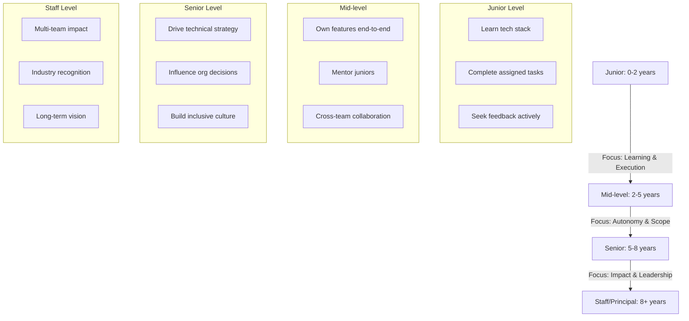
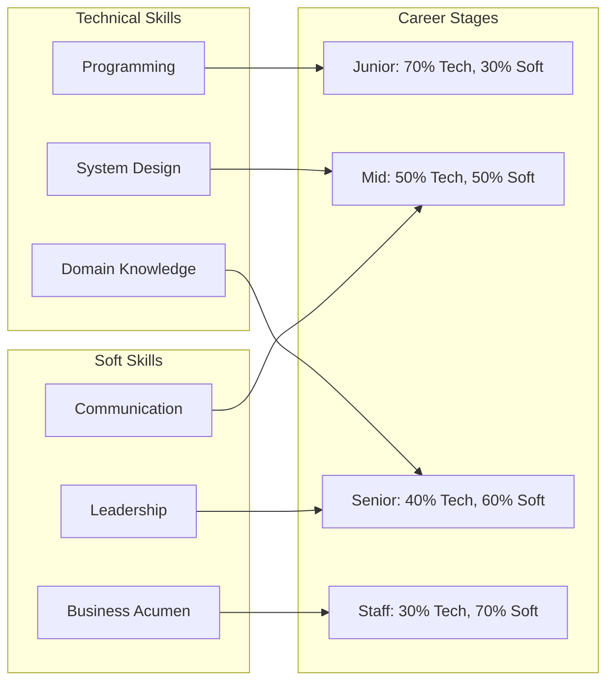
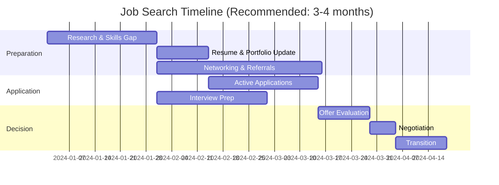

# Career Development for Technical Professionals

技术职业发展不仅仅是提升编程技能，更是要在技术深度、业务影响力和领导力之间找到平衡点。真正的职业突破往往来自你在什么时机选择什么方向，以及你如何让他人看到你的价值。

## Notes

技术职业路径通常分为 individual contributor (IC) 和 management 两条主线，但现实是大多数成功的职业轨迹都是混合型的。IC 路线强调技术深度和影响力，management 路线强调人员管理和组织建设。

关键是要认识到：技术能力是基础，但职业加速器通常是业务影响力、沟通能力和领导力。很多人在技术能力上投入80%的时间，但这只决定了20%的职业发展。

核心关注：

- 先明确自己当前的职业阶段和目标，是追求技术深度、产品影响力还是团队领导力。
- 技术深度要有可见的业务影响，单纯的技术优秀不足以获得认可或晋升。
- 沟通能力包括向上管理、跨团队协作和技术演讲，这些往往被低估但实际很重要。
- 领导力不等于管理，包括技术决策、项目推动、mentoring 和 hiring。
- 职业转换要有明确的价值主张，不仅仅是"我想学新技术"而是"我能解决什么问题"。
- 谈判不是一次性事件，而是持续的价值证明和市场定位。

## Career Stage Framework

## Skill Development Matrix

## Promotion Readiness Checklist

### Technical Excellence
- [ ] Consistently deliver high-quality work
- [ ] Solve complex technical problems
- [ ] Make architectural contributions
- [ ] Stay current with industry trends

### Business Impact
- [ ] Drive measurable business results
- [ ] Improve team productivity
- [ ] Reduce costs or increase revenue
- [ ] Launch successful products/features

### Leadership & Influence
- [ ] Mentor team members effectively
- [ ] Lead cross-functional initiatives
- [ ] Influence technical strategy
- [ ] Build inclusive team culture

### Communication
- [ ] Present to senior leadership
- [ ] Write clear technical documentation
- [ ] Facilitate technical discussions
- [ ] Provide constructive feedback

## Job Transition Strategy

### When to Change Jobs
**Green Lights:**
- Learning curve has flattened
- Limited growth opportunities
- Compensation below market rate
- Company direction misalignment
- Toxic work environment

**Red Flags:**
- Less than 1 year in current role
- Running away from problems
- No clear value proposition
- Emotional decision-making

### Job Search Timeline

## Salary Negotiation Framework

### Preparation Phase
**Research Market Value:**
- Sites: Levels.fyi, Glassdoor, Blind
- Network: Current/former employees
- Role: Similar companies, locations
- Total Comp: Base + bonus + equity

**Define Your Value:**
- Quantifiable achievements
- Unique skills/experience
- Business impact metrics
- Rarity and replacement cost

### Negotiation Strategies
**Initial Offer:**
- Express enthusiasm but not commitment
- Ask for detailed breakdown
- Request time to consider (3-7 days)
- Get offer in writing

**Counter Offer:**
- Start with total compensation, not just base
- Use data, not emotions
- Be specific and reasonable (10-20% above)
- Maintain positive tone

**Common Tactics:**
- "I'm excited about the opportunity"
- "Based on my research and experience..."
- "Is there flexibility on this component?"
- "Can we explore other forms of compensation?"

### Red Flags in Negotiation
- Unwilling to put details in writing
- Pressure tactics or deadlines
- Vague promises about future increases
- Dismissive of market data
- Unprofessional response to reasonable requests

## Performance Review Optimization

### Self-Assessment Framework
**Structure:**
1. **Executive Summary** (3-4 sentences)
2. **Key Achievements** (3-5 bullet points with metrics)
3. **Growth Areas** (2-3 specific areas)
4. **Future Goals** (aligned with team/company)

**STAR Method for Achievements:**
- **Situation**: Context and challenge
- **Task**: Your responsibility
- **Action**: What you specifically did
- **Result**: Quantifiable outcome

### Common Mistakes
- Listing responsibilities instead of achievements
- Being too modest about accomplishments
- Failing to connect work to business impact
- Not preparing specific examples
- Ignoring soft skills contributions

## Leadership Development

### Without Direct Reports
**Technical Leadership:**
- Lead technical initiatives
- Architecture decision-making
- Code review and standards
- Technical mentorship

**Project Leadership:**
- Drive cross-functional projects
- Coordinate team efforts
- Remove blockers
- Ensure delivery

**Thought Leadership:**
- Present at conferences
- Write technical blog posts
- Contribute to open source
- Participate in industry discussions

### Transition to Management
**Readiness Signs:**
- Enjoyment of mentoring
- Strong communication skills
- Interest in people development
- Strategic thinking ability
- Emotional intelligence

**Preparation Steps:**
1. Express interest to leadership
2. Take on hybrid responsibilities
3. Develop management skills
4. Build cross-functional relationships
5. Seek mentorship from managers

## Work-Life Integration

### Sustainable High Performance
**Energy Management:**
- Identify your peak performance hours
- Schedule deep work accordingly
- Take regular breaks
- Protect personal time

**Setting Boundaries:**
- Clear communication of availability
- Learn to say no gracefully
- Delegate effectively
- Prioritize ruthlessly

### Burnout Prevention
**Warning Signs:**
- Chronic fatigue
- Reduced performance
- Cynicism or detachment
- Physical symptoms

**Prevention Strategies:**
- Regular exercise and sleep
- Social support network
- Professional help if needed
- Regular reassessment of priorities

## Networking and Personal Brand

### Strategic Networking
**Internal Networking:**
- Cross-functional collaboration
- Lunch and learn sessions
- Company events and socials
- Mentorship programs

**External Networking:**
- Industry conferences
- Professional organizations
- Alumni networks
- Online communities (LinkedIn, Twitter)

### Personal Brand Building
**Content Creation:**
- Technical blog posts
- Conference talks
- Open source contributions
- Social media presence

**Consistency:**
- Regular publishing schedule
- Cohesent message and themes
- Authentic voice
- Quality over quantity

## Common Career Mistakes

1. **Staying Too Long**: Remaining in a role past growth opportunities
2. **Job Hopping**: Changing roles too frequently without depth
3. **Ignoring Politics**: Underestimating organizational dynamics
4. **Over-specialization**: Becoming too narrow in skills
5. **Passive Development**: Waiting for opportunities vs. creating them
6. **Poor Visibility**: Doing great work without ensuring it's recognized
7. **Burnout**: Sacrificing long-term health for short-term gains
8. **Isolation**: Not building diverse professional relationships

## Action Items

### This Quarter
- [ ] Update resume and LinkedIn
- [ ] Set specific career goals
- [ ] Identify skill gaps
- [ ] Schedule mentorship conversations

### This Year
- [ ] Lead a significant project
- [ ] Publish technical content
- [ ] Expand professional network
- [ ] Assess career satisfaction

### Long-term (2-3 years)
- [ ] Define career trajectory
- [ ] Build specialized expertise
- [ ] Develop leadership capabilities
- [ ] Plan next career transition

## Related Topics

- [[Coding Interview Playbook]]
- [[System Design Knowledge Map]]
- [[Coding Communication]]
- [[Problem Clarification]]
- [[Common Coding Interview Mistakes]]

## Further Reading

- "The Staff Engineer's Path" by Tanya Reilly
- "Radical Candor" by Kim Scott
- "Crucial Conversations" by Kerry Patterson
- "The First 90 Days" by Michael Watkins
