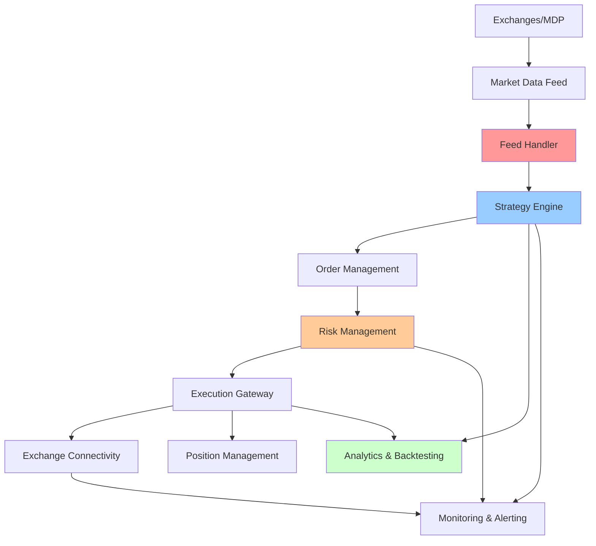
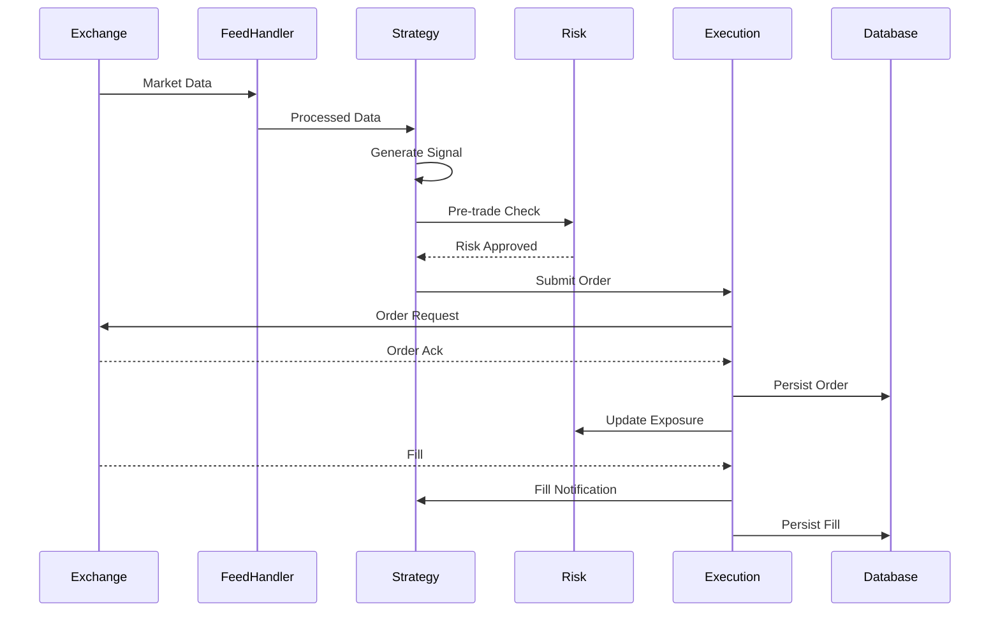
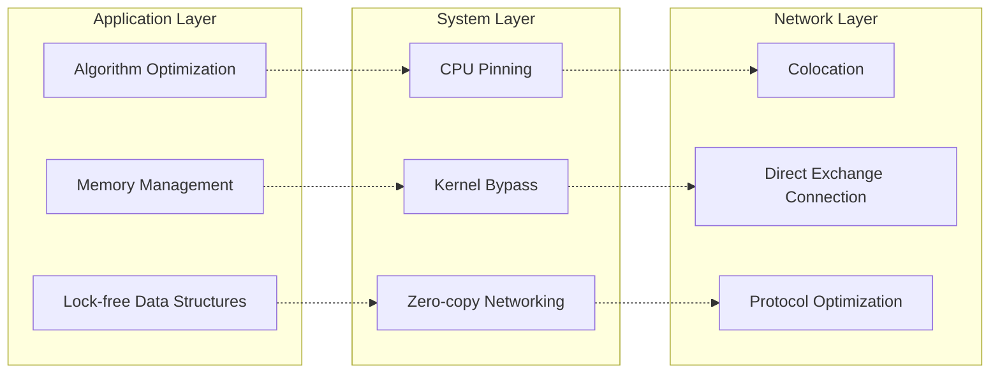

# System Design for Quant Trading Systems

量化交易系统的设计需要同时满足极低延迟、高吞吐量和强可靠性，这是系统设计与金融工程的交叉领域。真正的挑战不是用最先进的技术，而是在严格的时间约束下做出正确的架构权衡。

## Notes

量化交易系统可以分为市场数据接入、策略执行、风险管理和事后分析四个主要部分。每个部分对延迟、可靠性和数据一致性的要求都不同，需要针对性的架构设计。

高频交易系统通常追求微秒级延迟，需要在网络协议、硬件选择、数据结构设计和部署位置上做极致优化。而算法交易系统更关注策略逻辑的正确性和风险控制的完备性，延迟要求相对宽松但仍需要在毫秒级完成。

核心关注：

- 先把系统按数据流拆成 market data ingestion、strategy execution、risk management 和 analytics 四段，因为每段的 SLA 和优化方向完全不同。
- market data latency 要达到微秒级时，需要考虑 kernel bypass、CPU pinning、内存池和零拷贝等技术，同时要在 FPGA 和通用 CPU 之间做选择。
- order execution 必须保证幂等性和状态可恢复，因为网络分区、exchange downtime 和重复回调都会发生，系统要能从任意崩溃状态恢复。
- risk controls 不能只做事前检查，还要有实时监控和熔断机制，当市场异常或策略失控时能快速停止交易。
- position management 需要跨多个账户和交易所维护一致性视图，这涉及分布式事务和最终一致性的权衡。
- backtesting 和 production 环境的数据架构要尽可能一致，避免因为数据格式或时间戳处理差异导致的回测偏差。
- observability 在量化系统中特别重要，需要能够回放历史数据、重现交易决策和分析策略表现。

## System Architecture

## Data Flow

## Latency Optimization Layers

## Key Components

### Market Data Ingestion
**Feed Handler**: 处理交易所行情数据，解析协议并分发到策略系统。需要考虑：
- 协议解析效率（ITCH, OBI, FAST）
- 时间戳处理精度（接收时间、交易所时间、发送时间）
- 数据分发延迟（进程间通信、序列化开销）
- 数据完整性（gap detection, recovery）

### Strategy Engine
**策略执行**: 根据市场数据生成交易信号。核心考虑：
- 信号生成逻辑的延迟
- 历史数据窗口管理
- 多策略并发执行
- 策略间资源隔离

### Risk Management
**风险控制**: 确保交易在可接受的风险范围内。多层风险控制：
- 事前风控：订单下单前检查
- 实时风控：监控交易行为和头寸
- 事后风控：分析和审计交易记录
- 熔断机制：异常情况下停止交易

### Order Management
**订单管理**: 管理订单生命周期。关键功能：
- 订单路由（选择最优交易所）
- 订单状态管理
- 订单修改和撤销
- 订单确认和成交处理

## Performance Considerations

### Latency Targets by Strategy Type
- **High-Frequency Trading**: < 10 microseconds
- **Algorithmic Trading**: < 10 milliseconds
- **Portfolio Trading**: < 1 second
- **Execution Algorithms**: < 100 milliseconds

### Throughput Requirements
- **Market Data**: 100K+ messages/second
- **Order Flow**: 10K+ orders/second
- **Risk Checks**: 100K+ checks/second
- **Data Persistence**: 1M+ records/second

### Reliability Standards
- **Availability**: 99.99%+ (downtime < 1 hour/year)
- **Data Loss**: Zero tolerance for trade data
- **Recovery Time**: < 1 second for critical systems
- **Audit Trail**: Complete and immutable

## Technology Choices

### Programming Languages
- **C++**: 最小化延迟，直接硬件控制
- **Rust**: 内存安全 + 高性能
- **Java**: 适合业务逻辑，GC 停顿需要调优
- **Python**: 策略研究和回测，不适合生产系统

### Messaging Systems
- **IPC**: Shared memory, UNIX sockets for lowest latency
- **UDP**: Market data distribution (fire-and-forget)
- **TCP**: Order management (reliable delivery)
- **RDMA**: Ultra-low latency networking

### Data Storage
- **Time-series DB**: Market data and OHLCV
- **Key-value Store**: Real-time positions and risk
- **Relational DB**: Trade records and audit trail
- **Columnar Store**: Analytics and backtesting

## Trade-offs and Design Decisions

### Latency vs Throughput
- **Latency-optimized**: 单线程处理，CPU pinning，lock-free
- **Throughput-optimized**: 多线程并行，批量处理
- **Hybrid**: 关键路径优化，分析路径并行

### Consistency vs Availability
- **Strong Consistency**: 风险控制，头寸管理
- **Eventual Consistency**: 分析系统，报表生成
- **Compensation**: 消息队列 + 幂等处理

### Cost vs Performance
- **Colocation**: 减少网络延迟，增加托管成本
- **Premium Data**: 更快的数据源，更高的数据费用
- **Hardware Acceleration**: FPGA/GPU 加速，开发成本高

## Monitoring and Observability

### Key Metrics
- **Latency**: P50, P95, P99 latency by component
- **Throughput**: Messages/second, orders/second
- **Error Rates**: Failed orders, rejected orders
- **System Health**: CPU, memory, network, disk I/O
- **Business Metrics**: P&L, positions, risk exposure

### Alerting
- **Critical**: Order flow interruption, risk limit breach
- **Warning**: High latency, error rate increase
- **Info**: Daily performance summary, trade statistics

### Debugging Tools
- **Transaction Logging**: 完整的订单生命周期记录
- **Data Replay**: 重放历史市场数据
- **Performance Profiling**: 热点分析，延迟分解
- **Strategy Simulation**: 模拟交易环境

## Regulation and Compliance

### Regulatory Requirements
- **Best Execution**: 以最优价格执行订单
- **Market Abuse**: 防止市场操纵和内幕交易
- **Record Keeping**: 保存交易记录5-7年
- **Reporting**: 定期报告交易活动和风险状况

### Implementation
- **Audit Trail**: 完整记录所有交易决策
- **Access Control**: 严格的权限管理
- **Data Protection**: 加密存储和传输敏感数据
- **Compliance Reporting**: 自动生成监管报告

## Common Pitfalls

- **Over-engineering**: 在非关键路径上追求极致性能
- **Under-testing**: 未能充分测试市场异常情况
- **Ignoring Risk**: 为了性能牺牲风险控制
- **Poor Monitoring**: 缺乏足够的可观测性
- **Inadequate Recovery**: 没有完善的故障恢复机制

## Interview Approach

When asked about designing a quant trading system:

1. **Clarify Requirements**
   - Strategy type (HFT vs algorithmic)
   - Asset classes (equities, futures, options)
   - Target markets and exchanges
   - Performance requirements

2. **Architecture Overview**
   - Break down into major components
   - Explain data flow between components
   - Highlight critical path optimizations

3. **Deep Dives**
   - Market data handling and latency optimization
   - Order management and risk controls
   - Position management and reconciliation
   - Backtesting and production consistency

4. **Trade-offs**
   - Latency vs reliability
   - Performance vs development cost
   - Complexity vs maintainability

## Related Topics

- [[Low-Latency and Performance Engineering]]
- [[Market Microstructure]]
- [[Distributed Systems for Finance]]
- [[Stochastic Processes for Finance]]
- [[Data Structures and Algorithms for Quants]]
- [[Debugging and Profiling]]
- [[Model Validation and Controls]]

## Further Reading

- "High-Frequency Trading: A Practical Guide to Algorithmic Strategies and Trading Systems" by Irene Aldridge
- "Algorithmic Trading: Winning Strategies and Their Rationale" by Ernest Chan
- "Trading and Exchanges: Market Microstructure for Practitioners" by Larry Harris
