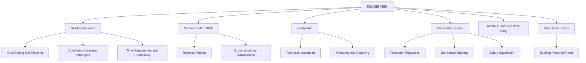

# Career Development Knowledge Map

本目录整理技术职业发展的核心能力、关键决策和成长路径，适合从初级工程师到技术领导的各个阶段。

职业发展不是“技术能力 + 工作年限”自动累加出来的结果。更像一道长期组合题：你是否知道当前阶段最该补什么，是否能把工作成果变成清晰证据，是否能把技术影响扩展到团队、项目和业务。

## Career Navigation Map

## How to Use This Map

- 如果你刚进入行业，先把 `目标设定 + 学习系统 + 时间管理 + 技术写作` 打牢，这会直接影响执行力和成长速度。
- 如果你已经是中级工程师，重点转向 `跨团队协作 + 晋升证据 + 技术领导力`，开始从“把事做完”升级为“推动更大范围的结果”。
- 如果你正在考虑跳槽、升职或转型，优先读 `Promotion Readiness`、`Job Search Strategy` 和 `Salary Negotiation`，把职业动作做成有节奏的 pipeline，而不是临时起意。

## Core Areas

### Self Development

先搭自己的 operating system。这个区域解决的是：你如何设目标、如何安排时间、如何持续学习，以及如何把每天的工作积累成长期竞争力。

- [[Career Development for Technical Professionals]]
- [[Goal Setting and Planning]]
- [[Continuous Learning Strategies]]
- [[Time Management and Productivity]]

### Communication Skills

很多职业瓶颈不是技术不够，而是“想法说不清、结论写不明、跨团队推动不动”。这一组条目聚焦表达、协作和影响力。

- [[Technical Writing]]
- Public Speaking and Presentations
- Effective Meetings
- [[Cross-functional Collaboration]]

### Leadership

领导力不等于 title。更常见的是你先开始影响决策、帮助他人成长、稳定推进复杂项目，然后才逐渐接手更正式的领导职责。

- [[Technical Leadership]]
- People Management
- [[Mentoring and Coaching]]
- Building and Leading Teams

### Career Progression

职业跃迁靠的不是“感觉差不多了”，而是证据、市场定位和关键时机判断。这一组条目更偏行动和决策。

- [[Promotion Readiness]]
- [[Job Search Strategy]]
- [[Salary Negotiation]]
- Career Transitions

### Mental Health and Well-being

长期表现不是纯靠拼时间。这个区域关注可持续性，避免短期冲刺之后把注意力、判断力和动力都透支掉。

- Work-Life Integration
- Burnout Prevention
- Stress Management
- Building Resilience

### Specialized Topics

这是放大个人影响力的区域。不是所有人都要做，但在合适阶段，这些条目会显著提升你的职业信号和机会密度。

- Remote Work Success
- Imposter Syndrome
- Office Politics Navigation
- [[Building Personal Brand]]

## Learning Paths

### For New Graduates (0-2 years)
Focus on technical skills, execution, and learning
1. [[Career Development for Technical Professionals]]
2. [[Goal Setting and Planning]]
3. [[Time Management and Productivity]]
4. [[Continuous Learning Strategies]]
5. [[Technical Writing]]

### For Mid-level Engineers (2-5 years)
Focus on autonomy, scope, and influence
1. [[Promotion Readiness]]
2. [[Cross-functional Collaboration]]
3. [[Technical Leadership]]
4. [[Mentoring and Coaching]]
5. [[Building Personal Brand]]

### For Senior Engineers (5+ years)
Focus on strategic thinking, leadership, and business impact
1. [[Technical Leadership]]
2. [[Salary Negotiation]]
3. Career Transitions
4. Building and Leading Teams

### For Career Transitions
Focus on market positioning and value demonstration
1. [[Job Search Strategy]]
2. [[Promotion Readiness]]
3. [[Building Personal Brand]]
4. Career Transitions
