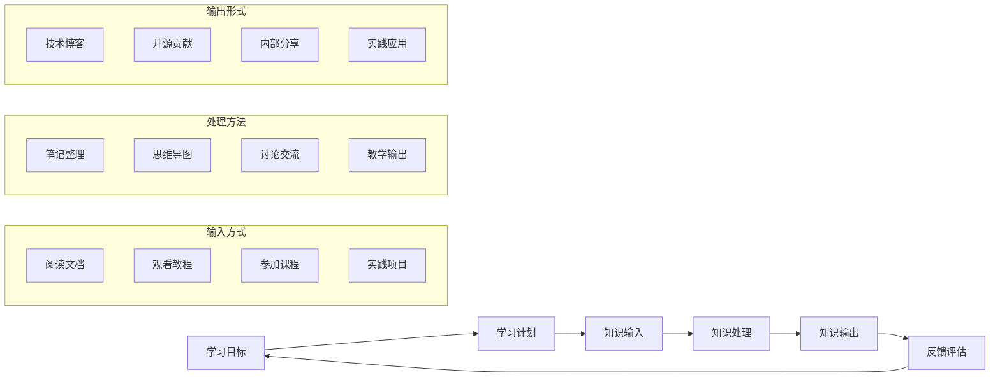

# Continuous Learning Strategies

在技术快速发展的时代，持续学习能力是职业发展的核心竞争力。真正的学习不是简单地收集资源，而是建立有效的学习系统和习惯，让学习成为日常工作的一部分。

## Notes

技术行业的变化速度意味着你在5年后使用的技能可能今天还不存在。传统的"学习→工作→应用"模式已经不够，需要变成"在工作中学习，在学习中工作"的循环。

高效学习的关键不是投入更多时间，而是提高学习质量和效率。这包括：选择正确的学习内容、使用科学的学习方法、建立知识体系和实际应用所学。

核心关注：

- 先明确学习目标和动机，是为了解决当前问题还是为未来机会做准备？
- 学习内容要与工作相关或个人兴趣强相关，否则很难坚持。
- 输入和输出要保持平衡，单纯的学习容易产生"懂了"的错觉。
- 实践和反馈是学习闭环的关键环节，没有实践的学习很难深入。
- 知识体系要比碎片知识更重要，建立自己的思维框架。
- 学习要适度，过度学习会导致疲劳和效率下降。

## Learning Framework



## Effective Learning Strategies

### 1. Deliberate Practice (刻意练习)
**原则：**
- 明确的技能目标和提升计划
- 超出舒适区的挑战
- 即时反馈和纠正
- 重复和专注练习

**应用：**
- 设定具体技能目标（如：掌握Kotlin协程）
- 找到有挑战的项目或问题
- 寻求code review和反馈
- 定期反思和改进

### 2. Spaced Repetition (间隔重复)
**原理：**
- 利用记忆曲线规律
- 在遗忘临界点复习
- 逐步延长复习间隔

**工具：**
- Anki（间隔重复软件）
- Flashcard apps
- 自己的复习系统

### 3. Active Learning (主动学习)
**方法：**
- 做中学：项目驱动学习
- 教中学：通过教学巩固理解
- 用中学：解决实际问题

**对比：**
- 被动学习：看视频、听讲座（留存率5-10%）
- 主动学习：实践、讨论、教学（留存率50-90%）

### 4. Just-in-Time Learning (按需学习)
**优势：**
- 学习动机强
- 应用场景明确
- 记忆效果更好
- 时间投入高效

**实施：**
- 在项目中遇到问题时学习
- 关注80/20法则：掌握20%核心解决80%问题
- 快速learn enough to get the job done
- 深入学习在需要时进行

## Knowledge Building Systems

### 1. Personal Knowledge Management (PKM)
**工具选择：**
- 笔记工具：Obsidian, Notion, Roam Research
- 代码库：GitHub (可搜索、可回溯)
- 书签管理：Pocket, Raindrop.io
- 文献管理：Zotero, Mendeley

**笔记系统：**
- ** fleeting notes**: 快速捕捉想法
- **literature notes**: 整理外部知识
- **permanent notes**: 自己的思考和洞察
- **project notes**: 特定项目的知识

### 2. Learning Project Management
**项目式学习：**
- 定义清晰的学习目标
- 选择有实际意义的项目
- 设定里程碑和deadline
- 公开commitment和进度

**示例项目：**
- "用Rust实现一个web server"
- "学习系统设计并设计一个真实系统"
- "深入研究一个开源项目"

### 3. Feedback Loops
**建立反馈渠道：**
- Code review
- 技术分享后的讨论
- Mentor和peer feedback
- 用户和业务反馈

**反思机制：**
- 每周学习总结
- 项目事后分析
- 定期技能评估
- 长期目标review

## Common Learning Pitfalls

### 1. Tutorial Hell
**问题：**
- 不断看教程但不实践
- 跟着教程能做，自己不会
- 学了很多但用不上

**解决方案：**
- Tutorial之后立即做项目
- 修改和扩展tutorial项目
- 解决自己遇到的真实问题

### 2. Hoarding Resources
**问题：**
- 收藏大量文章和视频
- 以为收藏=学习
- 焦虑错过任何信息

**解决方案：**
- 专注于少数高质量资源
- 学完一个再开始下一个
- 定期清理收藏夹

### 3. Perfectionism
**问题：**
- 追求完美理解才继续
- 不敢开始因为怕做不好
- 过度准备而从不实践

**解决方案：**
- 接受"足够好"的学习质量
- 快速迭代和改进
- Done is better than perfect

### 4. Burnout from Overlearning
**问题：**
- 过度学习导致疲劳
- 失去兴趣和动力
- 效率下降甚至倒退

**解决方案：**
- 设定合理学习时间
- 安排休息和恢复
- 保持学习兴趣和好奇心

## Time Management for Learning

### 1. Learning Time Allocation
**时间分配原则：**
- **70%**: 与当前工作相关学习
- **20%**: 未来技能储备
- **10%**: 兴趣驱动的探索

**学习时间段：**
- **深度学习**: 2-4小时连续时间
- **碎片学习**: 10-30分钟间隙
- **通勤学习**: 音频、视频
- **周末项目**: 整块深入时间

### 2. Learning Integration with Work
**工作中学习：**
- 选择需要新技能的项目
- 主动承担技术债务清理
- 参与技术方案讨论
- Code review中学习

**学习迁移到工作：**
- 寻找应用新知识的机会
- 分享学到的新技术
- 提出技术改进建议
- 建立最佳实践

## Tracking Progress

### 1. Skill Assessment
**技能矩阵：**
```kotlin
// 示例：技能评估表格
data class SkillAssessment(
    val skill: String,
    val currentLevel: Int,        // 1-5
    val targetLevel: Int,
    val currentUsage: String,     // daily/weekly/monthly/rarely
    val learningResources: List<String>,
    val practiceProjects: List<String>
)

// 定期review
val skills = listOf(
    SkillAssessment("Kotlin", 3, 5, "daily", listOf(...), listOf(...)),
    SkillAssessment("System Design", 2, 4, "weekly", listOf(...), listOf(...))
)
```

### 2. Learning Journal
**记录内容：**
- 今天学到了什么
- 如何应用到工作
- 遇到的问题和解决
- 下一步学习计划

**review频率：**
- 每周：快速进展check
- 每月：目标对齐和调整
- 每季度：技能评估和规划

### 3. Evidence Collection
**学习证明：**
- GitHub commits和projects
- 技术博客和articles
- Talks and presentations
- Certifications (if valuable)

## Action Items

### This Week
- [ ] 选择一个学习目标（与工作相关）
- [ ] 找到高质量学习资源（1-2个）
- [ ] 开始一个实践项目
- [ ] 建立学习笔记系统

### This Month
- [ ] 完成一个学习项目
- [ ] 分享学到的知识（blog/talk）
- [ ] 应用新技能到工作中
- [ ] 评估学习效果

### This Quarter
- [ ] 掌握一项新技能
- [ ] 建立知识体系
- [ ] 参与相关社区
- [ ] 规划下一阶段学习

## Recommended Resources

### Learning Platforms
- **Programming**: LeetCode, Exercism, Coursera, edX
- **System Design**: System Design Interview, ByteByteGo
- **Tech Skills**: egghead.io, Frontend Masters, Pluralsight

### Communities
- **General**: Stack Overflow, Reddit (r/programming, r/learnprogramming)
- **Specific**: Language/framework communities
- **Local**: Meetup groups, conferences

### Books
- "Make It Stick: The Science of Successful Learning"
- "Ultralearning" by Scott Young
- "The Pragmatic Programmer" by David Thomas and Andrew Hunt

## Related Topics

- [[Career Development for Technical Professionals]]
- Time management and productivity habits
- Goal setting and planning
- Technical writing

## Key Takeaways

1. **Learning is a skill that can be improved** - 用科学方法提高学习效率
2. **Output matters more than input** - 实践和教学比单纯学习更有效
3. **Context matters** - 在真实场景中学习效果最好
4. **Consistency beats intensity** - 持续学习胜过突击学习
5. **Quality over quantity** - 深入掌握少数技能比浅尝辄止很多技能更有价值
6. **Learning is social** - 通过社区、mentor和peers加速学习
7. **Balance is essential** - 避免过度学习和burnout
