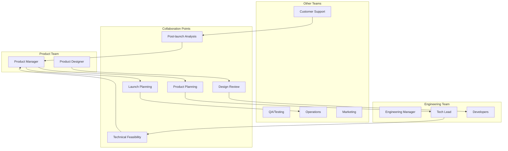

# Cross-functional Collaboration

跨职能协作是现代产品开发的核心能力，技术成功往往取决于能否与产品、设计、运营、市场等团队有效合作。真正的协作不是简单的信息共享，而是建立共同目标和相互信任的工作关系。

## Notes

很多技术人员认为只要技术做好就够了，但实际产品成功需要多个职能的紧密配合。技术决策需要理解业务需求，产品规划需要了解技术约束，用户体验需要技术可行性。

优秀的技术人员能够在技术要求和业务目标之间架起桥梁，既不牺牲技术质量，又能为业务创造价值。这需要理解其他职能的工作方式、语言和约束条件。

核心关注：

- 先理解其他职能的目标和约束，不是"他们不懂技术"而是"他们有不同的优先级"。
- 沟通要使用对方的语言，技术细节要用业务价值解释。
- 早期参与产品讨论，避免后期技术返工和妥协。
- 建立信任关系，通过deliverable和沟通建立credibility。
- 冲突是正常的，关键是如何建设性地解决争议。
- 协作要有清晰的decision-making框架和escalation路径。

## Collaboration Framework



## Key Collaboration Skills

### 1. Communication Across Functions
**理解不同职能的语言：**
- **Product**: 用户需求、业务指标、市场机会
- **Design**: 用户体验、交互流程、视觉规范
- **Engineering**: 技术可行性、实现成本、质量标准
- **QA**: 测试策略、质量标准、用户场景
- **Operations**: 部署流程、监控指标、容量规划
- **Marketing**: 用户价值、竞争优势、沟通策略
- **Support**: 用户反馈、使用场景、常见问题

**沟通技巧：**
- 用对方关心的metrics和goals说话
- 避免纯技术细节，强调业务影响
- 提供选项和trade-offs，不是简单yes/no
- 视觉化复杂概念（图表、原型）

### 2. Building Relationships
**建立信任：**
- Deliver what you promise
- Be transparent about constraints and risks
- Admit mistakes and fix them quickly
- Help other teams succeed

**理解动机：**
- 每个团队有不同的OKRs和incentives
- 资源有限，有competing priorities
- 压力来自不同方向（用户、execs、market）

### 3. Managing Stakeholders
**识别stakeholders：**
- **Direct**: Product, Design, QA, Operations
- **Indirect**: Marketing, Sales, Support, Legal
- **Executives**: CTO, VP Engineering, VP Product

**engagement策略：**
- 定期同步会议（daily/weekly/bi-weekly）
- 透明的进度和风险沟通
- 早期involvement in decision-making
- 清晰的escalation路径

## Common Collaboration Scenarios

### 1. Product Requirements Discussion
**技术角色：**
- 评估技术可行性
- 指出潜在风险和dependencies
- 提供implementation estimates
- 建议alternative approaches

**effective沟通：**
```
不是："这个技术实现太复杂，做不了"
而是："这个feature需要X周时间，主要复杂度在于...。我们可以考虑一个MVP版本，先实现核心价值..."
```

### 2. Design Review
**技术角色：**
- 评估技术可行性
- 指出性能和scale考虑
- 识别accessibility和internationalization问题
- 建议实现approach

**关注点：**
- 交互复杂度和开发时间
- 资源loading和caching策略
- 响应式设计和device constraints
- Analytics和measurement需求

### 3. Technical vs Product Trade-offs
**常见冲突：**
- **Perfect vs Good Enough**: 技术完美 vs 时间约束
- **Scalability vs Time to Market**: 为未来scale vs 当前需求
- **Technical Debt vs Features**: 偿还债务 vs 新功能
- **Quality vs Speed**: 完美测试 vs 快速迭代

**解决框架：**
1. 明确业务impact和urgency
2. 量化和沟通技术债务的成本
3. 提供phased approach（MVP → 完善）
4. 建立明确的标准和gates

### 4. Cross-team Dependencies
**管理策略：**
- 早期识别dependencies和risks
- 建立清晰的interfaces和contracts
- 定期sync meetings
- 联合planning和retrospectives

**工具和实践：**
- Shared roadmap和timeline
- Dependency tracking system
- Regular stakeholder updates
- Escalation protocols

## Collaboration Anti-patterns

### 1. "Throw over the Wall"
**问题：**
- Engineering只实现spec，不参与讨论
- Product只给requirements，不听取技术input
- 缺乏shared ownership和understanding

**解决：**
- 早期involvement in product discussions
- 联合problem-solving sessions
- Shared goals和success metrics

### 2. Technical Condescension
**问题：**
- "他们不懂技术所以..."
- 技术人员拒绝考虑其他角度
- 用技术复杂性拒绝合理需求

**解决：**
- 培养empathy和curiosity
- 学习其他职能的基础知识
- 用business language解释技术约束

### 3. Avoiding Difficult Conversations
**问题：**
- 不及时提出技术concerns
- 过度承诺导致delivery failure
- 团队间暗藏矛盾和不满

**解决：**
- 建立psychological safety
- 及时和transparent沟通
- 关注问题不针对个人

## Success Metrics

### Team Health
- Cross-team satisfaction scores
- Collaboration effectiveness ratings
- Conflict resolution time
- Peer feedback quality

### Delivery Excellence
- On-time delivery rate
- Post-launch bug rate
- Rework and change requests
- Overall product quality

### Innovation
- Cross-team initiatives
- Process improvements
- Knowledge sharing activities
- Joint problem-solving

## Action Items

### Immediate
- [ ] 主动邀请其他职能参与早期讨论
- [ ] 学习其他职能的基础知识和语言
- [ ] 建立定期sync会议

### Short-term
- [ ] 参与跨团队项目
- [ ] 分享技术知识给非技术团队
- [ ] 建立shared goals和metrics

### Long-term
- [ ] 成为跨团队桥梁
- [ ] 改进组织协作流程
- [ ] mentoring他人协作技能

## Related Topics

- [[Technical Leadership]]
- Effective meetings
- Public speaking and presentations
- [[Career Development for Technical Professionals]]

## Further Reading

- "Crucial Conversations" by Kerry Patterson
- "Radical Candor" by Kim Scott
- "The Five Dysfunctions of a Team" by Patrick Lencioni
- "Nonviolent Communication" by Marshall Rosenberg
