# Technical Leadership

技术领导力不是简单地成为最好的程序员，而是要能够通过技术决策、团队建设和跨团队协作来放大团队的影响力。真正的技术领导力体现在你如何帮助团队成功，而不是你自己写了多少代码。

## Notes

技术领导的职责通常包括：技术方向决策、架构设计、代码质量把控、团队技术成长和跨团队技术协调。这些工作往往看不见摸不着，但对团队长期成功至关重要。

优秀的技术领导需要在技术深度和管理广度之间找到平衡，既要能够深入技术细节做决策，又要能够从业务角度评估技术选择的合理性。

核心关注：

- 先搞清楚组织需要什么样的技术领导：是技术深度、项目推动还是团队建设？
- 技术决策要基于业务目标和团队现状，不能为了技术而技术。
- 代码审查不仅是找bug，更是技术传播和团队教育的机会。
- 架构设计要考虑可维护性、团队技能和业务变化，不能只追求完美。
- 技术债务管理是平衡短期交付和长期健康的关键能力。
- 跨团队协作需要理解对方团队的约束和目标，建立双赢关系。

## Technical Leadership Dimensions

```mermaid
graph TB
    TL[Technical Leadership]

    subgraph "Technical Excellence"
        TE1[Architecture Decisions]
        TE2[Code Quality]
        TE3[Technical Strategy]
        TE4[Innovation]
    end

    subgraph "Team Development"
        TD1[Mentoring]
        TD2[Hiring]
        TD3[Performance Management]
        TD4[Career Growth]
    end

    subgraph "Project Delivery"
        PD1[Planning]
        PD2[Execution]
        PD3[Risk Management]
        PD4[Stakeholder Communication]
    end

    subgraph "Cross-functional Impact"
        CF1[Collaboration]
        CF2[Standards Setting]
        CF3[Technical Evangelism]
        CF4[Organizational Influence]
    end

    TL --> TE1
    TL --> TD1
    TL --> PD1
    TL --> CF1
```

## Key Responsibilities

### 1. Technical Decision Making
**架构设计：**
- 评估技术选项的trade-offs
- 考虑团队技能和学习曲线
- 平衡短期交付和长期可维护性
- 制定技术标准和最佳实践

**技术债务管理：**
- 识别和分类技术债务
- 制定偿还计划和优先级
- 与stakeholders沟通债务影响
- 在交付和健康之间找到平衡

### 2. Team Development
**Mentoring：**
- 指导团队成员技术成长
- 分享技术经验和最佳实践
- 提供建设性反馈
- 创造学习机会和挑战

**Hiring：**
- 参与候选人筛选
- 设计技术面试流程
- 评估技术文化契合度
- 做出hire/no-hire建议

**Performance Management：**
- 设定清晰的performance期望
- 定期提供反馈和指导
- 识别和培养高潜力人才
- 处理performance问题

### 3. Project Delivery
**Planning：**
- 技术评估和可行性分析
- 资源需求评估
- 风险识别和缓解计划
- 里程碑和交付计划

**Execution：**
- 代码审查和架构评审
- 技术问题和阻塞解决
- 质量把控和测试策略
- 生产部署和监控

### 4. Cross-functional Collaboration
**Stakeholder Management：**
- 理解业务需求和约束
- 管理期望和沟通进度
- 协调资源和优先级
- 处理冲突和trade-off决策

**跨团队协作：**
- 建立跨团队技术关系
- 协调接口和依赖
- 解决技术争议
- 推动标准统一

## Leadership Styles

### Servant Leadership
**特点：**
- 关注团队成长和成功
- 移除障碍和阻塞
- 为团队争取资源
- 赋能团队成员

**适用场景：**
- 高成熟度团队
- 创新型项目
- 需要团队自主性

### Visionary Leadership
**特点：**
- 制定清晰技术愿景
- 激励团队追求卓越
- 推动技术创新
- 挑战现状

**适用场景：**
- 技术转型期
- 新产品开发
- 需要重大突破

### Situational Leadership
**特点：**
- 根据情况调整风格
- 新人：更多指导
- 成熟：更多授权
- 危机：更强指令

**适用场景：**
- 团队能力多样
- 项目阶段变化
- 复杂环境

## Common Challenges

### 1. Technical vs Management Balance
**问题：**
- 技术细节太多，忽视管理
- 或完全脱离代码，失去技术影响力

**解决方案：**
- 明确角色期望和时间分配
- 保持关键技术参与
- 依靠团队执行细节工作
- 定期review和调整

### 2. Influencing Without Authority
**问题：**
- 需要跨团队协作但缺乏直接权力
- 技术决策需要多方同意

**解决方案：**
- 建立credibility和信任
- 理解对方需求和约束
- 提供数据和事实支持
- 寻找共同利益点

### 3. Balancing Short-term vs Long-term
**问题：**
- 业务要求快速交付
- 技术债务持续累积
- 重构工作难以优先

**解决方案：**
- 与stakeholders对齐期望
- 在项目中包含偿还债务
- 量化技术债务的成本
- 渐进式改进而非大爆炸

### 4. Managing Up
**问题：**
- 领导不关注技术质量
- 资源分配不合理
- 期望与现实的差距

**解决方案：**
- 用业务语言沟通技术影响
- 提供选项和trade-offs
- 定期同步进展和风险
- 教育领导技术的重要性

## Development Path

### From Senior Engineer to Tech Lead
**技能发展：**
1. 开始承担小项目的技术领导
2. 参与架构讨论和决策
3. 开始mentoring初级工程师
4. 参与面试和hiring

**心态转变：**
- 从"我解决"到"我们解决"
- 从"我的代码"到"团队代码"
- 从"个人成长"到"团队成长"
- 从"技术完美"到"业务价值"

### From Tech Lead to Engineering Manager
**考虑因素：**
- 享受people development多过技术深度
- 愿意处理people管理问题
- 能够delegating技术工作
- 对组织目标有兴趣

**准备步骤：**
1. 表达对管理的兴趣
2. 承担people management责任
3. 发展管理技能（沟通、反馈、教练）
4. 寻求mentorship

## Success Metrics

### Team Health
- Team satisfaction and engagement
- Retention rate
- Promotion rate
- Learning and growth opportunities

### Technical Excellence
- Code quality metrics
- System reliability
- Technical debt trends
- Innovation and improvements

### Business Impact
- Project delivery success
- Stakeholder satisfaction
- Cross-team collaboration effectiveness
- Strategic influence

### Personal Growth
- Leadership capability development
- Organizational impact expansion
- Industry recognition
- Career progression

## Action Items

### This Month
- [ ] Identify leadership development areas
- [ ] Seek feedback from team and peers
- [ ] Take on small leadership responsibility
- [ ] Start mentoring someone

### This Quarter
- [ ] Lead a technical initiative
- [ ] Participate in hiring interviews
- [ ] Present technical proposal to stakeholders
- [ ] Document and share best practices

### This Year
- [ ] Deliver major technical project
- [ ] Develop 2-3 team members
- [ ] Influence technical direction
- [ ] Build cross-team relationships

## Related Topics

- [[Career Development for Technical Professionals]]
- People management
- Mentoring and coaching
- Building and leading teams
- Technical writing
- [[Cross-functional Collaboration]]

## Further Reading

- "The Manager's Path" by Camille Fournier
- "An Elegant Puzzle" by Will Larson
- "Staff Engineer" by Will Larson
- "The Making of a Manager" by Julie Zhuo
