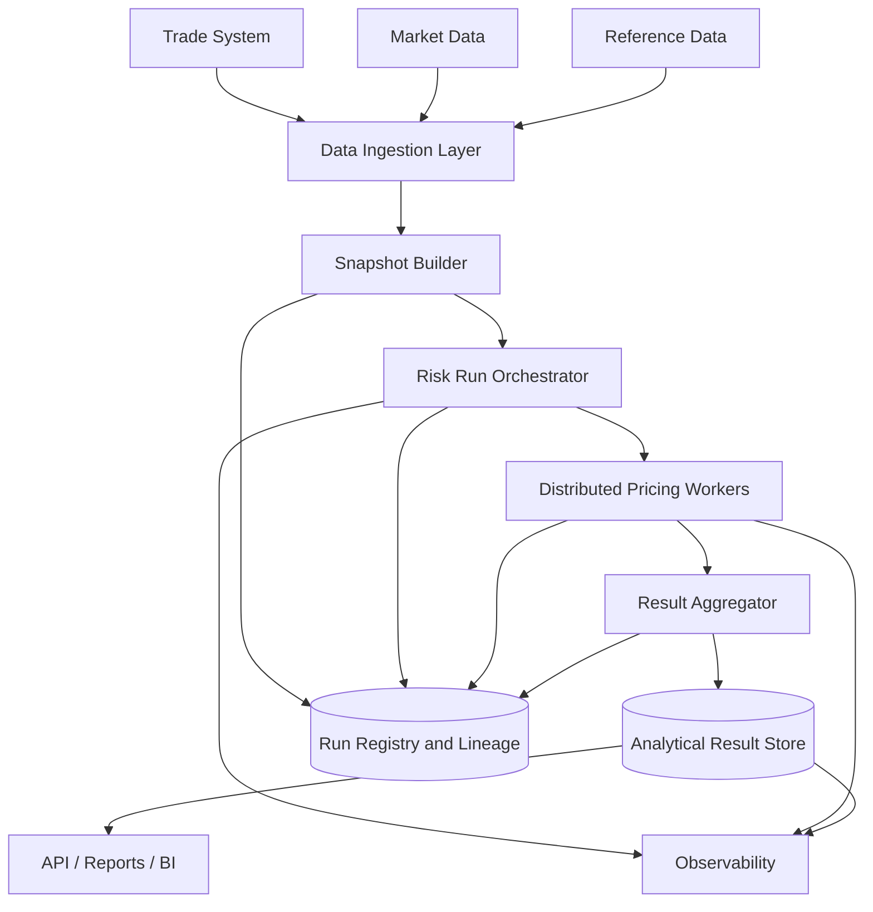

# HSBC Risk System Interview Knowledge Base

## 项目一句话定位

这是一个面向金融交易业务的风险计算与估值平台，负责接入交易数据、市场数据和参考数据，基于定价模型计算 Greeks、VaR、PnL Explain、风险敞口等指标，并将结果提供给前台交易、风险管理、监管报表和下游分析系统。

面试中不要把它讲成“我做了一个 Dataflow / BigQuery 项目”，而要讲成：

> 这是一个把金融风险模型生产化的平台：它需要在有限 batch window 内处理大量 portfolio、trade、scenario 和 market data，并保证结果可追溯、可重跑、可解释、可审计。

## 面试开场版本

我参与的是 HSBC 风险计算平台，核心目标是为交易和风险团队提供估值、Greeks、VaR 等风险指标计算。这个系统的难点不是单纯调用模型，而是如何把交易数据、市场数据、参考数据和定价模型组织成稳定的分布式计算平台。

典型链路包括：

- trade ingestion
- market data snapshot
- reference data versioning
- risk run orchestration
- distributed pricing workers
- result aggregation
- analytical result store
- downstream reporting

我会重点讲任务拆分、snapshot consistency、失败重试、幂等写入、结果 lineage、batch SLA 和云上成本控制。

## 推荐架构

## 核心难点与面试表达

### 1. 风险计算不是普通 CRUD

真实 case：

- 一个 portfolio 可能包含大量交易，不同产品的定价成本差异很大。
- 普通 equity / FX 计算很快，复杂衍生品、路径依赖产品、volatility surface 或 Monte Carlo 计算可能很慢。
- 如果简单按 trade count 均分任务，某些 worker 很快结束，某些 worker 会拖很久，整个 batch run 被少数 straggler 卡住。

面试表达：

- Risk 系统的核心难点之一是计算成本高度不均匀。
- 任务拆分不能只按 trade 数量，而要考虑 product type、pricing model、scenario count、historical runtime profile 和 portfolio priority。
- 更成熟的方案是 cost-based partitioning：按历史耗时估算任务成本，把复杂 trade 进一步拆分，把简单 trade 合并，提高 worker 利用率并减少 straggler。

可追问：

Q：为什么不能简单按 portfolio 拆？

A：portfolio 是业务边界，但不是稳定的计算成本边界。一个小 portfolio 如果包含 exotic products，计算成本可能比大 portfolio 更高。调度时应该在 portfolio 边界内继续按 product、scenario 和 estimated cost 拆。

Q：如何处理 straggler？

A：记录 task runtime profile，做 cost-based planning；对超大任务 further split；对慢任务设置 timeout 和 retry；对关键 portfolio 优先计算；对低优先级任务延后。

### 2. 数据快照一致性

真实 case：

- 同一次 risk run 的一部分任务用了 10:00 的 curve，另一部分用了 10:05 的 curve。
- 结果会混用不同版本的 trade、market data 和 reference data，无法解释，也无法审计。

面试表达：

- 金融风险系统最重要的不变量之一是同一次 risk run 必须使用一致的数据快照。
- 不能让不同 worker 各自读取 latest data。
- 需要先构建 snapshot，包括 `trade_snapshot_id`、`market_data_snapshot_id`、`reference_data_version`，再把 snapshot id 传给所有计算任务。
- 所有结果都带 `run_id` 和 snapshot id，保证可追溯和可重跑。

可追问：

Q：为什么不能直接读 latest market data？

A：latest 是不断变化的。如果计算持续几十分钟，不同任务会读到不同版本。Risk result 要求一致、可审计和可重跑，所以必须固定 snapshot。

Q：market data 缺失怎么办？

A：critical risk factor 缺失则 fail task；非关键字段可以使用 last good value，但必须显式标记；所有 missing data 进入 exception report。

### 3. Greeks 计算的任务爆炸

真实 case：

- Greeks 需要对利率曲线、FX、equity price、volatility surface 等 risk factors 做 bump。
- 任务数量约等于 `trade count * risk factor count * scenario count`，会迅速膨胀。

面试表达：

- Greeks 的挑战是 scenario explosion。
- Delta、Gamma、Vega 等本质上需要在不同 shock 下重新 pricing。
- 设计时要考虑 risk factor grouping、scenario batching、model result caching 和 parallel execution。
- 对 curve、vol surface、reference data 等可复用对象，要避免每个 task 重复加载。

可追问：

Q：Greeks 如何并行？

A：可以按 portfolio、product type、risk factor、scenario 分片。每个 worker 处理一组 trade + scenario，输出 sensitivity result，最后按 portfolio 和 risk factor 聚合。

Q：如何减少重复计算？

A：缓存 market data object，例如 curve、vol surface；复用 base PV；简单产品优先使用 analytic Greeks；复杂产品再使用 bump-and-reprice。

### 4. VaR 是 portfolio-level 聚合

真实 case：

- VaR 不是单个 trade 指标，而是 portfolio-level loss distribution。
- 需要基于历史模拟或 Monte Carlo 场景计算 portfolio PnL 分布，再取 95% 或 99% percentile。

面试表达：

- VaR 不能把 trade-level VaR 简单相加，因为 portfolio 内部存在相关性、净额效应和 offset。
- 系统通常先生成 scenario set，再对 portfolio 在每个 scenario 下重新估值，得到 PnL distribution，最后做 percentile aggregation。
- 关键是 scenario generation、market data alignment、portfolio aggregation 和 lineage。

可追问：

Q：为什么 trade-level VaR 不能直接相加？

A：风险因子存在相关性和 offset，简单加总会高估或误估 portfolio risk。VaR 必须在组合层看 PnL distribution。

Q：如何支持 VaR rerun？

A：每个 run 记录 `run_id`、`scenario_set_id`、`trade_snapshot_id`、`market_data_snapshot_id` 和 `model_version`。rerun 时用同一套输入重新生成结果。

### 5. 失败重试与幂等写入

真实 case：

- 一个 risk run 可能有成千上万个 task。
- worker 可能因为模型异常、数据缺失、网络问题、机器重启或写入失败中断。
- 如果每次失败都整批重跑，成本和时间不可接受。

面试表达：

- Risk 系统必须支持 task-level retry 和 partial rerun。
- 每个 task 要有稳定 `task_id`，结果写入要幂等。
- failure 要区分 transient failure、data failure 和 model failure。
- transient failure 自动 retry；data failure 进入 exception queue；model failure 记录 product、trade_id、model version 和 stack trace，交给 quant 或 support team 排查。

可追问：

Q：如何保证重试不产生重复结果？

A：使用 `run_id + task_id + scenario_id + risk_type` 作为唯一键，写入时 upsert 或先写 staging table。只有全部关键任务完成后，才把 run 标记为 completed。

Q：写入成功但 ack 失败怎么办？

A：consumer 可能重复执行，所以写入必须幂等。重复消息再次处理时覆盖同一 key 或检测已写入，不应产生重复行。

### 6. Result Lineage 与审计

真实 case：

- 风险经理问：“为什么今天 VaR 比昨天高了 30%？”
- 如果系统只能给出数值，不能说明输入数据、模型版本、scenario 和 rerun 情况，就无法支持业务解释和审计。

面试表达：

- 金融系统里结果正确还不够，必须可解释、可追溯、可审计。
- 每条 risk result 都应该带 `run_id`、`valuation_date`、`trade_snapshot_id`、`market_data_snapshot_id`、`model_version`、`scenario_set_id`、`created_at` 和 `rerun_flag`。
- 这样可以定位波动来自 position change、market move、model change 还是 scenario set change。

可追问：

Q：如何分析 VaR jump？

A：从 position change、market move、model/scenario change 三个维度拆。系统有 lineage 后，就能对比昨天和今天的 trade snapshot、market data snapshot 和 model version。

Q：为什么 lineage 是系统设计问题，不是报表问题？

A：lineage 必须从计算开始就写入每条结果。如果结果生成后再补，上下文容易丢失，也无法保证 rerun 可比。

### 7. 分析存储成本与查询性能

真实 case：

- risk result 维度多、数据量大。
- 如果 analyst 每次查询都 full scan，成本会高，查询也慢。

面试表达：

- Risk result 是 analytical workload。
- 明细结果表按 `valuation_date` 分区，按 `portfolio_id`、`risk_type`、`scenario_id`、`product_type` clustering。
- 高频 dashboard 查询要做 pre-aggregation 或 serving table，不能每次扫明细表。

可追问：

Q：查询太贵怎么办？

A：优化 partition pruning 和 clustering；限制 ad-hoc query 扫描范围；为 dashboard 做 summary table；对常用报表做 scheduled aggregation；必要时增加 API serving store。

Q：为什么不直接用 PostgreSQL 存全部 risk result？

A：PostgreSQL 适合 transactional query 和中小规模 serving，不适合超大规模多维分析。risk result 更像 analytical workload，列式分析存储更适合聚合查询。

## 高频面试题与标准回答

Q1：这个 Risk 系统最大的技术挑战是什么？

A：最大挑战是把高计算成本的金融模型稳定生产化。系统要在 batch window 内完成大量 portfolio、trade、scenario 和 risk factor 计算，同时保证输入 snapshot 一致、任务可重试、结果可追溯、查询可扩展、成本可控。

Q2：如何设计 Greeks 计算？

A：先固定 trade 和 market data snapshot，然后生成 risk factor shock scenarios。任务按 portfolio、product type、risk factor 和 scenario 拆分。worker 对每组 trade + scenario 做 pricing，输出 sensitivity result，最后按 portfolio 和 risk factor 聚合。

Q3：如何设计 VaR 计算？

A：VaR 是 portfolio-level 计算。先生成或读取 scenario set，在每个 scenario 下重估 portfolio，得到 PnL distribution，再取 percentile。系统必须记录 scenario_set_id、snapshot id 和 model version，保证 VaR 可重跑和可解释。

Q4：如何处理任务失败？

A：区分 transient failure、data failure、model failure。临时失败自动 retry；数据缺失进入 exception queue；模型异常记录 trade_id、product type、model version 和错误详情。所有 task 都有 task_id，结果写入幂等，支持 partial rerun。

Q5：如何保证结果可追溯？

A：每条结果都带 run_id、valuation_date、trade_snapshot_id、market_data_snapshot_id、reference_data_version、model_version、scenario_set_id 和 task_id。这样可以回答“这个结果从哪里来、用了什么输入、能否重跑”。

Q6：为什么用 Pub/Sub + Dataflow？

A：Pub/Sub 用于事件解耦和 ingestion buffer，Dataflow 适合批流一体的数据处理、清洗、窗口聚合和写入分析存储。在 GCP 生态下它们能快速构建弹性 pipeline，但 late data、schema evolution、debugging 和成本控制要设计好。

Q7：结果表怎么设计？

A：明细结果表按 valuation_date partition，按 portfolio_id、risk_type、scenario_id、product_type clustering。另建 summary table 支持 dashboard 和高频报表。所有表保留 run_id 和 snapshot metadata。

Q8：如何优化 batch SLA？

A：先定位瓶颈：数据准备、任务生成、worker 计算、straggler、写入、聚合还是查询。优化方法包括 cost-based task split、worker autoscaling、缓存 market data、批量写入、优先级调度、partial rerun 和 pre-aggregation。

Q9：如何和 quant team 合作？

A：把模型接入变成清晰接口契约：input schema、market data dependency、model parameters、output schema、error handling、versioning 和 regression test。Quant 关注模型正确性，engineering 关注稳定性、性能和可运维性。

Q10：Senior 贡献怎么总结？

A：我关注的是平台化能力，不只是实现某个计算逻辑。比如 task orchestration、snapshot consistency、lineage、retry、idempotency、analytical data model 和 monitoring，这些能力可以支撑多个 risk type 和多个业务场景。

## 最佳项目总结模板

> 这个项目的核心是把金融风险模型生产化。风险计算不同于普通业务系统，它有高计算成本、高数据一致性要求、高审计要求和严格 batch SLA。
>
> 我会把系统拆成 ingestion、snapshot builder、risk run orchestrator、distributed workers、result aggregator 和 analytical storage。Ingestion 接入交易、市场和参考数据；snapshot builder 固定同一次 run 的输入版本；orchestrator 生成 run_id 和 task plan；workers 并行计算 Greeks、VaR 或 valuation；aggregator 聚合结果；analytical store 支撑多维分析和报表。
>
> 这个系统最关键的不变量是：同一次 run 使用一致 snapshot；task 可以失败重试；结果写入幂等；每条结果都有 lineage；batch 必须在 SLA 内完成；查询成本必须可控。

## Senior Architecture 深度思考

### 1. High-level 架构边界

Senior 版本不要只讲“我用了 Pub/Sub、Dataflow、BigQuery”，而要讲清系统边界：

- **front office / trade source** 提供交易、position、book、counterparty、product economics。
- **market data platform** 提供 curve、FX、equity、vol surface、credit spread 和 fixings。
- **reference data** 提供 product static、holiday calendar、legal entity、book hierarchy 和 risk factor mapping。
- **risk platform** 不拥有交易真相和市场数据真相，它负责 snapshot、calculation、aggregation、lineage 和 publication。
- **downstream consumers** 包括 trader dashboard、risk manager report、finance PnL explain、regulatory reporting 和 data science analysis。

面试表达：

> 我会先把 ownership 分清楚：trade system 是 position source of truth，market data platform 是 risk factor source of truth，risk platform 的责任是把这些输入按 valuation date 固定成可计算、可审计、可重跑的 risk run。

### 2. Senior 需要主动讲的 8 个设计维度

| 维度 | Senior 关注点 | 面试表达 |
|---|---|---|
| Domain boundary | risk platform 不应该拥有 trade truth | 只消费 snapshot，不改交易真相 |
| Data consistency | 同一 run 固定输入版本 | snapshot id 是结果可比性的基础 |
| Compute orchestration | 任务成本不均匀 | cost-based partitioning 减少 straggler |
| Model integration | quant model 需要接口契约 | schema、version、error semantics、regression test |
| Result model | 明细和聚合分层 | detail table 支持 drill-down，summary table 支持 dashboard |
| Failure handling | 失败类型不同 | transient retry，data exception，model investigation |
| Governance | 每个数字可解释 | lineage、audit trail、rerun registry |
| Cost and SLA | 云成本与 batch window 同时优化 | partition pruning、autoscaling、priority scheduling |

### 3. 架构决策背后的 trade-off

Q：为什么不是所有计算都做 real-time？

A：风险计算有很多高成本 scenario 和模型依赖，实时计算全部风险指标成本很高，也不一定符合业务需求。常见做法是 intraday 做核心指标和限额预警，EOD batch 做完整 Greeks、VaR、stress 和报表。Senior 答案要区分 real-time risk、near-real-time risk 和 EOD official risk。

Q：为什么需要 run registry？

A：run registry 是 risk platform 的控制平面。它记录 run 状态、输入 snapshot、task plan、model version、rerun history 和 publication status。没有 registry，系统只能“跑 job”，不能管理 production-grade risk run。

Q：为什么 result store 要分 detail 和 summary？

A：detail result 支持审计、drill-down 和问题排查；summary result 支持 dashboard 和高频报表。把两者混在一张表里，要么查询太贵，要么丢失审计细节。

Q：什么时候用 Dataflow，什么时候用 Spark / Kubernetes workers？

A：Dataflow 适合数据清洗、窗口聚合、批流一体 pipeline；Spark 适合大规模 batch transform 和分布式数据处理；Kubernetes workers 更适合模型执行需要自定义 runtime、native library、quant library 或复杂 resource profile 的场景。Senior 回答要按 workload 选择，而不是按工具偏好选择。

## 潜在难点与亮点

### 难点一：模型正确性和平台稳定性的边界

Quant team 负责模型理论正确性，engineering team 负责可运行、可扩展、可观测和可恢复。真正难点在接口边界：

- model input schema 如何 versioning
- market data dependency 如何声明
- model failure 如何分类
- model output 如何 regression test
- model version change 如何 impact analysis

亮点表达：

> 我会把 quant model 当作 versioned compute unit 接入平台，而不是黑盒函数。每次模型变更都要有 schema contract、regression test、canary run 和 result comparison。

### 难点二：Data quality 不能静默吞掉

风险系统最怕“算出一个看似正常但其实错误的数字”。Data quality 问题要显式暴露：

- missing curve
- stale fixing
- invalid product static
- unsupported product
- stale trade feed
- inconsistent book hierarchy

亮点表达：

> 对 risk platform 来说，fail fast 有时比 silent fallback 更安全。critical market data 缺失应该进入 exception workflow，而不是用 last value 静默覆盖。

### 难点三：Batch SLA 和成本同时存在

只追求快会导致过度扩容，只追求省钱会 miss SLA。Senior 需要讲调度策略：

- portfolio priority
- risk type priority
- dynamic autoscaling
- spot / preemptible worker 的适用边界
- task cost profile
- late task escalation
- partial publication

亮点表达：

> 我会把 SLA 拆成 data readiness、task planning、compute、aggregation、publication 几段分别监控。优化不是盲目加 worker，而是找出真正的 critical path 和 straggler pattern。

### 难点四：审计、监管和工程设计是一体的

银行系统里“能算出来”不是终点。结果必须能回答：

- 谁触发了这个 run？
- 使用了哪一版 trade snapshot？
- 使用了哪一版 market data？
- 使用了哪一版 model？
- 哪些 task failed 后 rerun？
- 结果何时发布给下游？
- 与昨日结果差异来自哪里？

亮点表达：

> 我会把 auditability 设计进 data model 和 workflow，而不是最后在报表层补日志。每条 result 都带 lineage metadata，每次 publication 都可追踪。

## Senior 面试问题库

### Architecture

Q：如果让你重新设计这个 risk platform，你会先定哪几个架构原则？

A：我会先定六个原则：snapshot consistency、task-level idempotency、model versioning、lineage by design、detail/summary storage separation、SLA-driven orchestration。它们决定系统能否从单个 batch job 演进成真正的平台。

Q：如何从 monolithic risk batch 迁移到 platform architecture？

A：先不拆模型逻辑，先建立 run registry、snapshot registry 和 result schema；再把计算任务外部化为 task queue；然后逐步把 product/model worker 拆出来；最后引入 cost-based scheduling 和 independent scaling。迁移顺序要保护结果一致性，不能一上来大拆模型。

### Data and Consistency

Q：如果 trade snapshot 已经固定，但 market data late arrival 怎么办？

A：official run 应该使用 cutoff 前固定的 market snapshot。late arrival 进入 correction workflow，可触发 rerun 或 adjustment report，但不能悄悄修改已发布结果。这样能保持 official result 的可审计性。

Q：如何做 reconciliation？

A：对输入做 trade count、notional、book hierarchy reconciliation；对输出做 result count、portfolio total、risk factor coverage、day-over-day movement check；对 publication 做 downstream acknowledgement。Reconciliation 需要自动化 exception report。

### Compute and Performance

Q：worker 计算慢，你怎么定位？

A：先分解耗时：data loading、model initialization、market data calibration、pricing loop、serialization、write latency。再按 product type、model version、scenario count 聚合 runtime profile，判断是模型慢、数据加载慢、worker 资源不足还是 straggler partitioning 问题。

Q：如何做 capacity planning？

A：用 trade count、scenario count、average model runtime、parallelism、worker CPU/memory、batch window 倒推需要的 compute capacity。再留出 retry、straggler 和 data delay buffer。容量规划要按 risk type 和 portfolio priority 分层。

### Reliability

Q：如果 result aggregator 失败怎么办？

A：worker 明细结果先写 staging，aggregator 是可重跑的 deterministic job。失败后用同一 run_id 重跑 aggregation，不需要重算全部 pricing。aggregation output 也要幂等写入 summary table。

Q：如何避免 poison task 卡住整个 run？

A：task 有 retry limit 和 failure classification。超过阈值后进入 exception queue，不阻塞其他 task。run completion 可以定义为 critical task 全部成功，non-critical task 有 exception report，并由业务决定是否 publish。

### Governance

Q：模型版本升级怎么上线？

A：先跑 regression suite，再做 shadow run，对比旧模型和新模型在关键 portfolio、risk type、scenario 下的差异。差异超过阈值需要 quant sign-off。上线后保留 model_version lineage，支持回滚和 rerun。

Q：如何向非技术风险经理解释你的系统价值？

A：我会说这个平台让风险数字更稳定、更可解释、更快交付。它不只是让计算跑得更快，还能在 VaR jump、市场数据缺失、模型变化或任务失败时快速定位原因，减少人工排查和报表延迟。

## 相关

- [[Risk Platform]]
- [[Risk Calculation System]]
- [[Pricing Engine]]
- [[Greeks]]
- [[Value at Risk]]
- [[Risk Aggregation]]
- [[Market Data Pipeline]]
- [[Reference Data]]
- [[Data Lineage]]
- [[Batch Processing]]
- [[Workflow Orchestration]]
- [[Distributed Computing]]
- [[Result Store]]
- [[Design a Risk Calculation Platform]]
