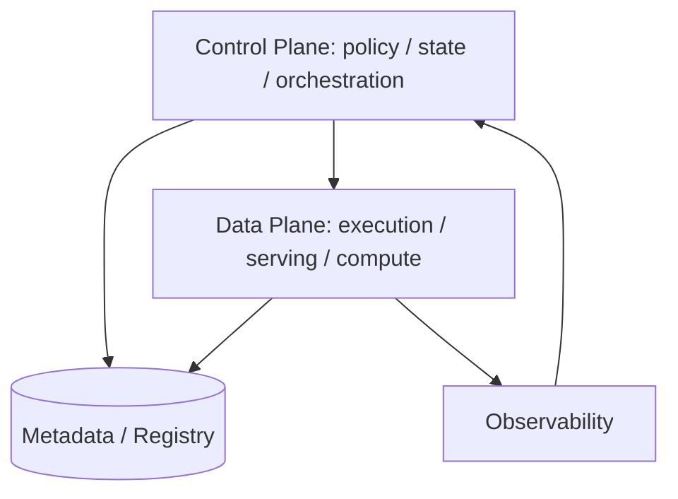

# Cross-Domain System Flow Patterns

不同知识域表面差异很大，但 senior architecture 的底层流程高度相似：输入进入系统，被规范化、验证、编排、计算或检索，最后生成可服务、可解释、可监控的输出。

## 1. 通用系统流转图

```mermaid
flowchart LR
    Source[External / Internal Sources]
    Ingest[Ingestion]
    Normalize[Normalize and Validate]
    Snapshot[Snapshot or Version]
    Orchestrate[Orchestrate / Plan]
    Execute[Execute / Compute / Retrieve]
    Aggregate[Aggregate / Rank / Decide]
    Store[(Store Results)]
    Serve[Serve / Report / Act]
    Observe[Observe and Govern]

    Source --> Ingest
    Ingest --> Normalize
    Normalize --> Snapshot
    Snapshot --> Orchestrate
    Orchestrate --> Execute
    Execute --> Aggregate
    Aggregate --> Store
    Store --> Serve
    Serve --> Observe
    Observe --> Orchestrate
```

这条链路可以映射到几乎所有目录：

- 投行风险：trade/market data -> snapshot -> risk run -> pricing workers -> risk result -> report。
- GenAI：documents -> chunk/embedding -> retrieval -> LLM/agent -> grounded answer -> evaluation。
- 系统设计：request/event -> validation -> queue/cache/storage -> processing -> serving。
- 量化研究：raw data -> cleaning -> feature -> backtest -> metrics -> production signal。
- 资产配置：income/goals -> risk profile -> allocation -> execution -> monitoring -> rebalance。

## 2. Pattern: Snapshot Then Compute

适用于：

- risk calculation
- backtesting
- financial reporting
- model evaluation
- portfolio review

核心思想：

- 先固定输入版本，再执行计算。
- 结果带 snapshot id。
- rerun 使用同一套输入。

Senior 追问：

Q：为什么不直接用 latest data？

A：latest 适合实时展示，不适合 official calculation。只要计算有持续时间，latest 就会导致输入混版本，结果不可解释。

## 3. Pattern: Event Log Then Derived Views

适用于：

- notification
- trade lifecycle
- PnL explain
- RAG ingestion
- user behavior analytics

核心思想：

- event log 保存可回放事实。
- cache、index、summary、dashboard 都是 derived views。
- derived view 异常时从 event log 重建。

Senior 追问：

Q：什么时候一定要保留 event log？

A：当系统需要审计、重放、修复派生视图、解释结果变化或支持多消费者时，就应该保留 event log。

## 4. Pattern: Control Plane / Data Plane Separation

适用于：

- risk platform
- AI agent platform
- workflow orchestration
- distributed compute
- cloud infrastructure

Senior 表达：

- control plane 管状态、策略、审批、调度。
- data plane 执行请求、计算、检索、推送。
- 两者分离后，执行层可以扩缩容和失败重试，而控制层保持一致性。

## 5. Pattern: Hot Path / Cold Path Separation

适用于：

- crypto price system
- search system
- recommendation system
- market data platform
- dashboard/reporting

| 路径 | 目标 | 数据 |
|---|---|---|
| Hot path | 快速响应用户或交易系统 | latest value、cache、serving index |
| Cold path | 准确、完整、可重放 | historical store、warehouse、object storage |

Senior 追问：

Q：hot path 和 cold path 结果不一致怎么办？

A：先定义哪个是 official truth。hot path 可以短暂陈旧或近似；cold path 通常用于审计和修正。需要 reconciliation job 和 data freshness metric。

## 6. Pattern: Model as Versioned Compute Unit

适用于：

- pricing model
- ML model
- GenAI prompt/model chain
- quant strategy
- risk factor model

核心字段：

- model version
- input schema version
- dependency version
- runtime config
- evaluation / regression result
- approval status

Senior 表达：

> I would not treat the model as a black box. I would treat it as a versioned compute unit with declared inputs, outputs, dependencies, tests and rollout controls.

## 7. Pattern: Decision System with Human Override

适用于：

- AI agent automation
- investment allocation
- risk limit breach
- fraud / compliance review
- production incident response

设计思路：

- 系统生成 recommendation。
- 高风险决策需要 human approval。
- 所有 override 都记录原因。
- 后续用 override 数据改进规则或模型。

Senior 追问：

Q：什么时候需要 human-in-the-loop？

A：当错误成本高、监管要求强、模型不确定性高、或者 action 不可逆时，需要 human review 或 approval gate。

## 相关

- [[Senior Architecture Decision Framework]]
- [[Domain Architecture Playbooks]]
- [[Event-Driven Architecture for System Design]]
- [[Data Lineage]]
- [[RAG]]
- [[Backtesting and Research Workflow]]
