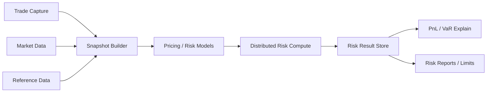
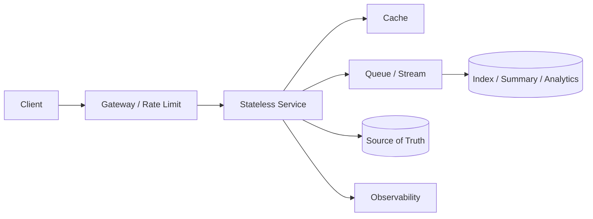
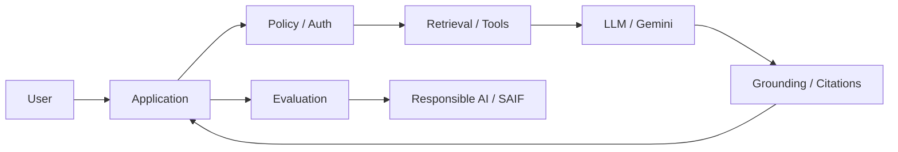
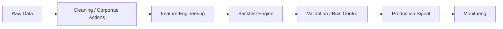
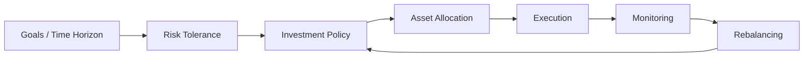

# Domain Architecture Playbooks

本页把整个知识库按 senior architecture 方式重新组织：每个领域都给出高层流程、设计取舍、难点亮点和面试追问。

## 1. Investment Banking / Risk / Valuation

### High-level Flow

Senior 设计维度：

- source of truth：trade、market data、reference data 分别由不同平台拥有。
- snapshot consistency：official run 必须固定输入版本。
- model governance：pricing model、risk model、scenario set 都需要 versioning。
- compute scale：Greeks、VaR、XVA 需要大规模并行。
- auditability：每个结果必须能解释输入、模型和 rerun。

核心取舍：

- real-time risk vs EOD official risk
- detail result vs summary result
- analytic Greeks vs bump-and-reprice
- PostgreSQL serving vs columnar analytical store
- fail fast vs fallback with data quality flag

潜在面试问题：

Q：为什么 risk result 必须带 lineage？

A：因为风险数字会被交易、管理层、财务和监管使用。没有 lineage，就无法解释 day-over-day jump、模型变化、市场数据修正或 rerun 差异。

## 2. System Design

### High-level Flow

Senior 设计维度：

- API 先行：API 迫使你定义访问模式。
- source of truth：DB/event log 是真相，cache/index 是视图。
- failure mode：限流、降级、重试、幂等、DLQ。
- scalability：水平扩展前先消除状态和热点。
- observability：指标必须对应用户体验和系统瓶颈。

核心取舍：

- sync vs async
- strong consistency vs eventual consistency
- cache freshness vs latency
- fanout-on-write vs fanout-on-read
- precompute vs on-demand

潜在面试问题：

Q：如果规模扩大 10 倍，你先看什么？

A：先看 dominant path 和 bottleneck：read/write ratio、cache hit rate、DB QPS、queue lag、hot key、P99 latency、storage growth。不要先盲目加组件。

## 3. Google GenAI / AI Applications

### High-level Flow

Senior 设计维度：

- problem fit：不是所有问题都需要 GenAI。
- retrieval vs fine-tuning：企业知识优先 RAG，行为/风格才考虑 fine-tuning。
- tool use：高风险 tool 要权限、审计、approval。
- evaluation：上线前后都要评估 faithfulness、latency、cost、safety。
- governance：privacy、security、Responsible AI、SAIF。

核心取舍：

- larger model vs better retrieval
- long context vs RAG
- agent autonomy vs workflow control
- speed vs grounding quality
- automation vs human-in-the-loop

潜在面试问题：

Q：企业知识助手为什么通常选 RAG？

A：因为企业知识会变化，且需要权限过滤和引用来源。RAG 可以使用最新文档、减少 hallucination，并保留 grounding 和 access control。

## 4. Quant Programmer / Research Platform

### High-level Flow

Senior 设计维度：

- data correctness：survivorship bias、look-ahead bias、corporate actions。
- reproducibility：data version、code version、config version。
- performance：vectorization、parallelism、profiling。
- research-to-production gap：回测逻辑和生产执行一致性。
- monitoring：signal drift、slippage、data delay。

核心取舍：

- research speed vs production rigor
- vectorized backtest vs event-driven backtest
- simple interpretable strategy vs complex model
- historical fidelity vs simulation cost

潜在面试问题：

Q：一个策略回测很好，为什么生产可能失败？

A：可能有 look-ahead bias、交易成本低估、流动性约束、数据修正、过拟合、延迟、执行偏差或 regime shift。Senior 需要把 research validation 和 production monitoring 一起讲。

## 5. Investing and Asset Allocation

### High-level Flow

Senior 设计维度：

- objective first：先目标、期限、流动性，再谈产品。
- risk budget：回撤承受力比收益想象更重要。
- diversification：资产、地域、因子、货币分散。
- execution discipline：再平衡、税费、成本。
- behavioral control：避免追涨杀跌。

核心取舍：

- strategic vs tactical allocation
- simplicity vs optimization
- liquidity vs return
- tax efficiency vs rebalancing precision
- home bias vs international diversification

潜在面试问题：

Q：为什么资产配置比选单个产品更重要？

A：长期组合结果主要由风险暴露、资产相关性、成本和行为纪律决定。单个产品选择有作用，但不能替代目标、期限和风险预算。

## 6. Career / Interview Knowledge

Senior 设计维度：

- narrative architecture：把经历组织成可复用故事。
- evidence-based answer：结果、指标、影响范围。
- stakeholder thinking：不同听众关心不同风险。
- trade-off explanation：为什么这么做，而不是只说做了什么。
- reflection：知道下次如何改进。

潜在面试问题：

Q：如何把项目经历讲成 senior story？

A：不要按任务流水账讲，要按 problem、constraints、decision、trade-off、execution、result、learning 讲。重点是你如何判断和推动，而不是只证明你参与过。

## 相关

- [[Senior Architecture Decision Framework]]
- [[Cross-Domain System Flow Patterns]]
- [[Senior Architecture Interview Question Bank]]
- [[Investment Banking Knowledge Map]]
- [[System Design Knowledge Map]]
- [[Google Generative AI Leader Certification Knowledge Map]]
- [[Quant Programmer Roadmap]]
- [[Investing and Asset Allocation Knowledge Map]]
