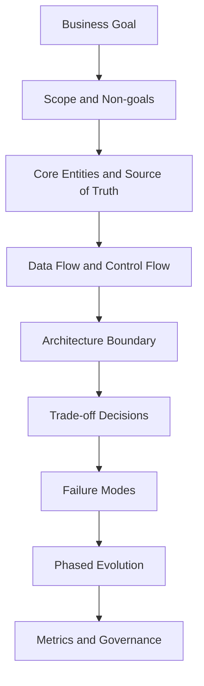
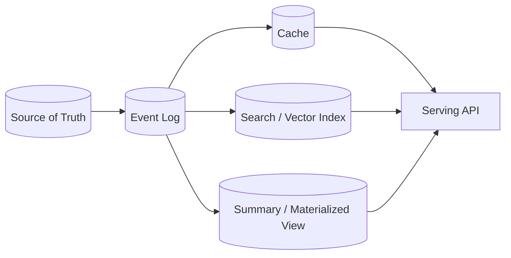

# Senior Architecture Decision Framework

Senior architecture 的核心不是知道更多组件，而是能解释 **为什么这个业务约束下，这个设计比其他设计更合理**。

## 1. High-level Answer Flow

面试表达：

> I would first define the business objective and the source of truth. Then I would separate the online path, offline path and control plane. After that I would discuss the core trade-offs, failure modes, phased evolution and operational metrics.

## 2. Architecture Boundary

任何系统都要先问边界。

| 问题 | Senior 关注点 | 例子 |
|---|---|---|
| 谁拥有真相？ | source of truth | trade system owns trades，risk platform owns run results |
| 谁只是视图？ | derived view | Redis cache、search index、summary table |
| 谁负责状态推进？ | control plane | workflow orchestrator、run registry、booking state machine |
| 谁负责执行？ | compute plane | pricing workers、agent tools、batch jobs |
| 谁负责治理？ | governance plane | audit log、approval、entitlement、model review |

常见误区：

- 一上来画组件，不定义 ownership。
- 把 cache、index、summary table 当成真相。
- worker 自己决定 official 状态，导致状态不可控。

## 3. Source of Truth vs Derived View

Senior 表达：

- Source of truth 必须强约束 schema、version、ownership 和 audit。
- Derived view 可以延迟，但必须可重建。
- 如果 derived view 不可重建，就要按 source of truth 的标准治理。

适用例子：

- Risk result detail 是 truth，dashboard summary 是 derived view。
- Trade capture 是 truth，risk cube 是 derived view。
- Document store 是 truth，vector database 是 RAG retrieval view。
- Brokerage account ledger 是 truth，portfolio dashboard 是 derived view。

## 4. Online Path / Offline Path / Control Plane

Senior 答案要把三条路径分开。

| 路径 | 目标 | 典型组件 | 设计重点 |
|---|---|---|---|
| Online path | 用户实时体验 | API、cache、serving DB、WebSocket | latency、availability、degradation |
| Offline path | 批处理和分析 | ETL、batch jobs、warehouse、feature store | correctness、cost、replay |
| Control plane | 状态和治理 | orchestrator、registry、workflow、approval | consistency、audit、recoverability |

例子：

- Crypto price：online path 是 latest price API / WebSocket；offline path 是 historical bucket；control plane 是 source health 和 replay。
- Risk platform：online path 是 report API；offline path 是 risk run compute；control plane 是 run registry。
- GenAI assistant：online path 是 chat inference；offline path 是 ingestion / embedding；control plane 是 prompt/version/eval/governance。

## 5. Trade-off Matrix

| Trade-off | 选择 A | 选择 B | Senior 判断 |
|---|---|---|---|
| Consistency vs latency | 强一致 | 最终一致 | official financial result 偏强一致，feed/search 偏最终一致 |
| Compute cost vs freshness | 预计算 | 实时计算 | 高成本风险指标预计算，低成本展示可实时 |
| Simplicity vs extensibility | 单体 job | 平台化 orchestration | 一次性任务可简单，长期多业务要平台化 |
| Storage cost vs audit | 只存汇总 | 存明细 + lineage | 银行/监管/风控必须保留明细 |
| Availability vs correctness | 降级返回旧值 | fail closed | 交易/风控关键结果倾向 fail closed，内容展示可 stale |
| Vendor speed vs portability | 托管服务 | 自建抽象层 | early stage 用托管，核心能力要保留边界 |

## 6. Failure Mode Thinking

Senior 需要主动说 failure mode，而不是等面试官问。

常见 failure categories：

- input failure：缺失、延迟、脏数据、schema change。
- compute failure：worker crash、straggler、timeout、OOM。
- state failure：重复执行、状态不一致、partial completion。
- serving failure：cache miss storm、slow query、hot key。
- governance failure：无法解释结果、权限泄漏、审计缺失。

回答模板：

> I would classify failures into transient, data, model/business and infrastructure failures. Each category should have a different retry, quarantine and escalation path.

## 7. Phased Evolution

Senior 设计不是一步到位，而是分阶段。

### Phase 1: MVP

- 明确 source of truth。
- 实现最短主链路。
- 加基本日志、错误处理和手动 rerun。

### Phase 2: Scale

- 引入 cache、queue、parallelism、partitioning。
- 加自动 retry、idempotency、metrics。
- 拆分 read path 和 write path。

### Phase 3: Platform

- 引入 control plane、workflow、versioning、lineage。
- 支持多业务、多模型、多租户。
- 加治理、权限、审计、成本控制和 SLO。

## 8. Senior Metrics

不要只说 QPS 和 latency。

| 类别 | 指标 |
|---|---|
| User experience | P50/P95/P99 latency、error rate、availability |
| Data quality | missing data count、stale data age、schema failure |
| Compute | task runtime、straggler ratio、worker utilization、retry rate |
| Cost | cost per run、query scan bytes、cache hit rate |
| Governance | lineage coverage、audit completeness、approval SLA |
| Business | report delay、risk breach detection time、decision latency |

## 高频面试问题

Q：什么是 senior 和 mid-level 架构回答的区别？

A：mid-level 主要讲组件如何连接；senior 会先定义业务目标、ownership、source of truth、状态控制、failure mode、演进路径和治理指标。senior 不是画更复杂的图，而是让复杂性有理由、有边界、可运营。

Q：如何避免 over-engineering？

A：用 phased evolution。MVP 不引入不必要的平台层，但要保留边界，例如 idempotency key、version field、event log、basic lineage。这些边界让未来演进不需要推倒重来。

Q：怎么判断一个 derived view 是否安全？

A：看它是否可重建、延迟是否可接受、是否有版本标识、是否有 reconciliation。如果不可重建或影响 official decision，就不能当普通缓存处理。

## 相关

- [[Cross-Domain System Flow Patterns]]
- [[Domain Architecture Playbooks]]
- [[System Design Project Storytelling Template]]
- [[Design a Risk Calculation Platform]]
- [[GenAI System Architecture]]
