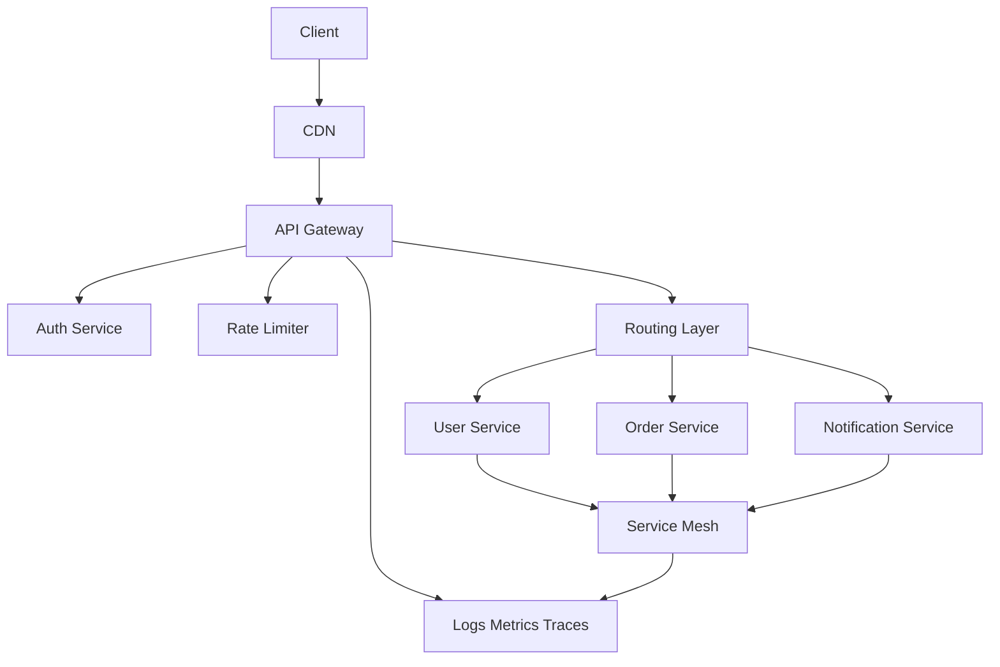
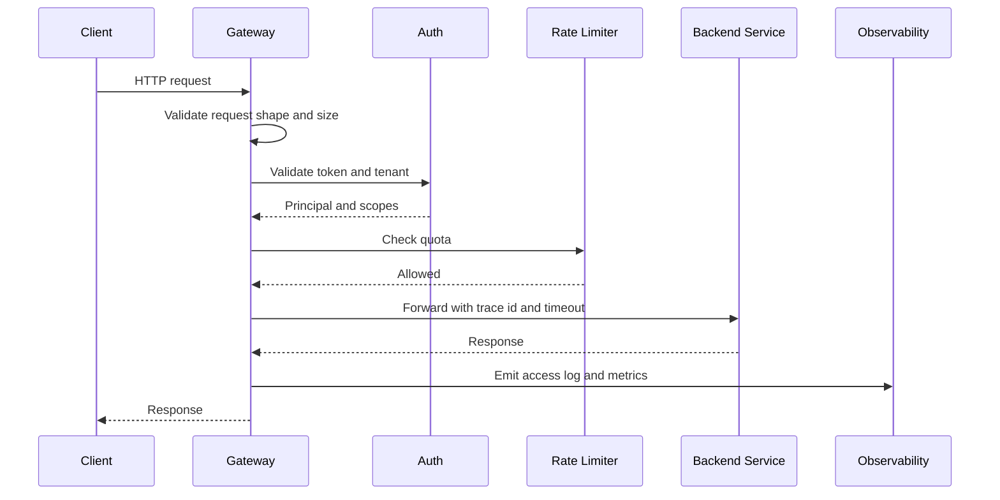

# API Gateway and Service Boundaries

服务边界和 API Gateway 决定系统怎样演化。真正的问题不是“要不要网关”，而是哪些能力应该放在统一入口，哪些能力必须留在业务服务里，避免网关变成新的大泥球。

API Gateway 适合处理横切能力：认证、鉴权入口、限流、路由、协议转换、请求校验、灰度发布、日志追踪和聚合少量轻量响应。业务规则、事务状态和领域决策不应该塞进 Gateway，否则服务边界会被绕开。

## Core Responsibilities

- **Routing**: 根据 path、host、version、tenant 或 header 把请求转到正确服务。
- **Auth and policy enforcement**: 做 token 校验、基础权限检查和租户隔离入口。
- **Rate limiting**: 在最靠前的位置保护下游服务。
- **Protocol translation**: 对外 HTTP/REST，对内 gRPC 或 service mesh。
- **Request shaping**: 统一 request id、header、timeout、payload size 和 schema validation。
- **Observability**: 记录 access log、latency、status code、trace id 和 upstream error。

## Gateway Architecture

## Request Flow

## Service Boundary Rules

- 按业务能力拆边界，而不是按技术层拆成 controller、service、dao 三个微服务。
- 一个服务应拥有自己的数据模型和关键 invariants，不要让多个服务共同写同一张核心表。
- 同步调用适合低延迟查询和强交互链路，跨服务状态变更要谨慎，必要时用事件或 Saga。
- 边界不清时先保持模块化 monolith，比过早拆成分布式系统更容易演进。
- API contract 要稳定，内部表结构可以变化，但对外 API 和事件 schema 要版本化。

## Common Failure Modes

- Gateway 里放太多业务逻辑，最后每个功能都要改网关。
- 服务拆得太细，单个用户请求需要调用 10 到 20 个服务，P99 latency 和故障率被放大。
- 多个服务共享数据库，表面上是微服务，实际上是分布式单体。
- Gateway timeout 大于下游 timeout，导致请求堆积和重试风暴。
- 认证、限流、灰度和观测逻辑在每个服务里重复实现，行为不一致。

## Interview Guidance

- 开场先说 Gateway 负责横切能力，业务服务负责领域规则。
- 画图时把 Gateway、Auth、Rate Limiter、Router、Backend Services 和 Observability 分开。
- 深挖时讲 timeout、retry、circuit breaker、schema versioning 和 service ownership。
- Trade-off 要说明：集中治理带来一致性，但 Gateway 不能成为业务变更瓶颈。

相关：

- [[Load Balancing]]
- [[Rate Limiting]]
- [[System Design Trade-offs]]
