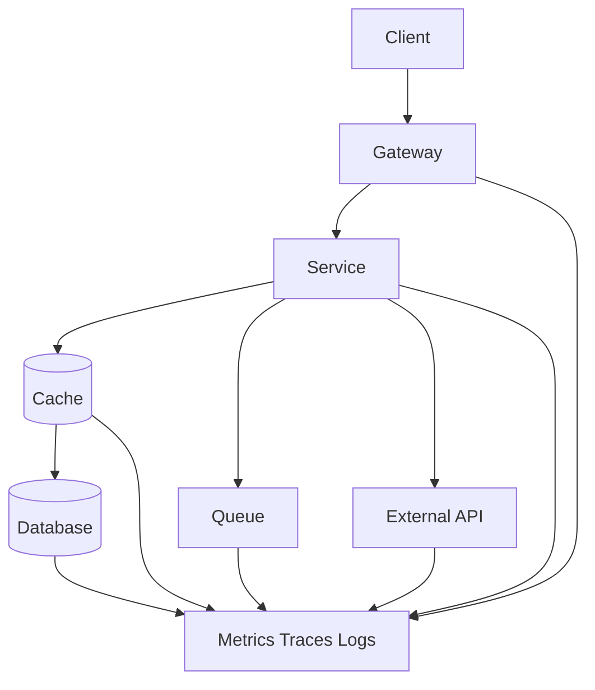
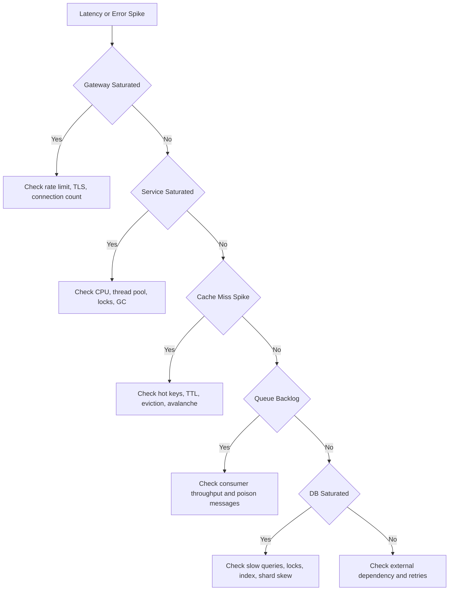

# Bottleneck Analysis in Distributed Systems

分布式系统瓶颈分析的核心是沿着请求链路找最先饱和的资源，而不是凭感觉说“数据库是瓶颈”。真正的瓶颈可能是连接数、线程池、锁、缓存 miss、队列积压、下游限流、序列化、网络带宽或热点分片。

## Analysis Order

1. 画出请求链路：client、CDN、gateway、service、cache、queue、database、external dependency。
2. 对每一段标 QPS、latency、error rate、payload size 和 concurrency。
3. 找 saturation signal：CPU、memory、IO、network、connection pool、thread pool、queue depth。
4. 区分 average 和 tail latency，P99 往往暴露真正问题。
5. 看 fan-out 和 retry，失败时调用量可能被放大。
6. 用实验验证：限流、压测、trace、profiling、shadow traffic 或 feature flag。

## Bottleneck Map

## Diagnosis Flow

## Common Bottlenecks

- **Connection pool exhaustion**: 服务线程在等连接，不是 CPU 忙。
- **Cache miss amplification**: 缓存故障或 key 过期导致 DB 突然承接全部流量。
- **Hot partition**: hash 或业务 key 分布不均，单个 shard 打满。
- **N+1 fan-out**: 一个请求扇出几十个下游调用，P99 被最慢调用决定。
- **Retry storm**: 下游慢时上游重试，实际 QPS 被放大。
- **Queue poison message**: 单条坏消息反复失败，阻塞 partition。
- **Large payload**: CPU 不忙但网络、序列化和 GC 成本很高。

## Fix Patterns

- 前移缓存、限流和请求合并，降低 origin QPS。
- 拆热点 key、加本地缓存、逻辑过期或预热。
- 给下游调用设置 timeout、budget、熔断和 retry jitter。
- 用异步队列削峰，但要监控 lag 和 DLQ。
- 对数据库加索引、读写分离、分片或改查询模型。
- 降低 fan-out，批量请求、预聚合或冗余读模型。

## Interview Guidance

- 不要直接给方案，先说“我会沿请求链路看每一层的 QPS、latency、error 和 saturation”。
- 用具体指标判断瓶颈，例如 cache hit rate 从 99% 掉到 90%，1M QPS 会多出 90K QPS 回源。
- 说明修复优先级：先保护系统，再定位根因，最后做结构性优化。
- 收尾补观测：distributed tracing、RED metrics、USE metrics、slow query、consumer lag 和 capacity dashboard。

相关：

- [[Observability in System Design]]
- [[Capacity Estimation for System Design]]
- [[Multi-Level Caching Strategies]]
- [[Graceful Degradation and Load Shedding]]
