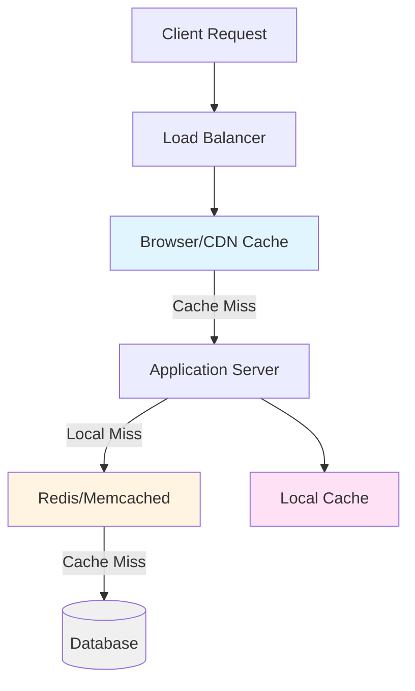
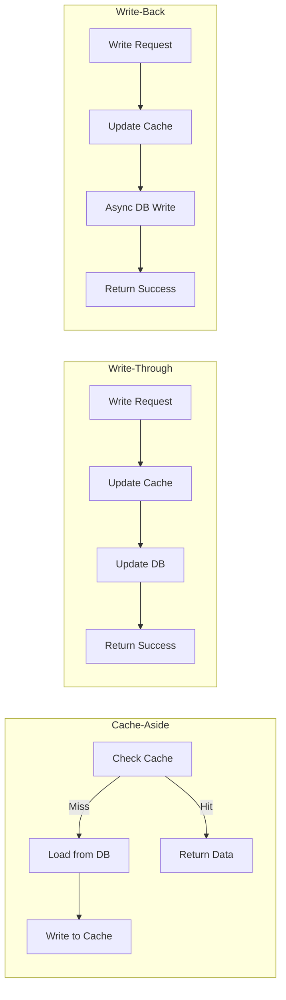
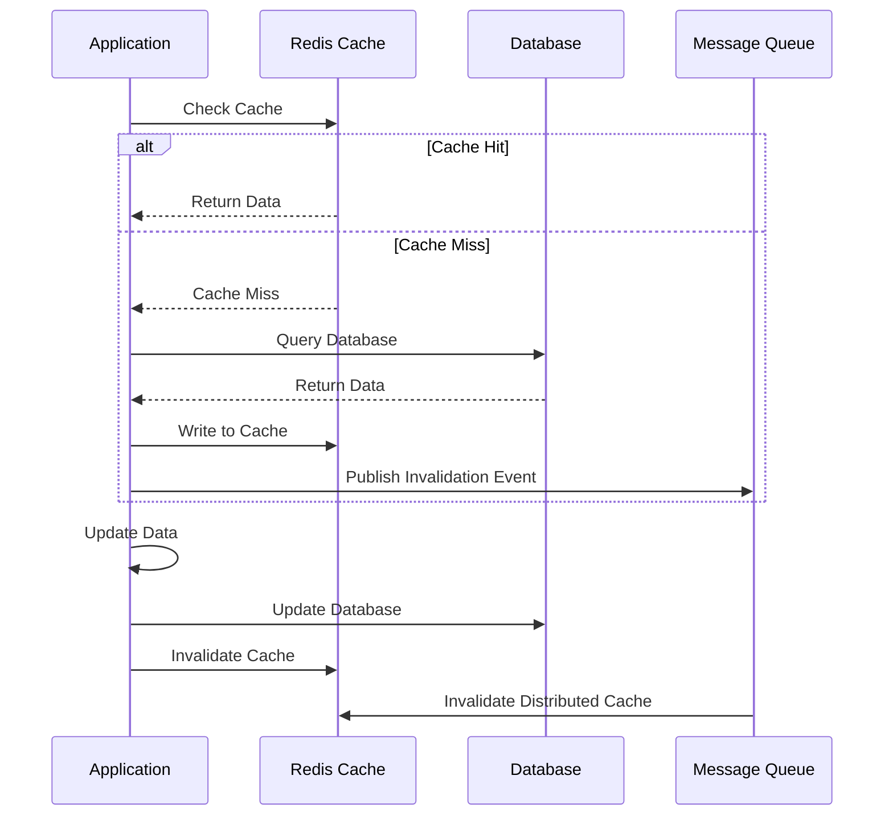

# Caching

Caching 通过提前保存热点数据来降低延迟和后端压力。

详细解释：

缓存是 system design 里最高频的优化手段之一，但它会带来失效、一致性和热点键问题。设计时要明确缓存对象、更新策略和失效策略。高并发系统里，缓存往往不是附属优化，而是主结构的一部分。

## Architecture Diagram

## Cache Strategies Comparison

## Cache Invalidation Flow

高并发场景中的典型问题：

- [[Cache Penetration]]
- [[Cache Breakdown]]
- [[Cache Avalanche]]
- [[Hot Key Overload]]
- [[Large Value Overhead]]

相关：

- [[Latency and Throughput]]
- [[Scalability]]
- [[Database Choices]]
- [[Multi-Level Caching Strategies]]
