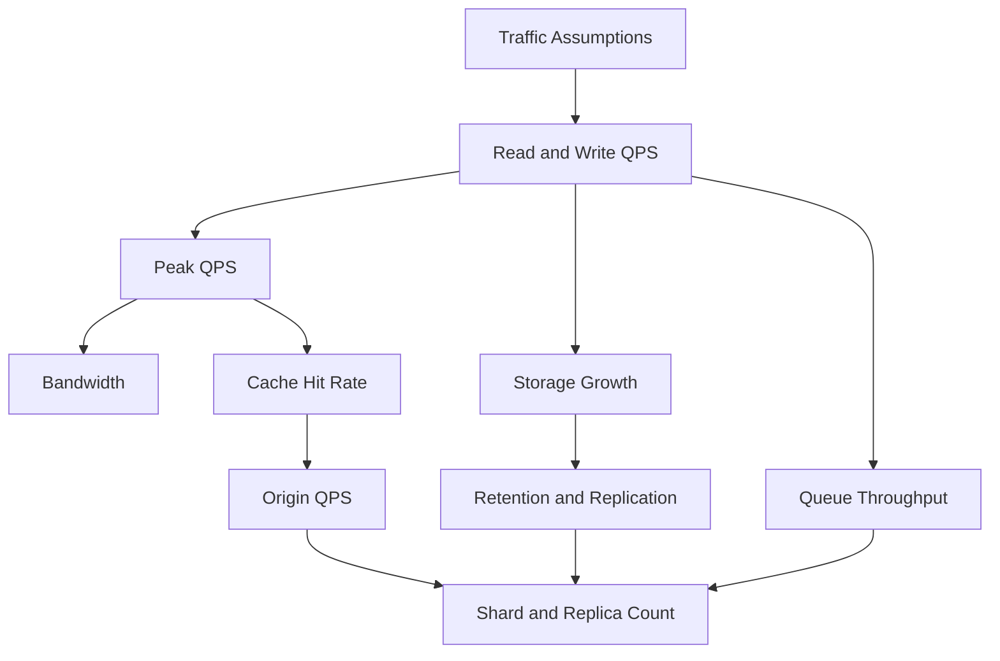

# Capacity Estimation for System Design

容量估算的价值不是算出一个“精确数字”，而是把架构约束显性化。你要从用户规模和行为频率推导 QPS、存储、带宽、缓存、队列和分片数量，然后用这些数字解释为什么需要某个组件。

## Estimation Order

1. 明确 DAU/MAU、峰值倍数、读写比例和区域分布。
2. 估算 read QPS、write QPS、peak QPS。
3. 估算 payload size 和 bandwidth。
4. 估算 daily storage growth 和 retention。
5. 估算 cache size、hit rate 和 origin QPS。
6. 估算 queue throughput、peak backlog 和 replay window。
7. 用单机能力粗略反推 shard、replica 和 worker 数量。

## Capacity Estimation Flow



## Example Template

```text
DAU = 10M
Actions per user per day = 20
Daily requests = 200M
Average QPS = 200M / 86,400 = 2,315 QPS
Peak factor = 5x
Peak QPS = 11,575 QPS
Payload = 2 KB
Peak bandwidth = 11,575 * 2 KB = 23 MB/s
Daily storage = writes_per_day * record_size
Replicated storage = daily_storage * retention_days * replica_factor
```

## What To Estimate By System Type

- **URL shortener**: mapping table, redirect QPS, analytics event volume, cache size.
- **Chat**: messages per day, inbox index, online presence, attachments.
- **Search**: document count, index expansion factor, query cache, indexing lag.
- **Notification**: notification events, queue backlog, provider quota, audit log retention.
- **File storage**: blob size, metadata size, replication factor, lifecycle tiers.
- **Recommendation**: impression logs, feature store, embedding index, candidate snapshots.
- **Booking**: search quote cache, order retention, audit logs, payment records.

## Common Multipliers

- Peak factor: 3x to 10x average QPS, depending on traffic shape.
- Replication factor: 2x to 3x for hot storage, plus backup or cross-region copy.
- Index overhead: search index can be 2x to 4x indexable data.
- Cache overhead: Redis/key-value overhead can make memory 1.5x to 3x raw value size.
- Logs: raw logs often dwarf core tables if retained long enough.

## Common Failure Modes

- 只估 QPS，不估 payload 和 bandwidth。
- 只估 storage 原始数据，不乘 retention、replication、index 和 backup。
- 只算平均值，不算峰值和热点。
- 忘记日志、analytics、审计、搜索索引和缓存占用。
- 用容量估算装饰答案，但不把数字反馈到架构选择。

## Interview Guidance

- 先说 assumptions，数字不必完美，但要自洽。
- 每个估算后都要接一句架构影响，例如“这说明 click analytics 不能同步写主库”。
- 如果面试官给了参数，用他们的参数；没给就声明合理假设。
- 最后说明哪些数字最敏感，例如 cache hit rate、payload size、retention 和 peak factor。

相关：

- [[Scalability]]
- [[Latency and Throughput]]
- [[Design a 10 Million QPS System]]
- [[Bottleneck Analysis in Distributed Systems]]
