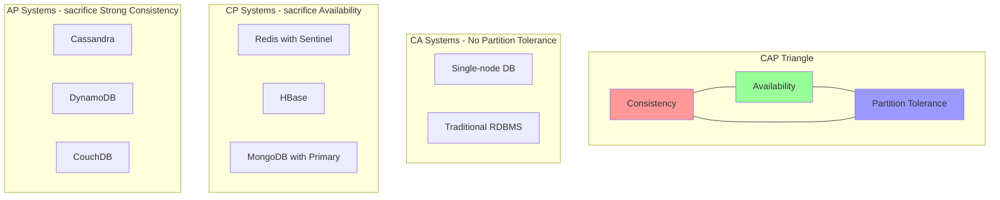
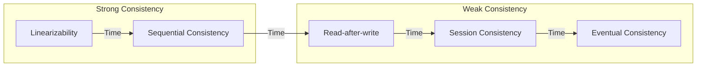
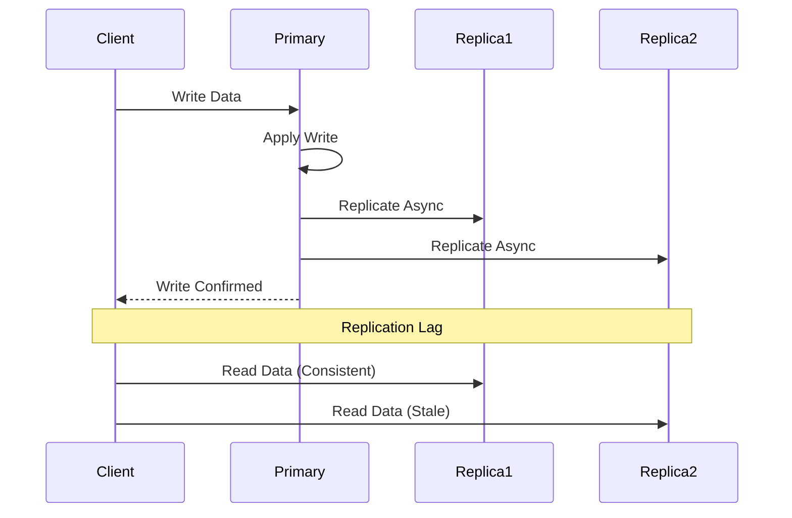

# Consistency and CAP

Consistency 是分布式系统设计里的关键权衡之一。

详细解释：

当系统分布式化后，通常无法同时无限制地兼得强一致、高可用和分区容忍。system design 题里更重要的是知道业务到底需要多强的一致性，而不是机械背 CAP 定理。

## CAP Theorem Visualized

## Consistency Models Comparison

## Replication Consistency Flow

## Consistency Patterns

**Strong Consistency (CP)**
- 所有节点同时看到相同数据
- 写操作等待所有副本确认
- 示例：金融交易、库存管理

**Eventual Consistency (AP)**
- 系统最终达到一致状态
- 读写可以到不同节点
- 示例：社交媒体、DNS

**Read-after-Write**
- 用户能立即看到自己的写入
- 其他用户可能有延迟
- 示例：用户配置文件

**Causal Consistency**
- 保持因果关系的顺序
- 因果无关的操作可以乱���
- 示例：聊天应用

常见区分：

- strong consistency
- eventual consistency
- read-after-write consistency

相关：

- [[Database Choices]]
- [[Replication and Fault Tolerance]]
- [[System Design Trade-offs]]

