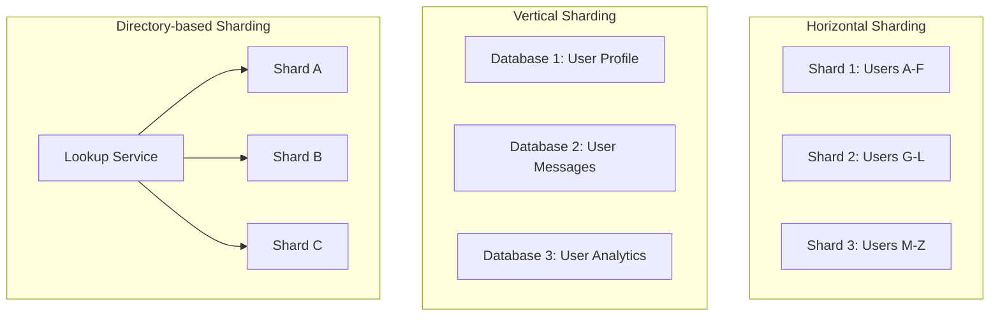
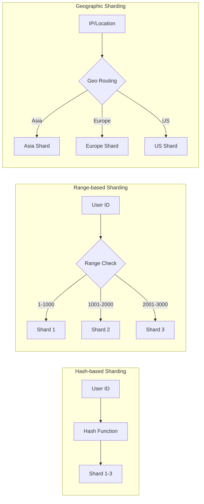
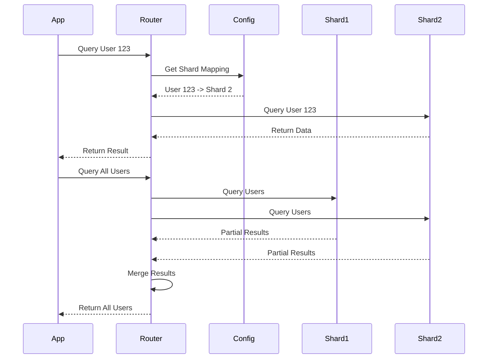
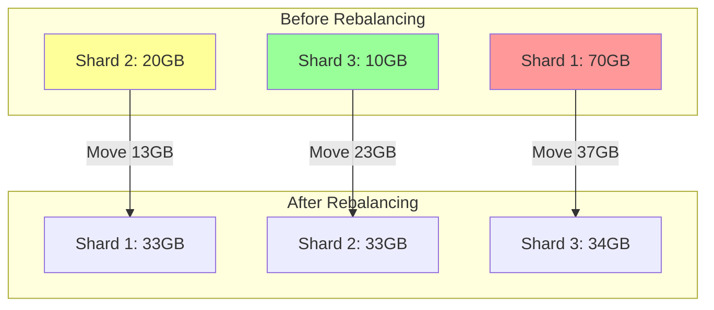

# Data Partitioning and Sharding

当单机数据库无法承受数据量或流量时，通常需要分片。

详细解释：

分片的核心问题不是“怎么切”，而是“按什么键切、热点如何处理、跨分片查询怎么办”。它通常是规模上来后的必要复杂度。

## Sharding Strategies

## Sharding Key Selection

## Query Routing with Sharding

## Rebalancing Strategy

## Key Considerations

**选择分片键的考虑因素：**
- 查询模式：主要查询的维度
- 数据分布：避免热点
- 扩展性：支持增加分片
- 路由效率：减少跨分片查询

**常见分片策略：**

1. **Hash-based Sharding**
   - 优点：数据分布均匀
   - 缺点：难以按范围查询
   - 适合：用户数据、订单数据

2. **Range-based Sharding**
   - 优点：支持范围查询
   - 缺点：可能导致数据倾斜
   - 适合：时间序列数据、日志数据

3. **Directory-based Sharding**
   - 优点：灵活映射，易于重新平衡
   - 缺点：依赖查找服务
   - 适合：需要动态调整的场景

4. **Geographic Sharding**
   - 优点：减少延迟，符合合规要求
   - 缺点：可能数据分布不均
   - 适合：全球部署的应用

## Common Failure Modes

- 分片键只按数据量均匀选择，却没有匹配主要查询模式，导致大量 scatter-gather 查询。
- 按时间 range sharding 后，所有新写入集中到最新分片，形成写热点。
- 跨分片事务没有边界控制，订单、支付、库存更新被拆到多个 shard 后一致性复杂度暴涨。
- rebalancing 没有在线迁移方案，只能停机搬数据。
- shard mapping 缓存不一致，路由层把请求打到旧 shard。

## Interview Guidance

- 先说明为什么需要分片：容量、QPS、热点、合规或地域延迟。
- 分片键要从查询模式推导，不要只说 hash user_id。
- 主动讲跨分片查询、全局唯一 ID、rebalancing、热点 shard 和 shard mapping。
- 如果业务核心是订单或聊天，优先保证同一用户、同一会话或同一订单相关数据尽量共址。
- 收尾补 observability：per-shard QPS、storage、latency、hot key、migration lag 和 routing error。

相关：

- [[Database Choices]]
- [[Scalability]]
- [[Replication and Fault Tolerance]]
