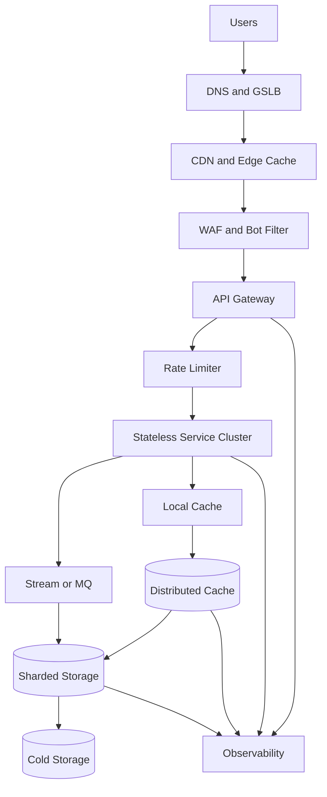
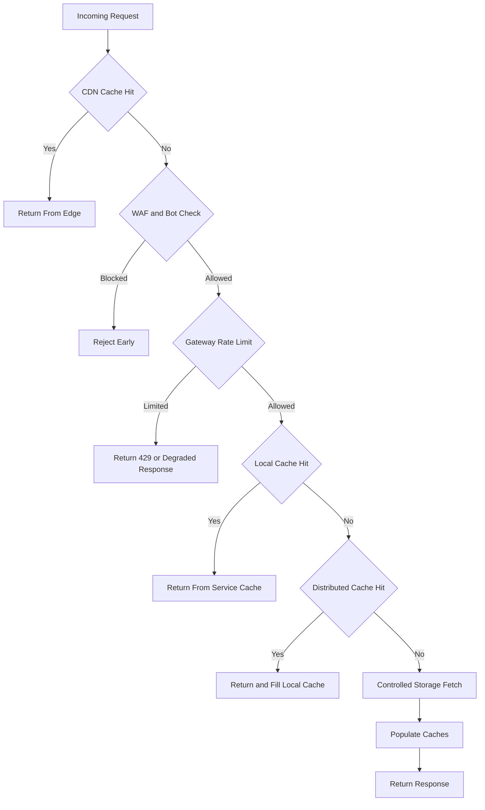

# Design a 10 Million QPS System

设计 1000 万 QPS 系统时，关键不是让数据库硬扛 1000 万，而是把真正落到最昂贵资源上的请求压到极低比例。

回答这题时，先问清楚这 1000 万 QPS 是读请求、写请求、短连接、长连接、全球峰值还是单区域峰值。不同答案会改变架构。如果是典型读多写少内容访问系统，核心策略是边缘缓存、分层缓存、静态化、异步写入、热点隔离和逐层保护。

高层思路：

1. 定义 traffic model and SLA：读写比例、payload 大小、P99 latency、区域分布和峰值倍数。
2. 把过滤和保护前移：DNS/GSLB、CDN、WAF、gateway、rate limit、bot detection。
3. 依赖 multi-level caching：CDN、edge cache、service local cache、distributed cache、storage cache。
4. 保持服务无状态，按 shard key 或 consistent hashing 水平扩展。
5. 写链路尽量异步化，用 MQ/stream 吸收峰值，并用幂等和 backpressure 保护下游。
6. 存储层用分片、复制、读写分离、热点拆分和访问整形。
7. 降级必须是设计的一部分：限流、熔断、静态兜底、关闭非核心功能和全链路观测。

典型分层：

- DNS / GSLB / Anycast
- CDN / WAF / gateway
- stateless service cluster
- local cache + distributed cache
- MQ / stream layer
- SQL / NoSQL / search / cold storage
- observability and governance

高价值表达：

- 真正瓶颈通常不是单机 CPU
- 更常见瓶颈是连接管理、回源比例、热点不均衡、调用链长度和故障放大
- 系统目标是把 90%~99% 的请求挡在更前面的便宜层

适用场景：

- 适用于超高读流量首页、短链跳转、热点新闻、直播活动页、广告点击上报和风控查询。
- 也适用于考察候选人是否能从容量估算推导架构，而不是背一个“高并发模板”。

常见误区：

- 常见误区是直接堆 Kafka、Redis、分库分表，却没有先把 10M QPS 拆到区域、服务、缓存命中率和回源比例。
- 另一个误区是只估平均值，不估峰值、热点 key、payload、连接数和失败放大。

## 10 Million QPS Architecture

## Request Filtering Flow

## Storage Estimation

假设：

- 10 million QPS peak, 95% served by CDN/edge, 4% served by service/distributed cache, 1% reaches storage or async write path。
- 平均响应 payload 2 KB。
- 请求日志采样：成功请求 1% 采样，错误请求 100% 记录；日志每条 300 bytes。
- 写事件占总请求 0.1%，每条事件 1 KB，进入 stream 保留 7 天。
- 热点缓存保存 100 million objects，平均 value 2 KB，metadata overhead 50%，双副本。

估算：

- 峰值出站带宽：10M * 2 KB = 20 GB/s，约 160 Gbps，需要 CDN 承担主体。
- 回源到服务：10M * 5% = 500K QPS。
- 到存储：10M * 1% = 100K QPS，这仍然很高，需要分片、缓存预热和请求合并。
- 成功日志采样量：10M * 1% * 300 B = 30 MB/s，约 2.59 TB/day。
- 写事件流量：10M * 0.1% * 1 KB = 10 MB/s，约 864 GB/day，7 天保留约 6 TB，三副本约 18 TB。
- 热点缓存：100M * 2 KB * 1.5 overhead * 2 replicas = 600 GB，可按 1 TB cluster 起步预留碎片和增长。

面试表达：

- 10M QPS 题的估算重点不是数据库容量，而是带宽、回源比例、缓存容量、日志吞吐和写入削峰。
- 每降低 1% 回源，在 10M QPS 下就是 100K QPS 的差别。
- 要明确降级策略，否则故障时缓存 miss 会把流量洪峰直接打到最贵的存储层。

## Key Components

- **DNS/GSLB/CDN**: 做全球流量调度、边缘缓存和静态兜底。
- **WAF/Gateway/Rate Limiter**: 前置过滤恶意流量、限流和租户级 quota。
- **Stateless Service Cluster**: 水平扩展业务逻辑，避免本地状态阻碍扩容。
- **Multi-level Cache**: 用 local cache、distributed cache 和 storage cache 逐层降低回源。
- **Stream/MQ**: 异步化写入、日志、统计和非关键链路。
- **Sharded Storage**: 只承接被缓存削峰后的请求，重点处理热点和扩容。
- **Observability**: 监控 CDN hit rate、origin QPS、cache miss、hot key、队列积压和 P99。

## Design Trade-offs

- **命中率 vs 新鲜度**: TTL 越长命中率越高，新鲜度越差；可用主动失效和版本化 key 平衡。
- **本地缓存 vs 一致性**: 本地缓存快但失效传播难，适合热点只读或短 TTL。
- **同步写 vs 异步写**: 计数、日志和分析适合异步；用户可见状态变更要谨慎。
- **全量日志 vs 采样日志**: 10M QPS 下全量日志很贵，通常要采样并保留错误全量。

相关：

- [[Multi-Level Caching Strategies]]
- [[Graceful Degradation and Load Shedding]]
- [[Capacity Estimation for System Design]]
- [[Bottleneck Analysis in Distributed Systems]]
