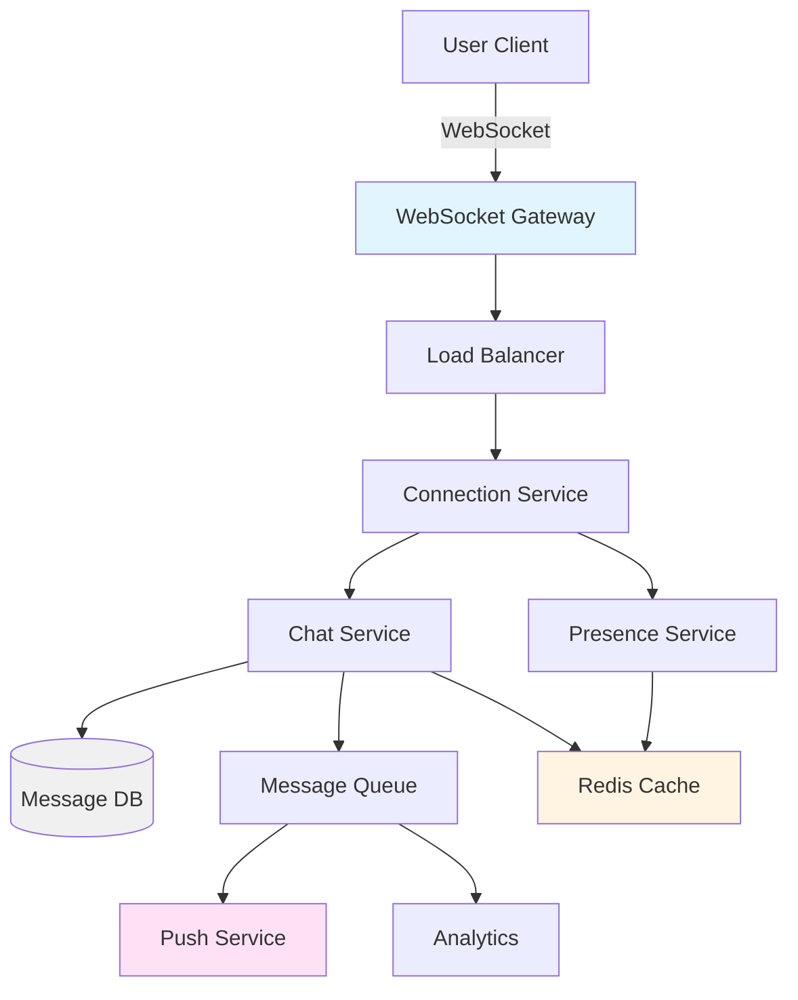
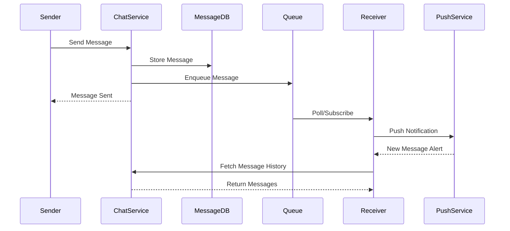
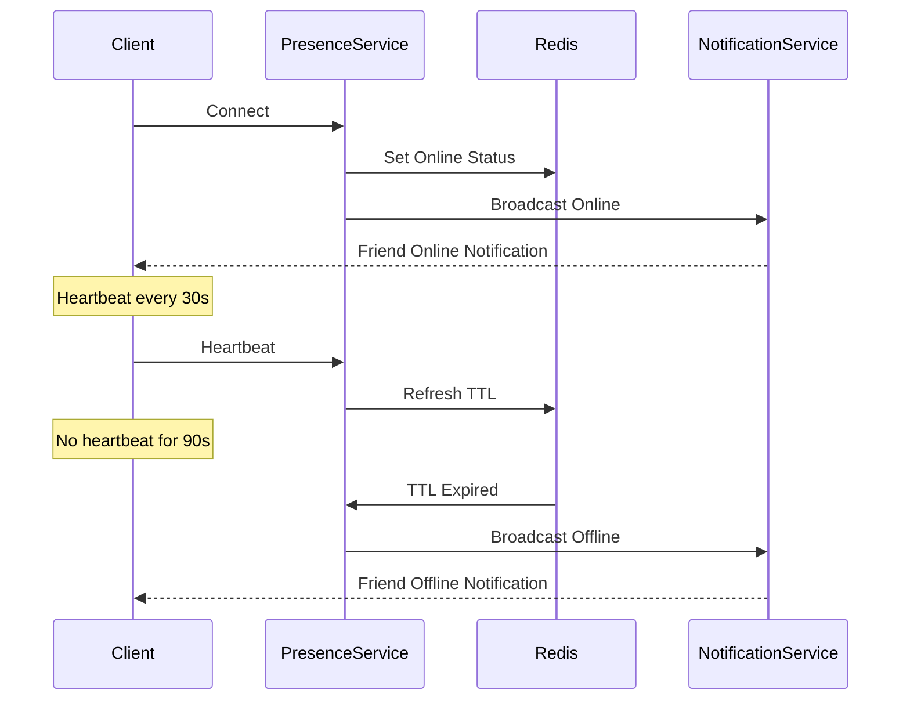
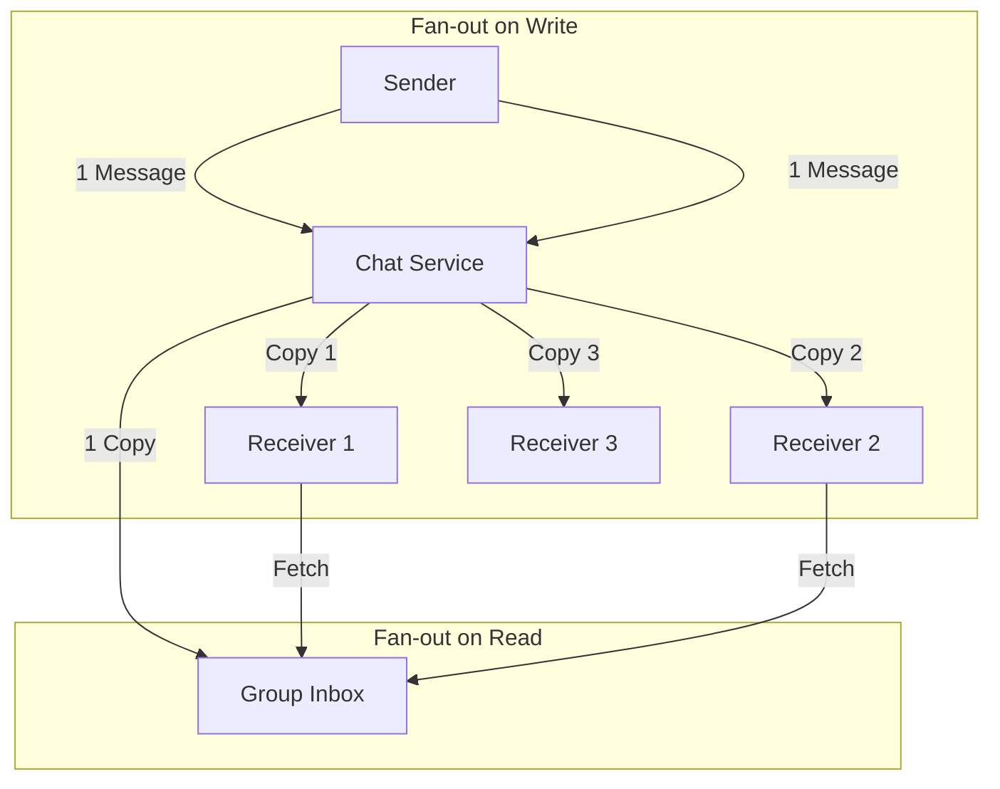

# Design a Chat System

聊天系统是面试里最常见的“实时 + 状态 + 多端同步”场景之一。它的代表性不在于业务多复杂，而在于你能不能把连接管理、消息投递、顺序、一致性和离线补偿这些问题讲清楚。真正的难点不是把消息存下来，而是让消息在多端、多用户和不稳定网络下还能可靠送达。

回答这题时，最好先收敛 scope：先做一对一聊天，再讨论群聊；先支持文本消息、在线状态和历史消息同步，再补文件、语音、已读回执和消息撤回。这样你能先把主链路做对，而不是一开始就被功能列表带散。

核心关注：

- 先拆连接层和消息层，连接层负责 WebSocket 或长连接管理，消息层负责存储、投递、重试和同步。
- message delivery 需要明确在线用户怎么推送，离线用户怎么补拉，失败后怎么重试以及如何避免重复消费。
- ordering and retries 是关键难点，至少要说清在单会话内如何保证顺序，以及重试时如何依赖 message_id 做幂等。
- online presence 不能只说“存 Redis”，还要讲心跳、过期、广播范围和多设备状态同步。
- group chat scaling 需要说明 fan-out 是写扩散、读扩散还是混合方案，以及群规模变化后架构如何演进。

适用场景：

- 适用于 IM、企业协作、客服咨询、游戏聊天和任何强调实时消息送达与多端同步的场景。
- 也适用于练习长连接管理、消息队列、状态同步和高可用设计，因为这些能力会反复出现在其他实时系统里。

常见误区：

- 常见误区是只讲 WebSocket 建连，却没有讲消息怎么持久化、离线怎么补偿、重复怎么去重。
- 另一个误区是直接给出很重的群聊广播方案，却没有先按一对一和小群场景收敛问题。

面试回答方式：

- 开场先说我会把系统分成 connection management、message write path、message delivery 和 history sync 四段。
- 先给出 baseline architecture：Gateway、Connection Service、Chat Service、Message Store、Queue、Presence Service 和 Notification Service。
- 深挖时重点讲消息发送和接收主链路、会话内顺序保证、离线补拉和群聊 fan-out trade-off。
- 收尾时补 observability、消息积压、连接数扩展、跨机房和数据保留策略。

## Chat System Architecture

## Message Send Flow

## Online Presence Management

## Group Chat Message Distribution

## Key Components

- **WebSocket Gateway**: 管理长连接，处理连接建立和断开
- **Connection Service**: 维护在线用户连接，路由消息到正确连接
- **Chat Service**: 处理消息发送、接收和存储
- **Message Store**: 持久化消息历史，支持分片
- **Message Queue**: 异步消息分发，解耦发送和推送
- **Presence Service**: 管理用户在线状态，处理心跳和多设备
- **Push Service**: 向离线用户推送通知
- **Cache Layer**: 缓存最近消息和在线状态

相关：

- [[Load Balancing]]
- [[Queues and Asynchronous Processing]]
- [[Availability and Reliability]]
