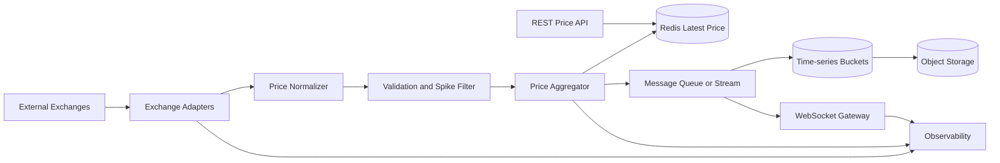

# Design a Crypto Price System

## 项目一句话定位

这是一个面向交易页面、行情看板和价格告警的实时 crypto price system，核心目标是在外部交易所数据源不稳定、热门币种订阅量很高的情况下，提供低延迟、可追溯、可降级的价格服务。

## 面试开场版本

我会把系统拆成四条链路：

- ingest：从多个 exchange adapter 拉取或订阅 tick / trade / order book。
- normalize：统一 symbol、timestamp、price、volume、source 和 event id。
- publish：把最新价格写入 Redis，并通过 queue / WebSocket 推送给订阅用户。
- store：把分钟级或秒级价格写入历史存储，用于 chart、回放和风控分析。

关键不是单纯把价格推给用户，而是处理外部源抖动、乱序、异常 spike、热门 symbol、高 fanout WebSocket 和历史数据归档。

## 推荐架构图

面试表达：

- Adapter 隔离不同交易所协议，不让业务服务直接依赖外部 API。
- Normalizer 生成统一 canonical price event，避免后续每个服务都处理 symbol 和 timestamp 差异。
- Redis 保存 latest price，是低延迟读路径，不是唯一真相。
- Queue / stream 负责 fanout、历史写入和异步解耦。
- Bucket storage 保存聚合后的 OHLCV 或 tick bucket，支持图表查询和回放。

## 核心难点与面试表达

### 1. 外部数据源不稳定

真实 case：

- 某个 exchange 会短暂断流、延迟升高、返回重复 tick，或者在维护期间返回 stale price。
- 如果系统只信单一来源，用户看到的价格可能突然停住或跳变。

面试表达：

- 我会为每个 exchange 建独立 adapter，并把外部数据转成 canonical price event。
- 每条事件带 `source`、`sourceTimestamp`、`ingestionTimestamp`、`symbol`、`price`、`volume` 和 `eventId`。
- Aggregator 不直接覆盖价格，而是根据 source health、timestamp freshness 和异常检测决定是否接受。

可追问：

Q：为什么不直接把交易所价格写进 Redis？

A：直接写会把外部源的不稳定暴露给用户。中间需要 normalization、freshness check、dedupe 和 source health，否则重复、延迟或异常价格都会污染 latest price。

### 2. Source Timestamp vs Ingestion Timestamp

真实 case：

- A 交易所 12:00:01 产生的 tick，可能 12:00:05 才被我们收到。
- 如果只按 ingestion time 排序，历史 chart 会错位；如果只按 source time 覆盖 latest price，又可能被 late event 回滚。

面试表达：

- source timestamp 用于市场事件时间和历史图表。
- ingestion timestamp 用于系统延迟、SLA 和乱序处理。
- latest price 更新要设置 allowed lateness window，过晚事件进入历史修正或审计链路，不回滚用户可见 latest price。

可追问：

Q：late event 怎么处理？

A：在一个短窗口内允许重排或修正 bucket；超过窗口后不更新 latest price，只写入 audit / correction pipeline。这样能平衡实时稳定性和历史准确性。

### 3. 异常价格 Spike

真实 case：

- 某个 exchange 返回 BTC 价格突然偏离市场 20%，但几秒后恢复。
- 如果系统立刻推送，用户告警、图表和下游策略都会被污染。

面试表达：

- 我会做 multi-source confirmation 和 spike quarantine。
- 单源价格偏离 median price 或 recent moving window 超过阈值时，先标记 suspicious，不立即更新 canonical latest price。
- 如果多个高可信 source 同时确认，才接受为真实市场跳变。

可追问：

Q：这样会不会错过真实暴跌？

A：有这个 trade-off。所以阈值不能固定死，要按 symbol liquidity、source reliability 和 market volatility 调整。高流动性主流币要求多源确认，小币种可能只做 softer alert。

### 4. 热门 Symbol 和 Redis Hot Key

真实 case：

- BTC-USDT、ETH-USDT 会被大量用户同时订阅，latest price key 和 WebSocket channel 都会成为热点。

面试表达：

- Redis latest price 可以按 symbol shard，但单个热门 symbol 仍可能 hot key。
- 读路径使用 local cache + short TTL，写路径使用 coalescing，把同一 symbol 的高频 tick 合并成固定频率推送。
- 对极热 symbol 可以使用 hot key replica 或按 gateway 分发 topic，避免所有连接打到同一个节点。

可追问：

Q：为什么不能每个 tick 都推给所有用户？

A：用户界面通常不需要毫秒级每笔 tick。对 WebSocket 做 100ms 或 250ms coalescing 可以显著降低 fanout 成本，同时保持感知实时。

### 5. 历史价格存储

真实 case：

- 图表查询一般按 symbol + time range 读取，如果逐 tick 单行存储，索引和查询成本都会很高。

面试表达：

- 我会把热数据按 symbol + time bucket 存，例如 1m bucket 保存 OHLCV 和必要 tick summary。
- 原始 tick 可以短期保留在 stream 或对象存储，用于回放和审计。
- 长期图表优先读聚合 bucket，而不是扫原始 tick。

可追问：

Q：为什么用 bucket model？

A：行情查询天然是时间范围查询。bucket 能减少文档数量和索引开销，也更适合按时间分层冷热存储。

### 6. WebSocket Fanout 和慢客户端

真实 case：

- 一个热门 symbol 有几十万订阅者，其中部分客户端网络很慢。
- 如果推送线程被慢客户端阻塞，会影响同一 gateway 上的其他用户。

面试表达：

- WebSocket gateway 只维护连接和 subscription map，不做复杂价格计算。
- 每个连接有 bounded outbound buffer，超过阈值就降级、丢弃中间价格或断开慢客户端。
- Gateway shutdown 时先停止接收新连接，再 drain 现有连接，并把订阅状态迁移或让客户端重连。

可追问：

Q：断线重连后怎么补数据？

A：客户端携带 last seen sequence 或 timestamp，服务端从 recent price buffer 或 history bucket 补最新窗口，再恢复实时订阅。

### 7. RabbitMQ / Kafka / Stream 选择

真实 case：

- 最新价推送看重低延迟 fanout，历史回放和审计看重可重放和分区顺序。

面试表达：

- 如果重点是任务分发和消费者确认，RabbitMQ 可以胜任。
- 如果重点是高吞吐、可回放、按 symbol 分区顺序和多消费者组，Kafka / Pub/Sub 更自然。
- 无论选哪种，都要设计 idempotency、DLQ、consumer lag 和 poison message 隔离。

可追问：

Q：消息重复怎么办？

A：消费者以 `eventId` 或 `(source, symbol, sourceTimestamp, sequence)` 做幂等。写历史 bucket 时使用 upsert 或去重集合，WebSocket 推送重复事件则依赖 sequence 丢弃旧消息。

## 高频面试题与标准回答

Q1：这个系统的 source of truth 是什么？

A：原始事件日志和规范化后的 price event 是可回放真相；Redis latest price 是低延迟派生视图；历史 bucket 是面向查询的聚合视图。

Q2：如何减少用户看到错误价格的概率？

A：使用多源校验、freshness check、spike quarantine、last known good price 和 source health score。异常时宁愿展示 stale 标记，也不要静默推送可疑价格。

Q3：怎么保证同一个 symbol 的顺序？

A：按 symbol 分区，让同一 symbol 的事件进入同一分区或同一 aggregator shard。系统不保证全局顺序，只保证 symbol 内顺序。

Q4：WebSocket gateway 如何扩容？

A：gateway 保持无状态业务逻辑，连接状态在本机内存，订阅信息可重建。通过负载均衡分配连接，后端用 topic fanout 或 queue 分发价格事件。

Q5：Redis 挂了怎么办？

A：REST 读可以降级到 local cache / last known good；写端短时间 buffering；如果 Redis 长时间不可用，系统进入 degraded mode，只保留核心 symbol 或降低推送频率。

Q6：如何设计监控？

A：监控 source latency、stale source count、accepted/rejected price events、spike quarantine rate、Redis hit rate、WebSocket connection count、outbound buffer size、queue lag 和 end-to-end tick latency。

## 亮点总结

这个系统的关键不是“接交易所 API 后推 WebSocket”，而是把外部不稳定输入变成可信 canonical price event。主链路保证 latest price 低延迟和异常隔离，异步链路处理历史 bucket、审计和 fanout。面试里要重点讲清楚 timestamp、late event、spike filter、hot symbol、慢客户端和消息幂等。

## 项目总结模板

> 我做的是一个实时 crypto price system，核心挑战是多交易所数据不稳定、价格事件乱序、热门币种高并发订阅和 WebSocket fanout。我的设计把 exchange adapter、normalizer、aggregator、Redis latest price、queue fanout、WebSocket gateway 和 historical bucket 拆开。主链路追求低延迟和可信 latest price，异步链路负责历史存储和推送扩展。为了提高可靠性，我加入了 source health、spike quarantine、late event window、hot key protection、idempotency 和 end-to-end observability。

## 相关

- [[System Design Project Storytelling Template]]
- [[System Design Interview Practicum]]
- [[Market Data Pipeline]]
- [[Caching]]
- [[Multi-Level Caching Strategies]]
- [[Hot Key Overload]]
- [[Request Coalescing]]
- [[Queues and Asynchronous Processing]]
- [[Observability in System Design]]
