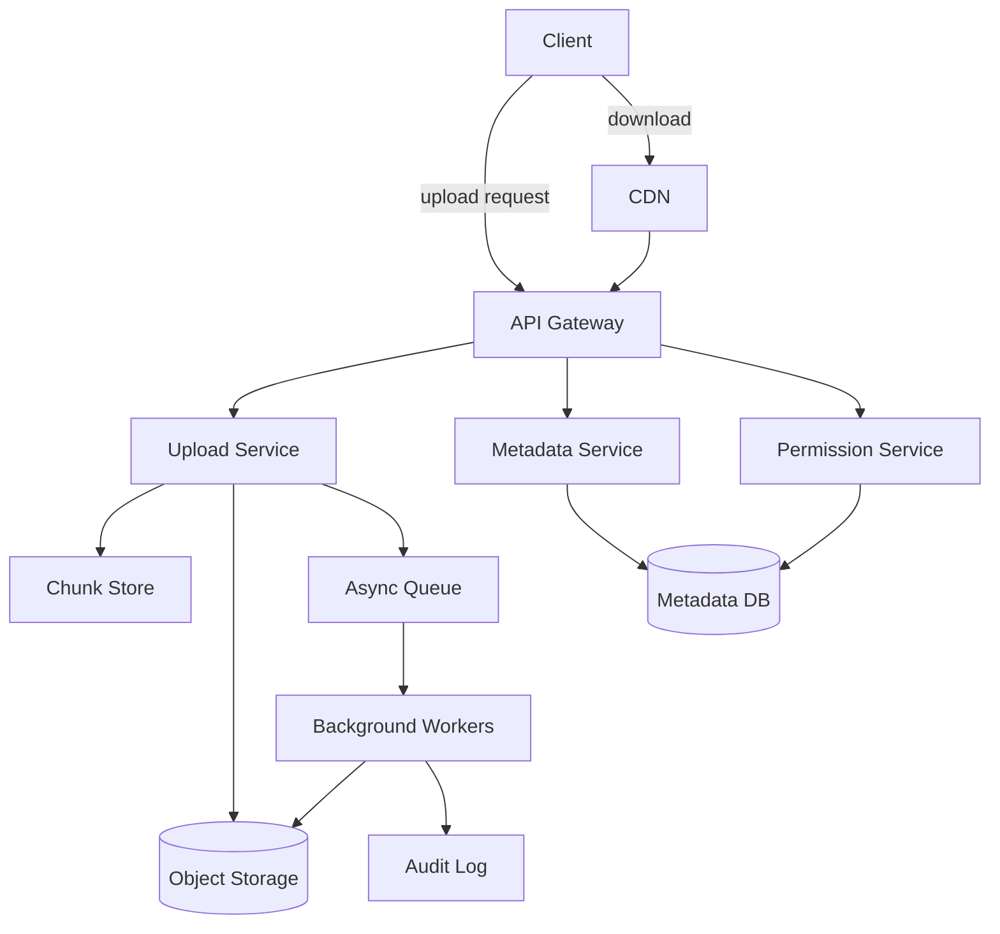
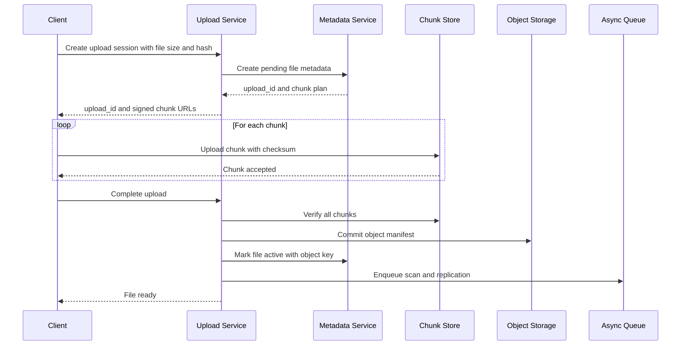

# Design a File Storage System

文件存储系统题通常围绕对象存储、元数据、大文件传输、权限控制和高可用展开。它不是“把文件放到磁盘”这么简单，而是要说明上传如何分片、元数据如何建模、对象如何复制、下载如何加速，以及失败时如何恢复。

回答这题时，先收敛 scope：支持用户上传、下载、删除、分享链接、断点续传和大文件分片；文件内容走对象存储，元数据走数据库；先不做多人协同编辑和全文检索。这样可以把 Dropbox、Google Drive、S3 类问题的主链路讲清楚。

核心关注：

- 大文件上传需要 chunking。客户端先申请 upload session，再把文件按 chunk 上传，服务端校验 checksum，最后提交 manifest 合并成对象。
- 元数据和文件内容要分开。metadata store 记录 owner、path、size、content hash、object key、version、permission 和 lifecycle 状态；blob store 保存真正的字节。
- 去重可以按 content hash 做，但要小心权限隔离和引用计数。相同内容可以只存一份对象，但不能泄露另一个用户是否拥有某文件。
- 下载性能依赖 CDN、range request、signed URL 和热点文件缓存，不能让所有下载都回源到存储集群。
- 删除通常是逻辑删除加异步回收。直接物理删除会影响恢复、版本管理、复制一致性和合规保留。

适用场景：

- 适用于网盘、对象存储、图片/视频上传、企业文档系统和附件服务。
- 也适用于练习 metadata modeling、分片上传、对象复制、权限控制、CDN 和生命周期管理。

常见误区：

- 常见误区是只说“用 S3”，却没有讲 upload session、checksum、metadata、权限和断点续传。
- 另一个误区是把文件内容存进关系数据库，导致大对象吞吐、备份、复制和查询性能全部变差。

面试回答方式：

- 开场先说明文件内容和元数据分离，上传和下载分成两条主链路。
- 高层架构可以拆成 API Gateway、Upload Service、Metadata Service、Object Storage、Chunk Store、Permission Service、CDN、Async Worker 和 Audit Log。
- 深挖时优先讲 chunk upload、manifest commit、checksum 校验、权限校验、signed URL 和跨区域复制。
- 收尾补 storage estimation、对象生命周期、垃圾回收、病毒扫描、冷热分层和数据恢复。

## File Storage Architecture

## Chunked Upload Flow

## Storage Estimation

假设：

- 10 million users, 20% monthly active uploaders.
- 每个活跃上传用户每月上传 200 MB。
- 平均文件大小 4 MB，metadata 约 2 KB per file。
- 复制因子 3，跨区域异步复制 1 份冷备。
- 去重节省 15%，压缩节省先保守按 0 计算，因为图片、视频和压缩包通常不可再压缩。

估算：

- 每月新增原始数据：10M * 20% * 200 MB = 400 TB。
- 主存储三副本：400 TB * 3 = 1.2 PB per month。
- 加冷备一份：400 TB * 1 = 400 TB per month。
- 去重后总新增：1.6 PB * 85% = 1.36 PB per month。
- 每月文件数：400 TB / 4 MB = 100 million files。
- 每月 metadata：100M * 2 KB = 200 GB，适合关系数据库或分片 KV 存储。
- 一年对象存储：1.36 PB * 12 = 16.32 PB，需要 lifecycle policy 把老文件迁到 cheaper tier。

面试表达：

- 先估原始写入量，再乘复制和备份系数。
- metadata 和 blob 分开估，因为二者存储系统、查询模式和扩容方式不同。
- 如果题目给的是 photo/video 系统，要单独估 thumbnail、transcode variants 和 CDN cache footprint。

## Key Components

- **Upload Service**: 管理 upload session、chunk plan、checksum 和 commit。
- **Metadata Service**: 管理文件路径、owner、version、object key、状态和分享信息。
- **Permission Service**: 校验 owner、ACL、share link、signed URL 和过期策略。
- **Object Storage**: 保存 immutable blob 或 object manifest，支持复制和冷热分层。
- **Chunk Store**: 暂存未完成上传的 chunks，支持重试和过期清理。
- **CDN**: 缓存热点下载，支持 range request 和边缘加速。
- **Background Workers**: 做病毒扫描、缩略图、复制、生命周期迁移和垃圾回收。

## Design Trade-offs

- **小文件优化 vs 大文件分片**: 小文件可直接上传，大文件必须分片、断点续传和后台校验。
- **强一致 metadata vs 最终一致 blob replication**: 用户看到文件创建要强一致，对象跨区域复制可以异步。
- **逻辑删除 vs 物理删除**: 逻辑删除支持恢复和审计，物理删除通过异步 GC 降低主链路风险。
- **自建存储 vs 云对象存储**: 面试中可以先用 S3/GCS 做 baseline，再说明如何自建 object storage 的元数据和复制挑战。

相关：

- [[Replication and Fault Tolerance]]
- [[Caching]]
- [[Database Choices]]
