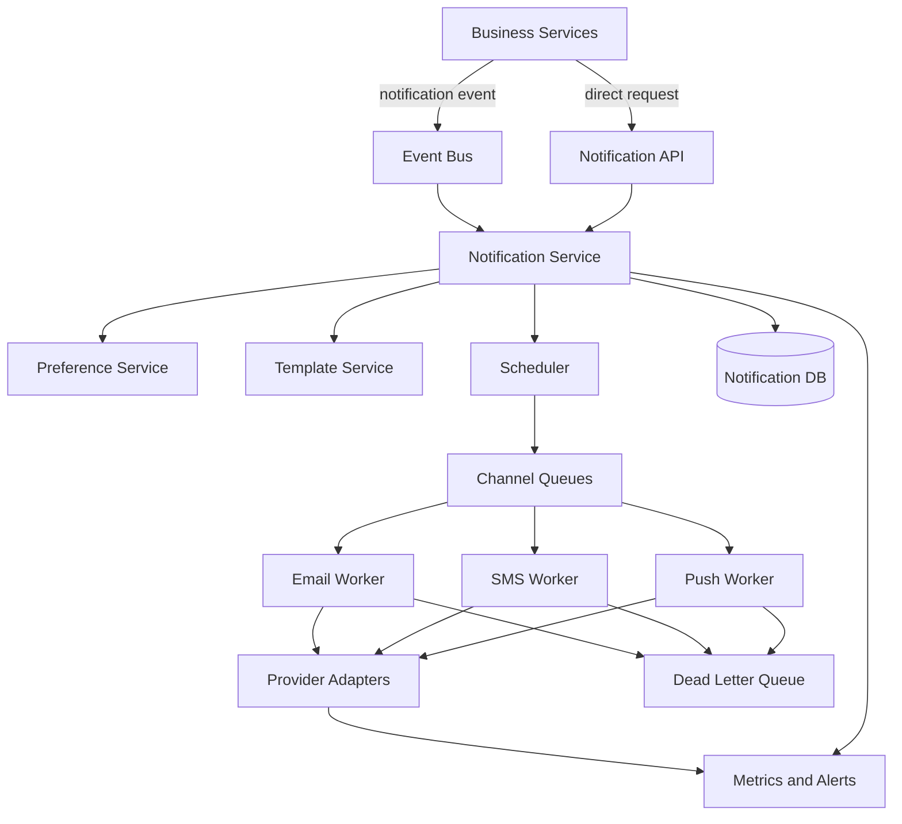
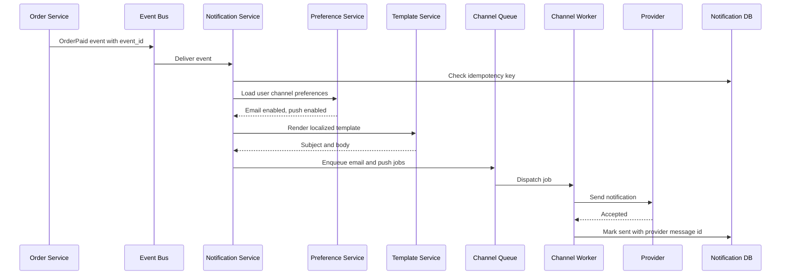
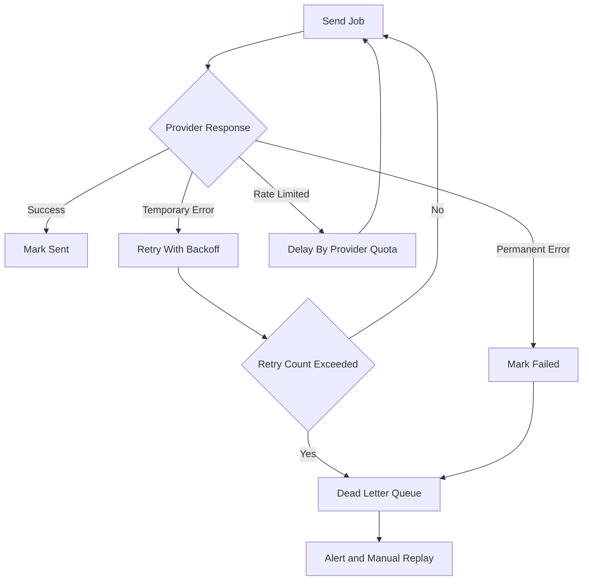

# Design a Notification System

通知系统常用于考察异步处理、多通道发送、用户偏好和可靠交付。它看起来只是“发一条消息”，但真正的系统设计问题是：谁触发通知、如何避免重复发送、怎样按用户偏好选择 channel、失败后怎么重试，以及如何在高峰期保护下游供应商。

回答这题时，先收敛 scope：支持 email、SMS 和 push 三种渠道；支持用户偏好、模板渲染、异步发送、重试、限流和状态追踪；暂时不做复杂营销编排、A/B test 和跨时区 campaign automation。这样能把主链路讲清楚，再扩展到批量通知和个性化。

核心关注：

- 先区分 transactional notification 和 marketing notification。前者追求及时可靠，例如支付成功和安全提醒；后者更关注批量、节流、退订和合规。
- 通知创建最好是异步化。业务系统写 notification event 到队列，Notification Service 再做模板、偏好、去重、限流和发送，避免把供应商延迟放进业务主链路。
- 重试必须有上限和退避策略。临时错误进入 delayed retry，永久错误进入 dead-letter queue，并写失败原因方便后续补偿或客服排查。
- 用户偏好不是简单开关，要支持 channel preference、quiet hours、unsubscribe、locale 和优先级覆盖，例如安全通知通常不能被普通营销退订屏蔽。
- 幂等是核心。每个业务事件需要 stable idempotency key，避免业务系统重试、队列重复投递或供应商回调重复导致用户收到多条相同通知。

适用场景：

- 适用于电商订单通知、支付提醒、社交互动提醒、安全登录提醒、运营活动和企业工作流通知。
- 也适用于练习队列、限流、重试、死信队列、多供应商适配和用户偏好建模。

常见误区：

- 常见误区是业务服务直接调用 email/SMS provider，导致供应商慢或失败时拖垮核心交易链路。
- 另一个误区是只讲 MQ，却没有讲模板渲染、用户偏好、幂等去重、发送状态和失败补偿。

面试回答方式：

- 开场先说通知系统会按事件接入、通知编排、渠道发送和状态追踪四段拆开。
- 先给出 baseline：Producer、Event Bus、Notification Service、Preference Service、Template Service、Scheduler、Channel Workers、Provider Adapter、Notification DB 和 DLQ。
- 深挖时重点讲 notification event 的生命周期、幂等 key、retry policy、rate limit、provider failover 和用户偏好。
- 收尾补监控指标：send latency、success rate、provider error rate、retry backlog、DLQ size、duplicate suppression count 和 unsubscribe rate。

## Notification System Architecture

## Notification Delivery Flow

## Retry and Failure Handling

## Storage Estimation

假设：

- 100 million users。
- 每个用户每天平均 5 条通知事件，其中 80% push、15% email、5% SMS。
- 每条 notification record 1 KB，包括 event_id、user_id、template_id、channel、status、provider id 和错误原因。
- provider 回执和审计日志平均 500 bytes per send。
- 通知状态保留 90 天，审计日志保留 1 年，复制系数 3。

估算：

- 每日通知事件：100M * 5 = 500M notifications/day。
- 每日 notification DB 写入：500M * 1 KB = 500 GB/day，三副本约 1.5 TB/day。
- 90 天状态表：500 GB * 90 = 45 TB，三副本约 135 TB。
- 每日回执日志：500M * 500 B = 250 GB/day。
- 1 年审计日志：250 GB * 365 = 91.25 TB，三副本约 273.75 TB，适合放日志湖或对象存储。
- SMS 每日发送量：500M * 5% = 25M/day，需要供应商配额、成本和限流单独估算。

面试表达：

- 通知系统的长期成本通常来自状态和审计日志，不只是队列容量。
- 队列容量按峰值积压估，例如高峰 2 倍、下游 provider 故障 1 小时，需要能缓冲这一小时的待发任务。
- 对用户可见通知中心和后台审计日志可以分不同保留周期，降低热存储成本。

## Key Components

- **Event Bus**: 接收业务事件，解耦交易系统和通知系统。
- **Notification Service**: 做幂等、编排、模板选择、偏好检查和发送任务创建。
- **Preference Service**: 管理用户 channel preference、quiet hours、退订和语言区域。
- **Template Service**: 按事件类型、locale 和渠道渲染模板，避免业务方拼接消息内容。
- **Scheduler**: 支持延迟发送、安静时段推迟和重试 backoff。
- **Channel Workers**: 分别处理 email、SMS、push 的发送、限流和供应商适配。
- **Notification DB**: 记录通知状态、幂等 key、provider message id 和失败原因。
- **Dead Letter Queue**: 收敛不可自动恢复的失败，支持告警和人工 replay。

## Design Trade-offs

- **同步 vs 异步**: 安全验证码可以同步等待短超时，订单通知和活动通知应异步化。
- **单供应商 vs 多供应商**: 单供应商简单，多供应商需要路由、fallback、成本控制和送达率监控。
- **用户偏好 vs 强制通知**: 营销通知必须尊重退订，安全和交易通知通常有更高优先级。
- **精确一次 vs 至少一次**: 队列通常提供至少一次投递，所以系统要靠幂等 key 和状态表压制重复发送。

相关：

- [[Queues and Asynchronous Processing]]
- [[Rate Limiting]]
- [[Event-Driven Architecture for System Design]]
