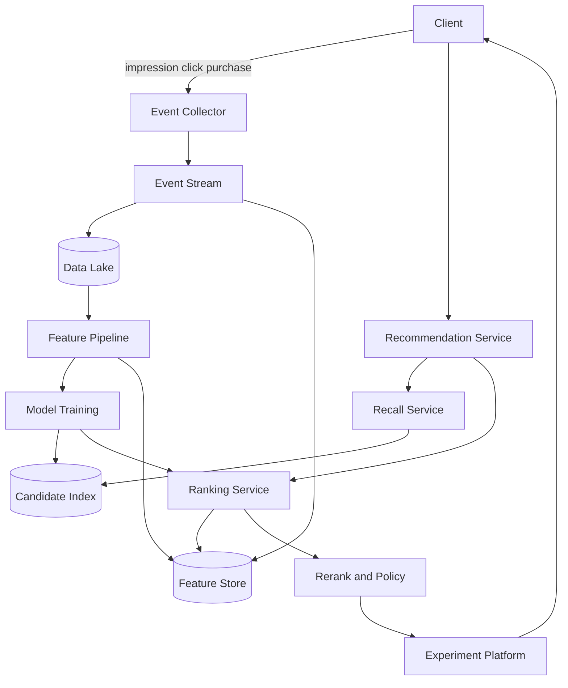
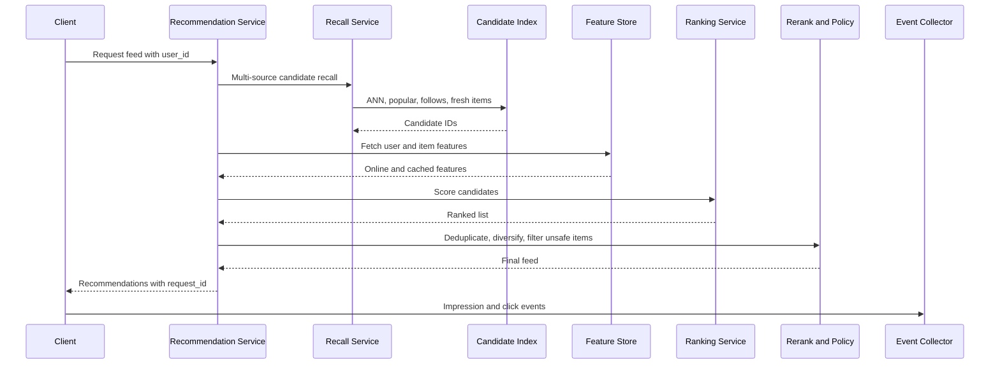

# Design a Recommendation System

推荐系统结合数据、特征、召回、排序和反馈闭环。面试里不要只说“训练一个模型”，而要把用户行为怎样进入数据管道、候选集怎样生成、在线请求怎样低延迟返回、曝光点击怎样回流到下一轮训练讲清楚。

回答这题时，先收敛 scope：设计 feed 或商品推荐，支持首页推荐、用户行为采集、离线训练、在线召回、排序、去重、多样性和实时特征更新；先不做广告竞价和复杂多目标强化学习。这样可以先把推荐系统主链路做完整。

核心关注：

- 推荐系统通常分成 offline pipeline 和 online serving。离线负责日志清洗、特征生成、模型训练和 embedding/index 构建；在线负责召回、排序、过滤、重排和返回。
- Candidate generation 要多路召回，不要只依赖单一模型。常见来源包括热门内容、协同过滤、embedding ANN、关注关系、地理位置和规则召回。
- Ranking 要区分粗排和精排。粗排处理几千个候选，精排处理几百个候选，最后通过 diversity、freshness、policy 和 business rules 重排。
- Feedback loop 是核心。曝光、点击、停留、收藏、购买、负反馈都要带 request_id 和 item_id 回流，避免训练数据无法关联推荐结果。
- 延迟约束通常很硬。在线链路要有 feature cache、precomputed candidates、ANN index、timeout fallback 和默认热门列表。

适用场景：

- 适用于短视频 feed、电商推荐、新闻推荐、音乐推荐、职位推荐和内容发现系统。
- 也适用于练习离线数据管道、在线低延迟服务、特征存储、模型更新和实验评估。

常见误区：

- 常见误区是只讲模型算法，却没有讲数据采集、候选召回、在线排序延迟和反馈闭环。
- 另一个误区是把所有特征都实时计算，导致在线请求链路过长、抖动大、成本高。

面试回答方式：

- 开场先说明推荐系统会按 offline training 和 online serving 两条链路设计。
- 高层架构可以拆成 Event Collector、Data Lake、Feature Pipeline、Model Training、Candidate Index、Recommendation Service、Ranking Service、Feature Store 和 Experiment Platform。
- 深挖时优先讲多路召回、特征存储、排序 pipeline、去重和冷启动。
- 收尾补 storage estimation、A/B test、监控指标、模型回滚、数据偏差和探索利用 trade-off。

## Recommendation System Architecture

## Online Recommendation Flow

## Storage Estimation

假设：

- 50 million DAU，每人每天 100 次曝光、5 次点击或互动。
- 每条曝光日志 500 bytes，每条互动日志 800 bytes。
- 100 million items，每个 item embedding 128 维 float32，另有 2 KB metadata。
- 50 million active users，每个 user profile/features 5 KB。
- 原始日志保留 180 天，训练特征保留 30 天，复制系数 3。

估算：

- 每日曝光日志：50M * 100 * 500 B = 2.5 TB/day。
- 每日互动日志：50M * 5 * 800 B = 200 GB/day。
- 日志原始量：约 2.7 TB/day，三副本后 8.1 TB/day。
- 180 天日志：8.1 TB * 180 = 1.46 PB。
- Item embedding：100M * 128 * 4 B = 51.2 GB，ANN index 加 overhead 可按 2 到 3 倍估，约 100 到 150 GB。
- Item metadata：100M * 2 KB = 200 GB。
- User feature store：50M * 5 KB = 250 GB，三副本约 750 GB。
- 如果每天离线产出 top 1000 candidates per user，每个 item_id 8 B，50M * 1000 * 8 B = 400 GB per snapshot。

面试表达：

- 日志存储通常最大，embedding/index 和在线 feature store 反而更可控。
- 在线 serving 关注内存和延迟，离线训练关注吞吐和保留周期。
- request_id 必须写进曝光日志，否则无法把点击和推荐结果关联起来做训练和评估。

## Key Components

- **Event Collector**: 收集曝光、点击、停留、购买和负反馈事件。
- **Data Lake**: 保存原始日志、训练样本和离线特征。
- **Feature Pipeline**: 生成用户、物品、上下文和交叉特征。
- **Model Training**: 训练召回模型、排序模型和校准模型。
- **Candidate Index**: 保存 embedding ANN index、热门列表和预计算候选。
- **Feature Store**: 服务在线低延迟特征读取，并接收实时特征更新。
- **Recommendation Service**: 编排召回、排序、重排、实验和日志埋点。
- **Experiment Platform**: 做 A/B test、流量分桶、指标归因和模型回滚。

## Design Trade-offs

- **实时特征 vs 离线特征**: 实时特征新鲜但贵，离线特征稳定便宜，常用混合方案。
- **模型质量 vs 延迟**: 精排模型越复杂越慢，需要分层排序和超时 fallback。
- **探索 vs 利用**: 只推荐高分内容会形成信息茧房，需要探索流量和多样性约束。
- **个性化 vs 冷启动**: 新用户和新 item 需要热门、规则、内容标签和地理位置等 fallback。

相关：

- [[Latency and Throughput]]
- [[Caching]]
- [[Observability in System Design]]
