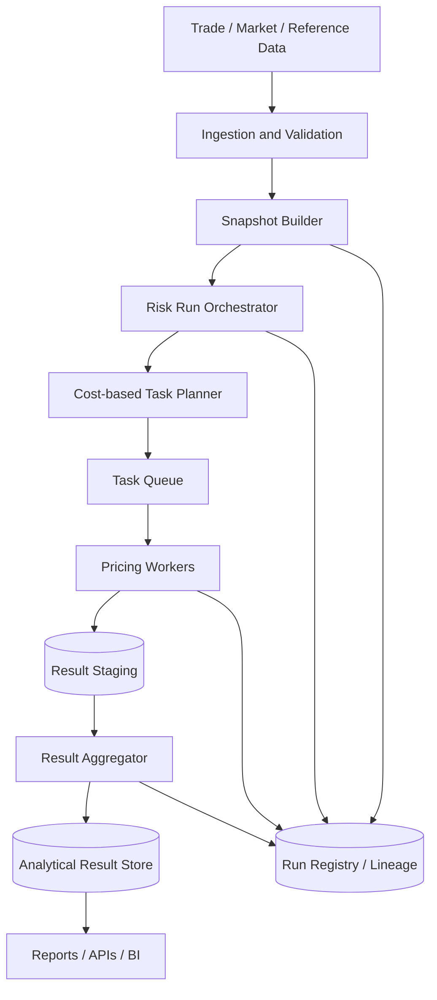

# Design a Risk Calculation Platform

## 项目一句话定位

这是一个面向金融机构的风险计算平台，用于把 trade、market data、reference data 和 pricing model 组合成可扩展、可重跑、可审计的 Greeks、VaR、PnL Explain 和 exposure 计算能力。

面试里要把它讲成 **high-cost distributed compute + snapshot consistency + lineage + analytical serving**，而不是普通 CRUD 或单个 batch job。

## 面试开场版本

我会把系统拆成六层：

- ingestion：接入 trade、market data、reference data。
- snapshot builder：固定同一次 run 的输入版本。
- run orchestrator：生成 `run_id`、risk type 和 task plan。
- distributed workers：并行执行 pricing、Greeks、VaR 或 scenario valuation。
- result aggregator：按 portfolio、risk factor、scenario 聚合。
- result store：支持 drill-down、dashboard、reporting 和 rerun audit。

核心设计点是 snapshot consistency、cost-based task partitioning、task-level retry、idempotent writes、result lineage、batch SLA 和查询成本控制。

## 推荐架构



## 核心难点与可追问

### 1. Cost-based Task Partitioning

真实 case：

- trade count 不是计算成本的好 proxy。
- exotic product、Monte Carlo、large scenario set 会让部分 task 成为 straggler。

面试表达：

- baseline 可以按 portfolio 拆，但高级设计应该引入 historical runtime profile。
- task planner 根据 product type、model type、scenario count、risk type 和 portfolio priority 估算 cost。
- 复杂 trade further split，简单 trade 合并，避免 worker utilization 不均。

可追问：

Q：如何知道任务成本？

A：先用 product type 和 scenario count 做静态估算，再把历史 runtime、failed count、input size 反馈到 task profile。下一次 run 用 profile 做更准确的 planning。

### 2. Snapshot Consistency

真实 case：

- run 持续 30 分钟，如果 worker 读取 latest market data，早完成任务和晚完成任务会使用不同 curve 或 vol surface。

面试表达：

- 同一次 run 必须绑定 `trade_snapshot_id`、`market_snapshot_id`、`reference_data_version` 和 `model_version`。
- worker 只能读取 snapshot id 指向的数据版本。
- result 必须保留 snapshot metadata，便于 rerun 和 audit。

可追问：

Q：缺失 market data 是否可以 fallback？

A：critical risk factor 不应静默 fallback，应 fail task 并进入 exception workflow。非关键字段可以使用 last good value，但结果必须标记 data quality flag。

### 3. Scenario Explosion

真实 case：

- Greeks 和 VaR 都会把计算放大成 trade × risk factor × scenario。

面试表达：

- 需要做 risk factor grouping、scenario batching、market data object caching 和 parallel execution。
- 对 analytic product 使用 closed-form Greeks；对复杂产品使用 bump-and-reprice 或 simulation。
- worker 应避免重复加载 curve、vol surface 和 static reference data。

可追问：

Q：如何降低重复计算？

A：缓存 base PV、curve、vol surface 和 model calibration object；把多个 scenario batch 到同一个 worker；对相同 market snapshot 做 object reuse。

### 4. Partial Rerun and Idempotency

真实 case：

- 单个 task 失败不应导致整批 rerun。
- 写入成功但 ack 失败会导致重复消费。

面试表达：

- 每个 task 有稳定 `task_id`，result key 使用 `run_id + task_id + scenario_id + risk_type`。
- 写入采用 staging + upsert，run completion 由 orchestrator 判断。
- failure 分为 transient、data、model 三类，处理策略不同。

可追问：

Q：如何防止重复结果？

A：用唯一键约束和 upsert；所有 worker 输出都是 deterministic result row；重复处理同一 task 不新增行，只覆盖同一 logical key。

### 5. Lineage and Auditability

真实 case：

- 风险经理追问 VaR jump，需要知道变化来自 position、market move、model version 还是 scenario set。

面试表达：

- lineage 不是报表层补充，而是 result schema 的一部分。
- 每条 result 带 `run_id`、`valuation_date`、snapshot ids、model version、scenario set、task id、created_at、rerun flag。
- 这样才能支持 drill-down、rerun、reconciliation 和 regulator audit。

可追问：

Q：如何解释 VaR 比昨天高？

A：先比较 position snapshot，再比较 market data snapshot，再比较 model/scenario version。系统需要能按这些维度做 PnL Explain 或 VaR Explain。

### 6. Analytical Result Store

真实 case：

- 风险结果有 valuation date、portfolio、desk、risk type、scenario、product type 等多维度。
- analyst full scan 会很贵。

面试表达：

- result store 是 analytical workload，适合列式存储或 BigQuery / ClickHouse 类系统。
- 明细表按 valuation_date partition，按 portfolio_id、risk_type、scenario_id、product_type clustering。
- dashboard 使用 summary table 或 serving table，避免每次扫明细。

可追问：

Q：为什么不用 OLTP 数据库存全部结果？

A：OLTP 数据库适合事务和点查，不适合高维聚合和大规模扫描。risk result 更适合 analytical store，必要时再把少量高频结果同步到 serving store。

## 高频面试题与标准回答

Q1：这个系统和普通 batch pipeline 最大区别是什么？

A：普通 pipeline 重在数据转换，risk platform 重在高成本模型计算、一致 snapshot、task-level retry、result lineage 和 auditability。计算结果需要能解释、能重跑、能和监管或风险管理流程对齐。

Q2：如何保证 batch SLA？

A：先拆分 latency budget：data preparation、task planning、worker compute、aggregation、write、reporting。再用 cost-based partitioning、autoscaling、market data caching、priority scheduling、partial rerun 和 pre-aggregation 控制尾部延迟。

Q3：如何设计 result schema？

A：核心字段包括 `run_id`、`valuation_date`、`portfolio_id`、`trade_id`、`risk_type`、`scenario_id`、`risk_factor`、`value`、snapshot ids、model_version、task_id 和 quality flags。明细表服务 drill-down，summary table 服务 dashboard。

Q4：如何和 quant team 协作？

A：把 model integration 做成接口契约：input schema、market data dependencies、model parameters、output schema、error semantics、versioning 和 regression tests。Quant 负责模型正确性，engineering 负责稳定性、可扩展性和运维。

Q5：系统最重要的监控是什么？

A：run duration、SLA miss、task success rate、retry count、worker utilization、straggler ratio、missing market data count、failed trade count、result row count、query cost 和 data quality exceptions。

## Senior Architecture Review

### High-level 设计目标

Senior candidate 需要先说明这类平台的目标不是“跑完一个 job”，而是管理一类可重复的 official risk run。

核心目标：

- **Correctness**: 同一 run 使用一致 snapshot，结果不混版本。
- **Scalability**: 支持 portfolio、trade、scenario、risk factor 增长。
- **Auditability**: 每个结果可以解释输入、模型、任务和 rerun 历史。
- **Recoverability**: 单 task 失败可以 partial rerun，不需要整批重跑。
- **Cost control**: 查询和计算都按 workload 优化，而不是无限扩容。
- **Extensibility**: 新 risk type、新 product、新 model 可以按契约接入。

面试表达：

> I would design this as a control-plane plus compute-plane architecture. The control plane manages runs, snapshots, task plans and lineage. The compute plane executes pricing and scenario valuation in parallel. This separation makes the system easier to rerun, audit and scale.

### Control Plane vs Compute Plane

| 层 | 责任 | 不应该做什么 |
|---|---|---|
| Control plane | run registry、snapshot binding、task planning、state machine、publication control | 不直接执行高成本 pricing |
| Compute plane | pricing、Greeks、scenario valuation、worker autoscaling | 不决定 official run 状态 |
| Data plane | snapshot store、result staging、analytical store、serving table | 不隐藏 lineage 和 data quality |
| Governance plane | model version、approval、audit trail、exception workflow | 不只依赖人工文档 |

Senior 亮点：

- 把 run orchestration 从 worker 中剥离。
- worker 可以失败、重试、扩容；run state 仍由 control plane 管理。
- official result publication 是受控状态转移，不是 job 成功后直接写报表。

### Data Model 深度设计

关键实体：

- `RiskRun`: official run 的控制实体。
- `SnapshotSet`: trade、market data、reference data 和 model version 的组合。
- `RiskTask`: 最小可调度、可重试、可计量成本的任务。
- `RiskResult`: 明细结果，服务 drill-down 和 audit。
- `RiskSummary`: 聚合结果，服务 dashboard 和 reporting。
- `Exception`: data/model/compute failure 的业务化记录。
- `Publication`: 结果发布给下游的状态和时间。

关键不变量：

- 一个 completed run 必须绑定不可变 snapshot set。
- 一个 task 的 logical output key 必须稳定。
- result 明细必须能回到 task、snapshot 和 model version。
- summary 可以重建，不能成为唯一真相。

### Workflow State Machine

```text
CREATED
  -> SNAPSHOT_READY
  -> TASK_PLANNED
  -> RUNNING
  -> AGGREGATING
  -> VALIDATING
  -> PUBLISHED
  -> ARCHIVED
```

失败分支：

- `DATA_EXCEPTION`: 输入数据缺失或质量问题。
- `MODEL_EXCEPTION`: 模型不支持、参数非法、数值异常。
- `COMPUTE_RETRYING`: transient infrastructure failure。
- `PARTIAL_COMPLETE`: 非关键任务失败但核心报表可发布。
- `FAILED`: critical task 失败且不能发布 official result。

面试表达：

> I would not model a risk run as a single job status. It needs a state machine because data readiness, task execution, validation and publication fail in different ways and require different recovery actions.

### Reliability and Recovery

Senior 需要区分三类失败：

- **Transient failure**: worker crash、network timeout、temporary write failure。自动 retry。
- **Data failure**: missing curve、stale fixing、invalid reference data。进入 exception workflow。
- **Model failure**: unsupported product、calibration failure、numerical instability。记录 model context，需要 quant/support 介入。

恢复策略：

- worker output 先写 staging。
- aggregator 可 deterministic rerun。
- task 有 retry limit 和 quarantine。
- run registry 记录 partial rerun history。
- publication 前做 validation gate。

### Performance and SLA

Senior 回答不要只说 autoscaling。先拆 critical path：

```text
data cutoff
-> snapshot build
-> task planning
-> worker compute
-> result write
-> aggregation
-> validation
-> publication
```

优化手段：

- cost-based task split
- model warmup and market data object reuse
- scenario batching
- worker pool by product/model type
- priority scheduling for critical books
- pre-aggregation for dashboard
- partition pruning for ad-hoc queries

关键指标：

- end-to-end run duration
- P50/P95/P99 task runtime
- straggler ratio
- worker utilization
- retry rate by failure type
- data exception count
- aggregation duration
- publication delay
- cost per run

### Security and Governance

这类系统通常涉及敏感交易和风险数据。Senior 需要主动补：

- entitlement control by desk / book / region
- least privilege for worker service accounts
- encrypted data at rest and in transit
- audit log for result access and publication
- model approval workflow
- segregation between dev, UAT and production runs
- regulatory retention policy

面试表达：

> Risk data is sensitive and often access-controlled by desk, book or legal entity. The platform should enforce entitlement not only at report level, but also in APIs and analytical queries.

## 潜在难点与亮点

### 难点

- trade、market data、reference data 的 readiness 时间不同，导致 snapshot build 成为 critical path。
- 不同产品模型成本差异大，导致 worker straggler。
- Greeks / VaR scenario explosion 导致计算和结果存储同时膨胀。
- model change 可能导致结果跳变，需要 regression 和 explainability。
- result store 很容易在 analyst ad-hoc query 下成本失控。
- partial rerun 后要保证 official result 版本和 publication 状态清楚。

### 亮点

- 使用 control plane / compute plane 分离，让 run 管理和 worker 扩展解耦。
- 使用 snapshot set 保证 official risk result 可重跑、可审计。
- 使用 cost-based task planner 降低 long-tail straggler。
- 使用 staging + idempotent upsert 支持 task-level retry。
- 使用 detail table + summary table 同时支持审计和 dashboard。
- 使用 lineage-first schema 支持 VaR jump、PnL explain 和 model change analysis。

## 潜在面试问题

Q1：你怎么定义这个系统的 source of truth？

A：trade truth 在 trade system，market data truth 在 market data platform，risk platform 的 source of truth 是 run registry、snapshot binding 和 risk result lineage。summary table 和 dashboard 都是派生视图。

Q2：如果 batch window 从 4 小时缩到 1 小时，你怎么设计演进？

A：先找 critical path，再做四类优化：提前 snapshot readiness、cost-based task split、worker autoscaling/priority scheduling、pre-aggregation 和 incremental publication。如果仍不够，再考虑 intraday precompute 或 risk factor grouping。

Q3：如何支持新增一个 risk type？

A：抽象 risk type contract：input requirements、scenario generation、model invocation、result schema、aggregation rule、validation rule 和 publication rule。新增 risk type 应该复用 run registry、snapshot、task queue、lineage 和 result store。

Q4：如果某个 quant model 非确定性，rerun 结果不一致怎么办？

A：official risk run 应尽量要求 deterministic model execution。若模型使用随机数，需要固定 seed、记录 simulation config、model version 和 runtime parameters。否则 audit 和 rerun 会失去可信度。

Q5：如何做 day-over-day explain？

A：用 waterfall 拆解：position change、market data move、model/scenario change、data correction。系统上要保留昨天和今天的 snapshot、model version 和 scenario set，才能做自动 explain。

Q6：如何设计 multi-region？

A：先区分 compute resiliency 和 official data residency。risk compute 可以多区域弹性扩展，但 official result、trade data 和 regulatory data 可能受 region 限制。multi-region 设计要考虑 data residency、RTO/RPO、cross-region cost 和 result publication consistency。

Q7：如果下游报表发现结果不一致怎么办？

A：先用 run_id 和 publication_id 对齐版本，再检查 downstream 是否读了 summary 还是 detail，是否存在 late rerun 或 partial publication。平台应提供 result reconciliation API 和 publication audit trail。

## 相关

- [[System Design Project Storytelling Template]]
- [[System Design Interview Practicum]]
- [[Queues and Asynchronous Processing]]
- [[Distributed Computing]]
- [[Batch Processing]]
- [[Data Lineage]]
- [[Risk Platform]]
- [[Risk Calculation System]]
- [[Value at Risk]]
- [[Greeks]]
