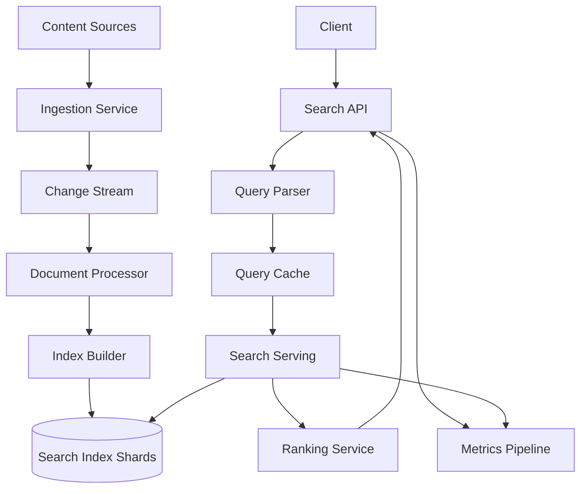
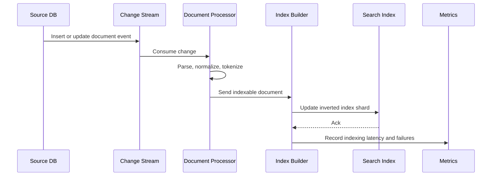
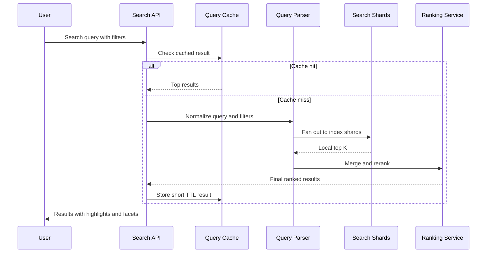

# Design a Search System

搜索系统考察的不是“会不会用 Elasticsearch”，而是你能不能把 indexing、retrieval、ranking、freshness 和 latency 这几条链路讲成一个完整系统。最稳的答法，是先明确你做的是通用文档搜索、站内商品搜索还是垂类检索，然后再把系统拆成 ingest、index、query、ranking 和 serving 五段。

面试里不要一上来就说搜索引擎内部实现细节。更重要的是先收敛 scope：支持 keyword search、基础过滤和排序、相关性排名、高亮和分页；先不做复杂个性化、广告混排和多模态召回。这样你能把核心链路讲扎实，再根据时间讨论更高级能力。

核心关注：

- indexing pipeline 需要说明数据源怎么进入系统、如何做解析、分词、倒排索引构建、增量更新和删除传播。
- ranking 不能只说 BM25，要讲召回和排序分层，以及业务排序、质量分、个性化特征怎样进入主链路。
- query latency 通常需要多级缓存、并行 shard 查询、top-k merge 和超时降级策略。
- freshness 是搜索系统的关键 trade-off，需要明确近实时索引、批量重建和 query-time 补偿之间怎么平衡。
- shard strategy 需要结合数据规模、写入速度、热点分布和扩缩容成本，而不是空泛地说“按 hash 分片”。

适用场景：

- 适用于站内文档搜索、电商搜索、日志搜索、企业知识检索和任何以检索质量加低延迟为核心目标的系统。
- 也适用于面试里需要区分“静态召回”和“动态补充”的场景，例如商品、内容和本地生活搜索。

常见误区：

- 常见误区是只讲倒排索引和分词，却没有解释 query path、缓存、排序延迟和结果新鲜度。
- 另一个误区是把所有字段都当成强实时更新目标，结果写入链路复杂度和成本远超业务需要。

面试回答方式：

- 开场先说我会先区分 ingest path 和 query path，因为搜索系统通常是典型的读写分离架构。
- 高层架构可以拆成 Data Ingestion、Document Processing、Index Builder、Search Serving、Ranking Service、Cache 和 Metrics Pipeline。
- 深挖时优先讲索引更新、查询扇出、相关性排序和 freshness trade-off，说明哪些数据可以近实时，哪些可以最终一致。
- 收尾时补 shard rebalance、热点 query、降级策略、离线评估和线上指标。

## Search System Architecture

## Indexing Flow

## Query Flow

## Storage Estimation

假设：

- 100 million searchable documents.
- 平均原始文档 4 KB，解析后的 indexable text 和 metadata 约 6 KB。
- 倒排索引、term dictionary、posting list、doc values 和 ranking features 总 overhead 按原始 indexable data 的 2.5 倍估。
- 主索引复制 2 副本，原始数据在 source system 中另存，不计入搜索系统主估算。
- 每天 2% 文档更新，保留 7 天 replay/change log。

估算：

- Indexable data：100M * 6 KB = 600 GB。
- Search index：600 GB * 2.5 = 1.5 TB。
- 两副本总量：1.5 TB * 2 = 3 TB。
- 每日更新输入：100M * 2% * 6 KB = 12 GB/day。
- 7 天 change log：12 GB * 7 * 2 replicas = 168 GB。
- Query cache 如果缓存 10 million 热门 query，每条结果存 50 个 doc_id 和分数，约 10M * 50 * 16 B = 8 GB，再加 metadata overhead 可按 20 到 40 GB 估。

面试表达：

- 搜索估算要分原始文档、可索引字段、索引膨胀和副本数。
- 如果有图片、向量或日志场景，要单独估向量索引、冷热分层和保留周期。
- 搜索 index 通常可以重建，source of truth 不应该是搜索引擎本身。

## Key Components

- **Ingestion Service**: 接收全量导入和增量变更。
- **Document Processor**: 做解析、清洗、分词、语言检测、字段提取和删除传播。
- **Index Builder**: 构建倒排索引、doc values、term dictionary 和 segment merge。
- **Search Serving**: 执行 shard fan-out、top-k merge、超时和降级。
- **Ranking Service**: 处理 BM25、业务排序、个性化特征和 reranking。
- **Query Cache**: 缓存热门 query、facet 和低频变更结果。
- **Metrics Pipeline**: 追踪 query latency、zero-result rate、indexing lag 和 relevance metrics。

## Design Trade-offs

- **Freshness vs Latency**: 近实时索引更复杂，批量索引更稳定；可以对库存、价格等字段做 query-time enrich。
- **召回质量 vs 成本**: 更宽召回提高质量但增加 ranking 和 merge 成本。
- **分片数 vs 扩容成本**: 分片太少扩容困难，分片太多 fan-out 和 merge overhead 增加。
- **缓存 vs 个性化**: 越个性化越难缓存，可以缓存候选集或公共部分。

相关：

- [[Database Choices]]
- [[Data Partitioning and Sharding]]
- [[Caching]]
