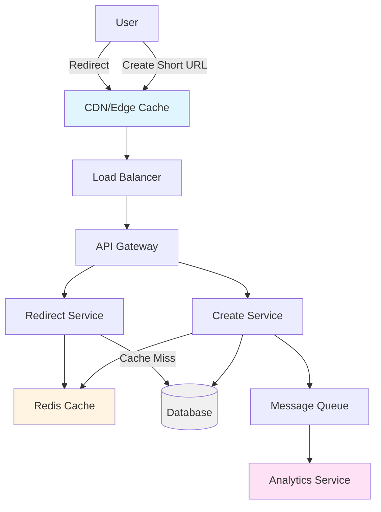
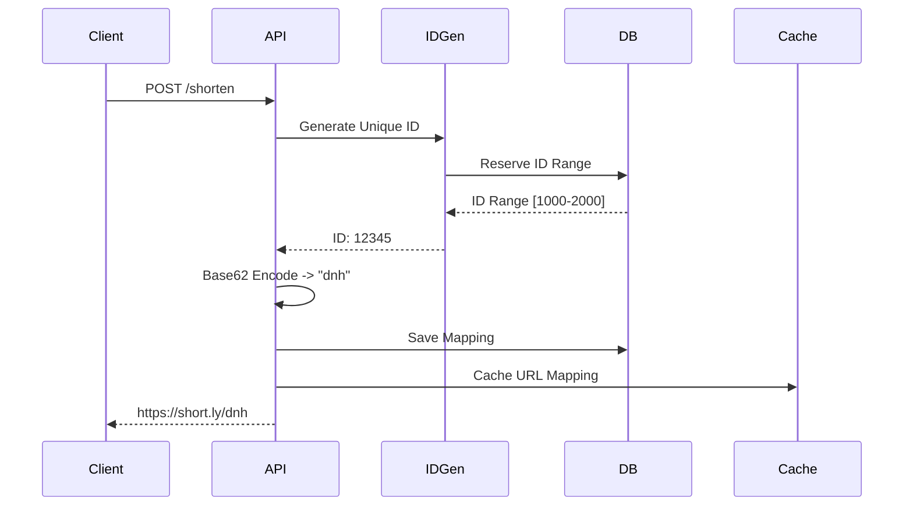
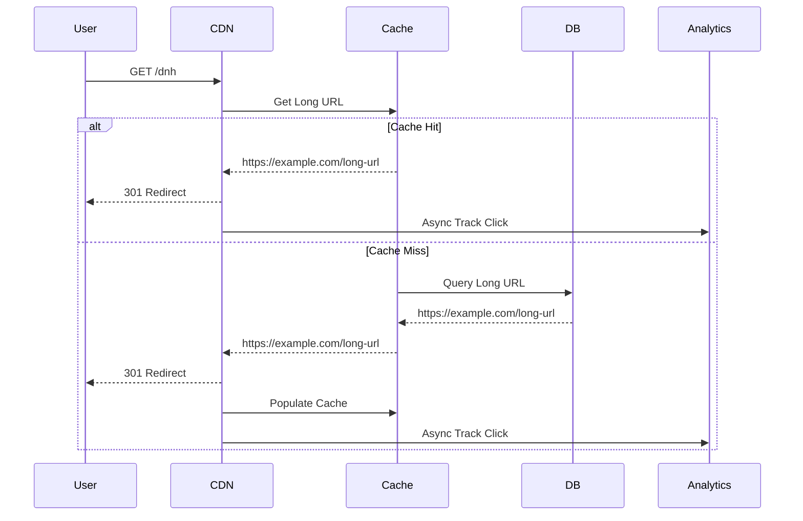
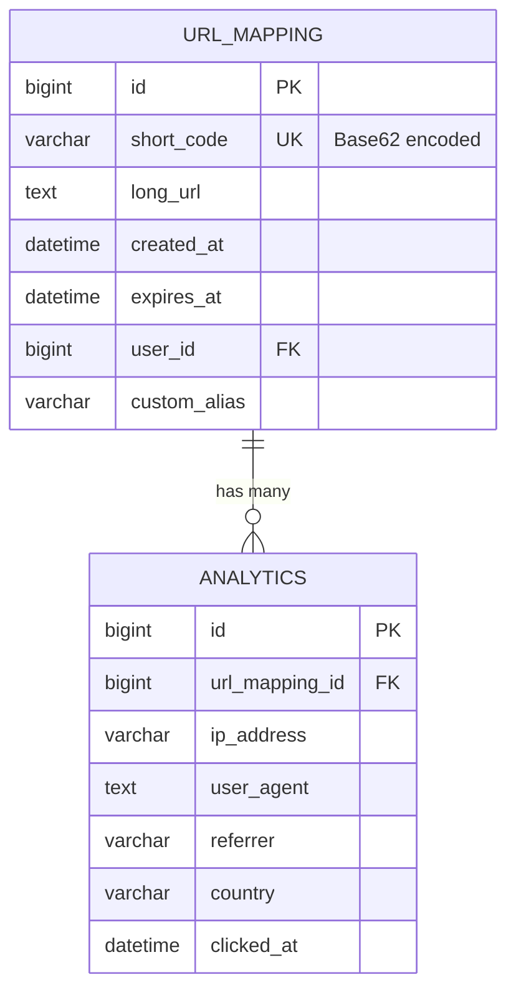

# Design a URL Shortener

URL shortener 是很经典的 system design 入门题，因为它看起来简单，但刚好能把 ID 生成、读多写少、缓存、存储和可用性这些基础能力讲清楚。它不是“做一个很短的字符串”这么简单，而是要说明怎样在高读流量下稳定完成短链创建、跳转和统计。

如果面试里遇到这题，最稳的答法不是上来堆 Redis、Kafka，而是先收敛 scope：先做短链生成、跳转和基础统计，再根据规模讨论自定义 alias、过期时间、恶意链接治理和分析平台。这样面试官能看到你先控制边界，再做架构判断。

核心关注：

- 先区分 create short URL 和 redirect 两条链路，因为 redirect 通常是高 QPS 读路径，create 则是相对低频写路径。
- short code generation 要保证唯一性并支持水平扩展，常见思路是全局 ID 编码、号段分配或数据库自增后做 base62。
- redirect latency 要足够低，通常要结合 CDN、edge cache、本地缓存和 Redis，把绝大多数请求挡在数据库前。
- collision handling 不能只靠“随机够长”，而是要明确冲突检测、重试策略和自定义 alias 的保留规则。
- analytics optionality 最好异步化处理，点击统计不要阻塞跳转主链路。

适用场景：

- 适用于短链接平台、营销分享链路、短信和邮件活动、社交传播以及任何需要把长 URL 压缩成可分享链接的场景。
- 也适用于你想训练最基础的读多写少 system design 框架，因为它能很好地练习缓存、存储和高可用拆分。

常见误区：

- 常见误区是一上来先讲数据库分片，却没有先说明 redirect 的读路径、缓存命中和失败回退。
- 另一个误区是把 analytics 同步写进主链路，导致每次跳转都要等待多个下游系统。

面试回答方式：

- 开场先说我会先支持 create 和 redirect 两个核心能力，再根据流量决定缓存、存储和异步统计怎么分层。
- 然后给一个 baseline：API Gateway 后面拆成 URL Service、Redirect Service、Metadata Store、Cache 和 Analytics Pipeline。
- 深挖时优先讲 redirect 主链路、short code 生成策略、缓存层次和数据库唯一性约束，而不是泛泛列组件。
- 收尾时补一下恶意链接治理、TTL、监控指标和未来如何从单库扩展到分片。

## System Architecture

## Short Code Generation Flow

## Redirect Flow

## Database Schema

## Storage Estimation

假设：

- 每月 100 million 新短链。
- 每条 URL mapping 平均 1 KB，包括 long_url、short_code、user_id、TTL、状态和索引 overhead。
- 每天 1 billion redirects。
- 每条 click analytics event 500 bytes，原始点击日志保留 1 年，聚合报表长期保留。
- URL mapping 三副本，analytics 日志三副本，缓存只保存热点 20% mapping。

估算：

- 每月 mapping 原始写入：100M * 1 KB = 100 GB/month。
- 三副本 mapping：300 GB/month，一年约 3.6 TB。
- 每日点击日志：1B * 500 B = 500 GB/day。
- 三副本点击日志：1.5 TB/day，一年约 547.5 TB。
- 热点缓存：100M monthly active mappings * 20% * 1 KB = 20 GB，双副本和 overhead 后可按 50 到 80 GB Redis 起步。
- 聚合统计如果按 short_code + day 存 PV/UV/country/referrer，通常远小于原始日志，可以按每天数 GB 级别估。

面试表达：

- 短链长期存储瓶颈通常不是 mapping 表，而是 click analytics 原始日志。
- redirect 主链路只需要读取 mapping，点击统计应异步写日志或流系统。
- 如果题目要求隐私合规，要说明 IP/user-agent 的保留周期和脱敏策略。

## Key Components

- **API Gateway**: 路由、限流、认证
- **Create Service**: 处理短链创建，ID 生成和存储
- **Redirect Service**: 处理短链跳转，高 QPS 读取
- **Cache Layer**: Redis 缓存热点短链，CDN 缓存跳转结果
- **Database**: 存储短链映射关系，支持分片
- **Message Queue**: 异步处理点击统计和分析
- **Analytics Service**: 点击分析、报表生成

## ID Generation Strategies

- **Database Auto-increment**: 简单但单点，可配合号段分配
- **Snowflake**: 分布式唯一 ID，包含时间戳和机器 ID
- **UUID**: 全局唯一但较长，不适合短链
- **Custom Base62**: 将数字 ID 转换为更短的字符串

相关：

- [[Database Choices]]
- [[Caching]]
- [[Scalability]]
