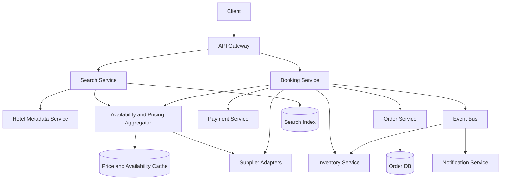
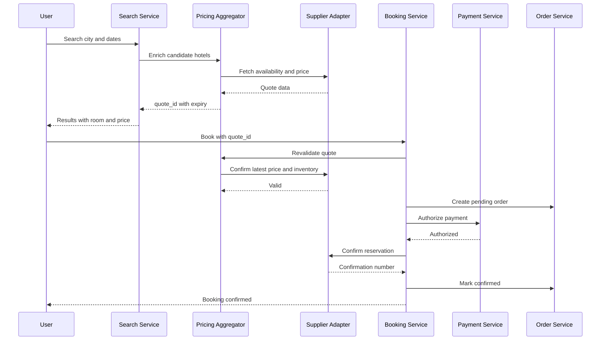
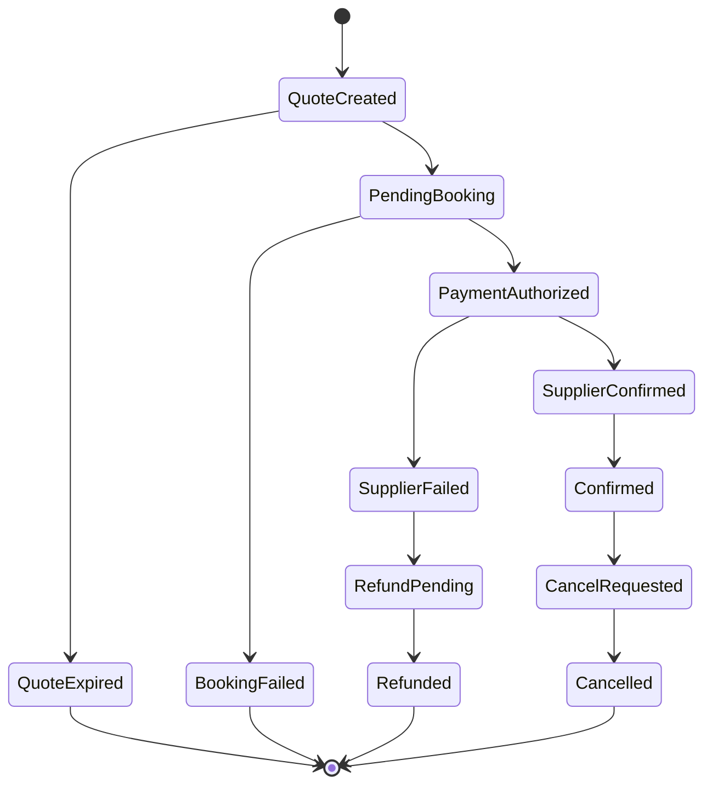

# Design an Expedia-like Travel Booking System

Expedia 类 system design 的核心，不是把旅游业务讲得多全，而是你能不能把高并发搜索、多供应商聚合、强一致预订和最终一致订单链路讲清楚。最稳的答法，是先把系统拆成 Search、Pricing、Booking、Payment 和 Order 五段，再明确哪些地方追求低延迟，哪些地方追求强一致。

面试里先主动收敛 scope。可以先设计 hotel booking 场景：用户按城市和日期搜索酒店，看到房型和价格，选择后下单支付并收到确认。先不做机票票规、多城市行程和复杂客服改签，先把酒店搜索和预订主链路做对，再讨论扩展。这样面试官能看到你有 scope control，也有 product sense。

这个系统最关键的一句判断是：搜索阶段看到的是 quote，真正下单前必须重新校验价格和库存。因为 Expedia 这类系统最大的现实问题就是价格和库存会变化，搜索页可以接受轻微陈旧，但 booking 阶段必须对 authoritative inventory source 做 revalidation。

核心关注：

- 先把系统拆成 Search path 和 Booking path，因为二者的 SLA 完全不同。搜索追求高吞吐和低延迟，预订追求正确性、幂等和状态可恢复。
- 搜索结果通常是静态召回加动态 enrich。酒店元数据、评分、设施和地理位置适合进搜索索引，动态库存和价格要通过 availability and pricing layer 单独补充。
- 价格与库存要按 quote 和 booking 两阶段设计。搜索阶段返回 quote_id 和过期时间，下单阶段执行 validate、hold inventory、pay、confirm。
- 多供应商场景下不能把本地缓存当最终真相。必须明确 supplier adapter、revalidation、confirm reservation 和失败补偿流程。
- 订单链路要建模成状态机，并且默认网络重试、重复点击和第三方重复回调都会发生，所以幂等性必须是主设计，不是补丁。

建议包含：

- 功能上先支持搜索、筛选排序、返回房型与动态价格、创建预订、支付确认、订单查看、取消和退款。
- 非功能上明确搜索高 QPS、低延迟，预订不能超卖，搜索页允许最终一致，下单必须强校验，并且系统要支持多供应商接入。
- 核心实体最好先定义清楚：Hotel、RoomType、RatePlan、Inventory、PriceQuote、Booking、PaymentTransaction 和 Supplier。
- 数据存储不要泛泛说 MySQL、Redis、Kafka，而是明确订单和支付流水放事务数据库，热点价格和库存缓存放 Redis，酒店召回和筛选放 OpenSearch，事件流和异步通知放 Kafka。

典型流程：

- Search：Location Service 解析城市，Search Service 从索引拿候选酒店集合，Availability and Pricing Aggregator 对候选集补价格和可售性，再做 filter 和 sort。
- Quote：返回可售房型、动态价格、税费、政策和 quote_id，同时附带过期时间和 advisory 语义。
- Booking：用户提交 quote_id 和入住信息后，Booking Service 先 revalidate price and inventory，再 hold inventory，创建 pending order，发起支付，最后向 supplier confirm reservation。
- Finalize：支付和确认都成功后更新订单状态为 confirmed，写 supplier confirmation number，正式扣减库存并发送通知。
- Cancel and Refund：检查 rate plan cancellation policy，调用 supplier cancel，更新订单状态，释放库存，发起退款，再异步通知用户。

适用场景：

- 适用于本地生活、酒店预订、门票、租车和任何“高并发搜索 + 稀缺库存 + 强一致下单”的聚合交易平台。
- 也适用于 system design 面试，因为它能同时考察搜索、缓存、聚合、库存、支付、状态机和 Saga 补偿。

常见误区：

- 常见误区是把搜索和预订当成同一种链路来设计，结果既拿不到搜索性能，也守不住预订正确性。
- 另一个误区是只谈分布式锁防超卖，却没有说明 authoritative inventory 在谁手里，以及 supplier confirm 失败后怎么退款和补偿。

面试回答方式：

- 开场先收敛到 hotel booking，再说明搜索和预订会按不同 SLA 分开设计。
- 高层架构可以拆成 Client、API Gateway、Search Service、Hotel Metadata Service、Availability and Pricing Aggregator、Booking Service、Inventory Service、Payment Service、Order Service 和 Notification Service。
- 深挖时优先讲搜索链路为什么不能每次实时打所有 supplier、booking 链路为什么必须做 revalidation + hold + confirm，以及如何避免超卖。
- Trade-off 要主动讲清楚：搜索实时性 vs 延迟、库存正确性 vs 吞吐、预占时长 vs 库存利用率、同步关键路径 vs 异步边缘链路。
- 收尾时补状态机、Saga、幂等键、监控指标和未来怎样从酒店扩展到机票、门票和租车。

## Travel Booking Architecture

## Search to Booking Flow

## Booking State Machine

## Storage Estimation

假设：

- 20 million MAU，每人每月 20 次搜索。
- 每次搜索平均返回并缓存 100 个 hotel-rate candidates，单条 quote/cache record 1 KB，TTL 15 min。
- 搜索转化率 2%，即每月 8 million booking attempts。
- 每个 booking/order/payment/supplier record 合计约 8 KB。
- 订单数据保留 7 年，搜索 quote/cache 只短期保留。

估算：

- 每月搜索次数：20M * 20 = 400M searches。
- 短期 quote/cache 写入：400M * 100 * 1 KB = 40 TB/month 写入量。
- 因 TTL 15 min，常驻缓存取决于 QPS。若 400M/month 约 154 QPS，每次 100 KB，15 min 常驻约 154 * 100 KB * 900 = 13.9 GB，实际加热点和副本可按 50 到 100 GB Redis/kv cache 估。
- 每月 booking attempts：400M * 2% = 8M。
- 每月订单存储：8M * 8 KB = 64 GB，三副本约 192 GB/month。
- 7 年订单：64 GB * 12 * 7 = 5.38 TB，三副本约 16.1 TB。
- 供应商原始响应和审计日志若每次 booking attempt 20 KB，每月约 160 GB，7 年约 13.4 TB，适合对象存储或日志湖。

面试表达：

- Expedia 类系统的长期存储主要是订单、支付、审计和供应商确认，不是搜索缓存。
- 搜索缓存写入量很大但 TTL 短，估算时要区分写入吞吐和常驻容量。
- 订单和支付数据要按合规保留期估，不能只看当月容量。

## Key Components

- **Search Service**: 召回候选酒店，处理筛选、排序和分页。
- **Availability and Pricing Aggregator**: 聚合供应商价格库存，生成短期 quote。
- **Supplier Adapter**: 屏蔽供应商 API 差异，处理重试、超时、熔断和幂等。
- **Booking Service**: 编排 revalidate、hold、payment、confirm 和补偿。
- **Inventory Service**: 管理本地库存视图、hold TTL 和释放。
- **Order Service**: 管理订单状态机、确认号、取消退款和审计记录。
- **Payment Service**: 做授权、扣款、退款和支付回调幂等。

## Design Trade-offs

- **实时供应商查询 vs 缓存**: 搜索阶段缓存降低延迟，下单阶段必须重新校验。
- **库存 hold 时长 vs 转化率**: hold 太短影响支付完成，太长浪费库存。
- **同步确认 vs Saga**: 用户确认页需要强结果，但通知、发票、积分等边缘链路可异步。
- **本地库存 vs supplier authoritative source**: 自营库存可本地强一致，第三方库存必须尊重 supplier 最终确认。

从哪里继续看：

- [[Design a Search System]]
- [[Database Choices]]
- [[Caching]]
- [[Consistency and CAP]]
- [[Queues and Asynchronous Processing]]
- [[Event-Driven Architecture for System Design]]
