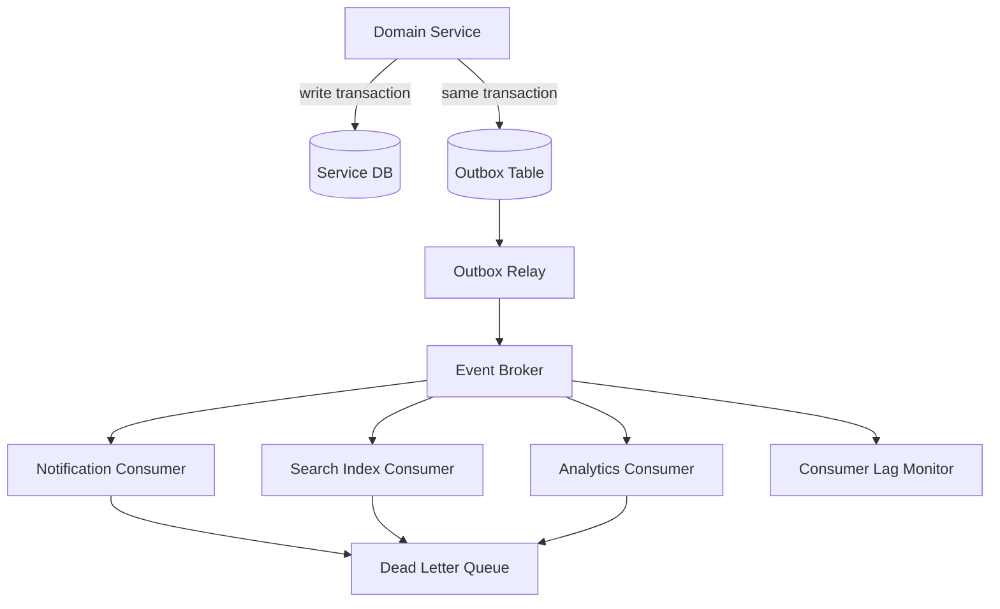
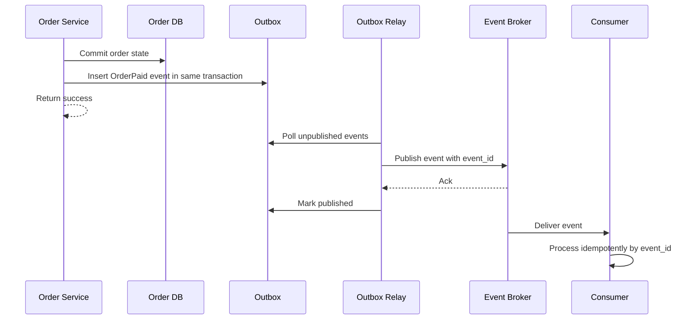

# Event-Driven Architecture for System Design

事件驱动架构适合把核心交易链路和下游副作用解耦。它不是“加个 Kafka”这么简单，而是要讲清事件边界、投递语义、幂等、顺序、重试、死信队列和最终一致性。

最常见的用法是：主服务完成自己的事务后发布领域事件，下游服务异步消费。例如订单支付成功后，库存、通知、积分、风控、数据分析都可以通过事件继续处理，而不是让支付接口同步等待所有下游。

## When To Use

- 下游处理不应该阻塞用户主链路，例如通知、报表、搜索索引更新和数据同步。
- 多个消费者需要对同一业务事实做不同处理。
- 系统要吸收突发流量，用队列削峰填谷。
- 跨服务事务可以接受最终一致，并且有补偿和状态追踪。

不适合的场景：

- 用户必须立刻知道强一致结果，例如账户扣款余额。
- 下游处理必须和主事务原子提交，但系统没有 outbox 或事务消息机制。
- 事件 schema 不稳定，生产者和消费者频繁互相打破兼容性。

## Event-Driven Architecture

## Reliable Publish Flow

## Design Checklist

- **Event type**: 用领域事实命名，例如 `OrderPaid`，不要用技术动作 `SendEmailCommand`。
- **Schema**: 包含 event_id、event_type、occurred_at、producer、schema_version 和业务主键。
- **Idempotency**: 消费者用 event_id 或业务 key 去重，默认队列会重复投递。
- **Ordering**: 如果需要同一订单内有序，用 order_id 作为 partition key。
- **Retry**: 临时失败 backoff retry，永久失败进入 DLQ。
- **Replay**: 事件要能重放，消费者处理逻辑要能承受重复和旧版本 schema。
- **Observability**: 监控 publish failure、consumer lag、DLQ size、processing latency 和 replay rate。

## Common Failure Modes

- 发布事件和写数据库不是同一事务，导致订单成功但事件丢失。
- 消费者不是幂等的，重复投递导致重复发券、重复通知或重复扣库存。
- 事件 payload 过大，把 broker 当数据库用。
- 没有 schema versioning，生产者改字段后消费者线上崩掉。
- 所有消费者共享一个 topic 和 consumer group，导致扩展和权限边界混乱。

## Interview Guidance

- 先说明哪些动作必须同步，哪些副作用可以事件驱动。
- 主动讲 outbox pattern，表明你知道“写库成功但发消息失败”的经典坑。
- 讲清至少一次投递、幂等消费、partition ordering 和 DLQ。
- 收尾补 backfill/replay、schema evolution 和 consumer lag 告警。

相关：

- [[Queues and Asynchronous Processing]]
- [[Consistency and CAP]]
- [[Design a Notification System]]
- [[Observability in System Design]]
