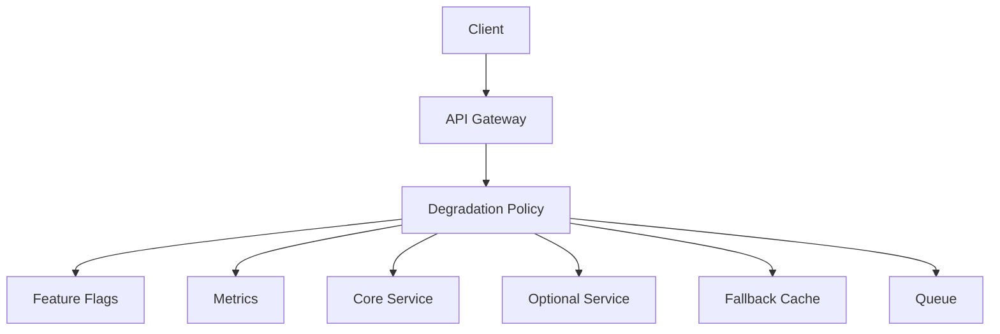
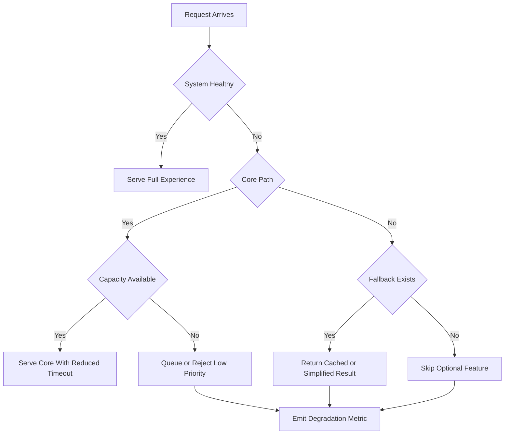

# Graceful Degradation and Load Shedding

优雅降级和负载丢弃的目标是在系统压力过大时保住核心用户体验，而不是让所有功能一起崩。面试里要讲清哪些功能是核心、哪些可以降级、触发条件是什么、降级结果是什么，以及如何恢复。

Graceful degradation 是返回“较差但可用”的结果，例如关闭个性化、返回缓存、隐藏非核心模块。Load shedding 是主动拒绝一部分请求，保护系统剩余容量，例如返回 429、503、排队或只服务高优先级流量。

## Degradation Architecture

## Decision Flow

## What To Degrade

- **Recommendation**: 返回热门列表，跳过个性化排序。
- **Search**: 降低召回数量，关闭复杂 filter 或 facet。
- **Analytics**: 异步采样写入，暂停非关键报表。
- **Notification**: 延迟营销通知，保留安全和交易通知。
- **Product page**: 保留价格库存和购买按钮，隐藏评论、推荐和非核心模块。
- **Media**: 降低图片/视频质量，返回 CDN stale cache。

## Trigger Signals

- CPU、内存、连接数、队列积压、cache miss、DB QPS、P99 latency。
- 下游 error rate、timeout rate、circuit breaker open。
- 业务指标，例如支付成功率下降、库存服务错误、登录失败。
- 人工开关和预案，例如大促、发布异常、供应商故障。

## Common Failure Modes

- 降级开关从未演练，真正故障时没人敢打开。
- 降级逻辑依赖同一个故障下游，fallback 也失败。
- 对所有用户一刀切，误伤付费用户或关键交易。
- 只降级读链路，写链路仍然把队列和数据库打爆。
- 没有恢复策略，系统健康后仍然停留在降级模式。

## Interview Guidance

- 先定义核心路径和可降级路径。
- 用一个具体系统举例，例如电商详情页或推荐 feed。
- 说明触发条件、降级动作、用户看到什么、监控什么、如何恢复。
- 把 load shedding 和 rate limiting 区分开：限流是常态保护，丢弃是压力下的生存策略。

相关：

- [[Rate Limiting]]
- [[Availability and Reliability]]
- [[Bottleneck Analysis in Distributed Systems]]
- [[Design a 10 Million QPS System]]
