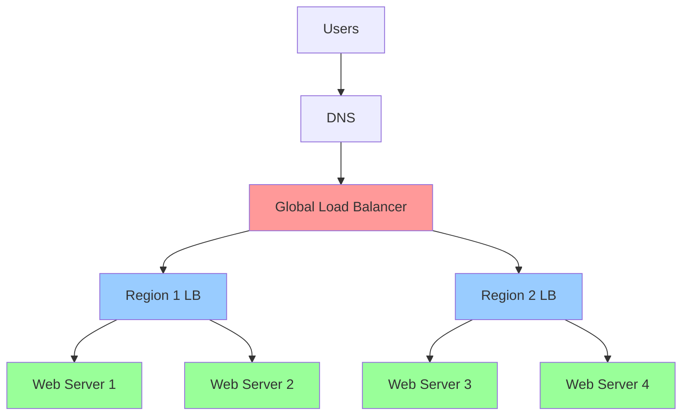
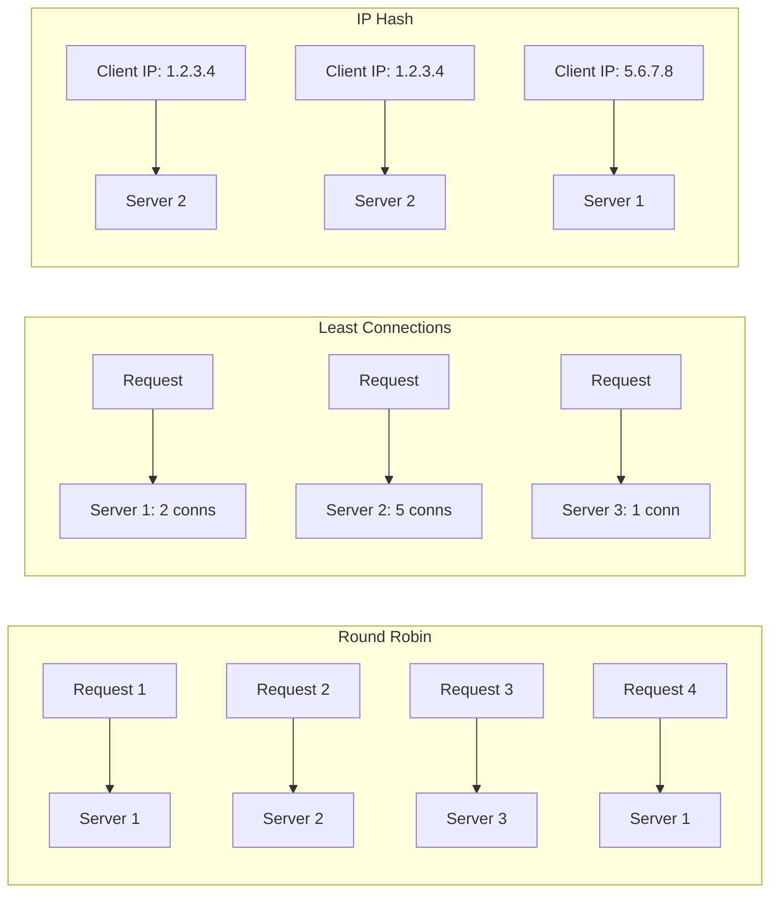
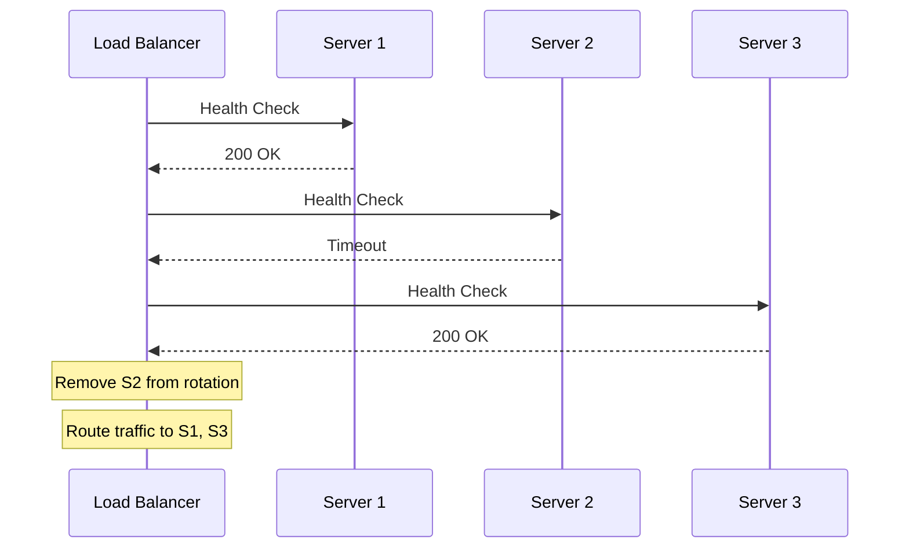

# Load Balancing

Load Balancing 用于把流量合理分配到多个实例。

详细解释：

它是横向扩展和高可用的基础能力。system design 题里常见于 web service、API service 和 stateful connection 管理场景。

## Load Balancer Placement

## Load Balancing Algorithms

## Health Check Flow

## Key Algorithms

- **Round Robin**: 依次分发，适合服务器性能相近
- **Weighted Round Robin**: 按权重分发，适合服务器性能不同
- **Least Connections**: 分发到当前连接数最少的服务器
- **IP Hash**: 根据 client IP 做 hash，保证同一用户路由到同一服务器
- **Least Response Time**: 分发到响应时间最短的服务器

相关：

- [[Scalability]]
- [[Availability and Reliability]]
- [[Design a Chat System]]

