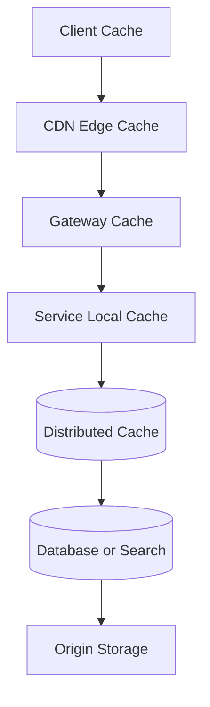
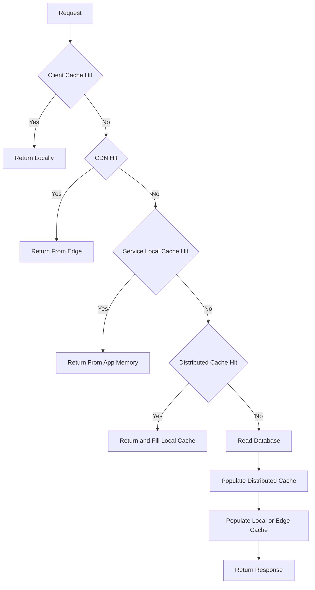

# Multi-Level Caching Strategies

高 QPS 系统里的缓存通常不是单层，而是多层协同。核心目标是把热点请求挡在越靠前、越便宜的位置：浏览器、CDN、网关、本地内存、分布式缓存，最后才是数据库或搜索引擎。

## Cache Layers

1. **Client cache**: 浏览器、移动端、SDK，本地最快但最难统一失效。
2. **CDN or edge cache**: 适合静态资源、公开页面、短链跳转和热点内容。
3. **Gateway cache**: 适合轻量 API response、认证公钥、配置和路由规则。
4. **Service local cache**: 适合热点小对象、短 TTL、低一致性要求。
5. **Distributed cache**: Redis/Valkey/Memcached，适合共享热点、会话、计数和查询结果。
6. **Storage cache**: 数据库 buffer pool、搜索引擎 query cache、对象存储边缘缓存。

## Multi-Level Cache Architecture

## Read Flow

## Invalidation Strategies

- **TTL**: 简单可靠，适合允许短暂陈旧的数据。
- **Write-through**: 写数据库同时更新缓存，路径更复杂但读更稳定。
- **Cache-aside**: 服务先查缓存，miss 后查库再回填，最常见。
- **Versioned key**: key 带版本号，适合 CDN 和不可变资源。
- **Event invalidation**: 数据变更后发事件清理多个缓存层。
- **Stale-while-revalidate**: 先返回旧值，后台刷新，适合热点内容和读多写少。

## Common Failure Modes

- 缓存击穿：热点 key 过期瞬间大量请求打到 DB。
- 缓存穿透：不存在的数据持续 miss，绕过缓存打到 DB。
- 缓存雪崩：大量 key 同时过期或缓存集群故障。
- 热 key：单个 key 被极高 QPS 访问，集中打爆一个分片。
- 大 value：单个缓存值太大，网络和序列化成本超过收益。
- 不一致：多级缓存失效顺序不清，用户看到旧数据太久。

## Interview Guidance

- 先说明缓存层级和每层适合的数据。
- 用 cache hit rate 反推 origin QPS，例如 99% 命中率下 1M QPS 仍有 10K QPS 回源。
- 主动讲失效策略和失败模式，不要只说“加 Redis”。
- 收尾补监控：hit rate、miss rate、eviction、hot key、latency、stale rate 和 origin protection。

重点治理问题：

- [[Cache Penetration]]
- [[Cache Breakdown]]
- [[Cache Avalanche]]
- [[Hot Key Split]]
- [[Request Coalescing]]
- [[Cache Prewarming]]
- [[Logical Expiration and Background Refresh]]

相关：

- [[Caching]]
- [[Design a 10 Million QPS System]]
- [[Bottleneck Analysis in Distributed Systems]]
