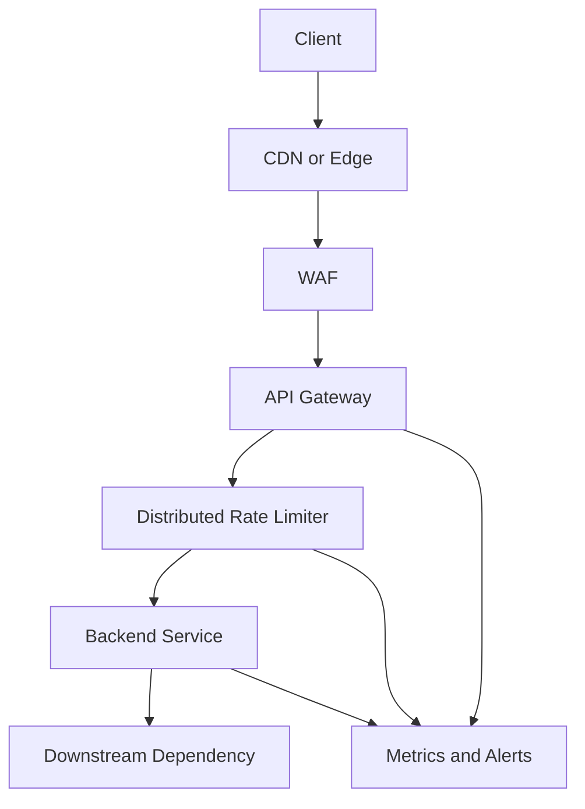
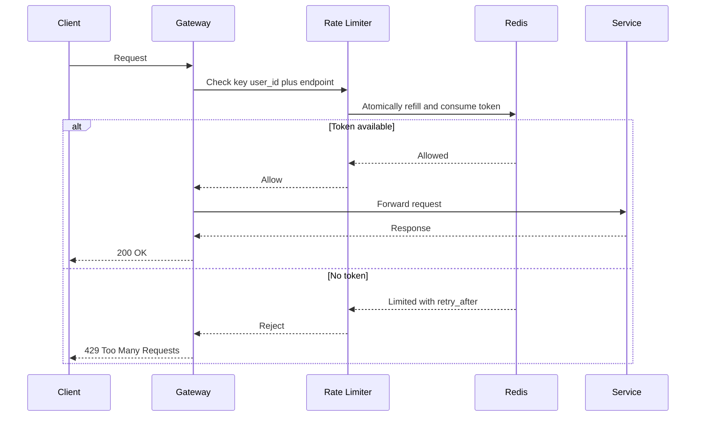

# Rate Limiting

限流用于保护系统免于被突发流量、恶意请求或滥用压垮。它既是系统保护措施，也是公平性、成本控制和租户隔离机制。好的限流设计要说明限什么、在哪里限、按什么 key 限、超过后怎么返回，以及如何避免限流器本身成为瓶颈。

## Common Algorithms

- **Fixed window**: 实现简单，但窗口边界会出现突刺。
- **Sliding window log**: 精确但存储成本高，适合低 QPS 或高价值 API。
- **Sliding window counter**: 在精度和成本之间折中。
- **Token bucket**: 允许短时 burst，长期速率受控，最常用于 API rate limit。
- **Leaky bucket**: 平滑出流量，适合保护下游稳定处理速率。

## Layered Rate Limiting

## Token Bucket Flow

## Key Design Choices

- **Limit key**: IP、user_id、tenant_id、API key、endpoint、region 或组合 key。
- **Limit location**: CDN/WAF 挡恶意流量，Gateway 做租户和 endpoint 限流，服务内部保护昂贵操作。
- **Global vs local**: 全局限流更公平但延迟和一致性成本更高，本地限流更快但不够精确。
- **Response behavior**: 返回 429、Retry-After、降级结果、排队或静默丢弃，取决于业务。
- **Burst handling**: token bucket 支持短时 burst，适合用户真实行为；严格匀速用 leaky bucket。

## Common Failure Modes

- 只按 IP 限流，移动网络或企业 NAT 下会误伤大量用户。
- 限流 Redis 挂了没有 fallback，保护组件自己变成单点。
- retry-after 缺失，客户端疯狂重试造成更大流量。
- 全局限流要求过高一致性，每个请求都跨区域查限流状态，延迟被放大。
- 只在服务层限流，恶意流量已经消耗了网关、TLS 和连接资源。

## Interview Guidance

- 先说明限流目标：防攻击、公平性、成本控制还是保护下游。
- 画分层限流：edge、gateway、service、downstream。
- 算法优先讲 token bucket，再对比 fixed/sliding window。
- 深挖时讲分布式计数、Lua/atomic update、local fallback、Retry-After 和观测指标。

相关：

- [[API Gateway and Service Boundaries]]
- [[Latency and Throughput]]
- [[Design a Notification System]]
- [[Graceful Degradation and Load Shedding]]
