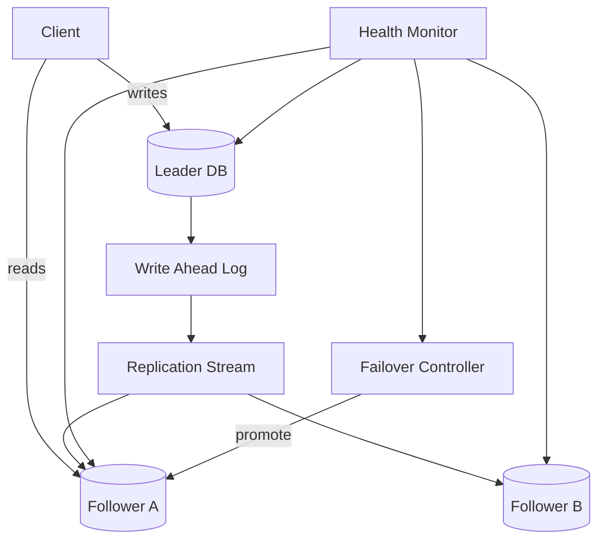
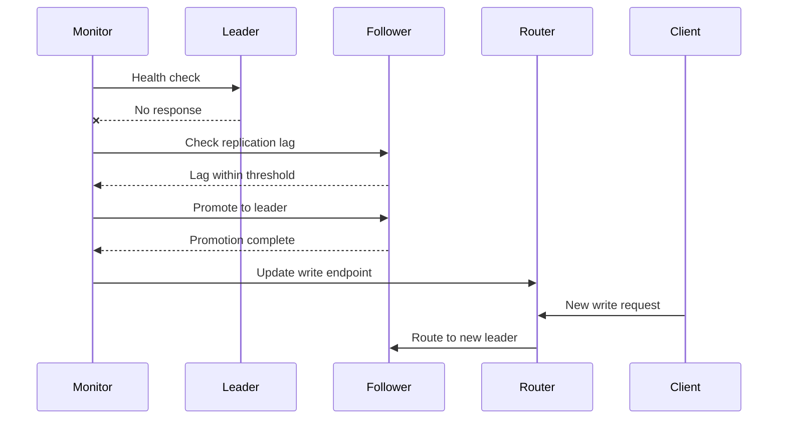

# Replication and Fault Tolerance

复制和容错的目标不是“多放几份数据”这么粗糙，而是在机器、机房、网络和依赖失败时，系统仍然能提供可接受的正确性和可用性。面试里要讲清复制对象、复制方式、故障检测、切换流程和一致性代价。

## Replication Types

- **Leader-follower replication**: 写入 leader，再复制到 follower。简单，适合读扩展和主从切换。
- **Multi-leader replication**: 多地都能写，延迟低但冲突处理复杂。
- **Quorum replication**: 写入 W 个副本、读取 R 个副本，通过 R + W > N 提高一致性概率。
- **Async cross-region replication**: 主区域写入后异步复制到灾备区域，RPO 取决于 replication lag。
- **Object replication**: 对文件或 blob 做多副本和纠删码，重点是耐久性和成本。

## Replication Architecture

## Failover Flow

## Key Decisions

- **RPO**: 最多能丢多少数据。异步复制可能丢掉最后几秒写入。
- **RTO**: 多久恢复服务。自动 failover 快，但误判会造成 split-brain。
- **Read consistency**: 从 follower 读可能读到旧数据，关键读可以走 leader 或 read-your-writes token。
- **Replication lag**: lag 高时要限流、降级或临时关闭 follower reads。
- **Split-brain prevention**: leader 选举需要 quorum、lease 或 fencing token。

## Common Failure Modes

- 只说主从复制，没有说明 leader 挂了谁来提升、DNS/路由怎么切、客户端怎么重试。
- 异步复制跨区域，但业务又要求零数据丢失。
- follower 延迟太高，用户写完马上读却看不到自己的数据。
- failover 误判导致两个 leader 同时接受写入。
- 备份从未演练恢复，真正故障时发现备份不可用。

## Interview Guidance

- 开场先定义目标：读扩展、容灾、高可用、数据耐久性分别需要不同复制策略。
- 对交易系统优先讨论 leader-follower、quorum、RPO/RTO 和幂等重试。
- 对全球多活要主动说明冲突解决、数据归属和一致性代价。
- 收尾补演练：故障注入、备份恢复、replication lag 告警和 runbook。

相关：

- [[Consistency and CAP]]
- [[Availability and Reliability]]
- [[Data Partitioning and Sharding]]
- [[Design a File Storage System]]
