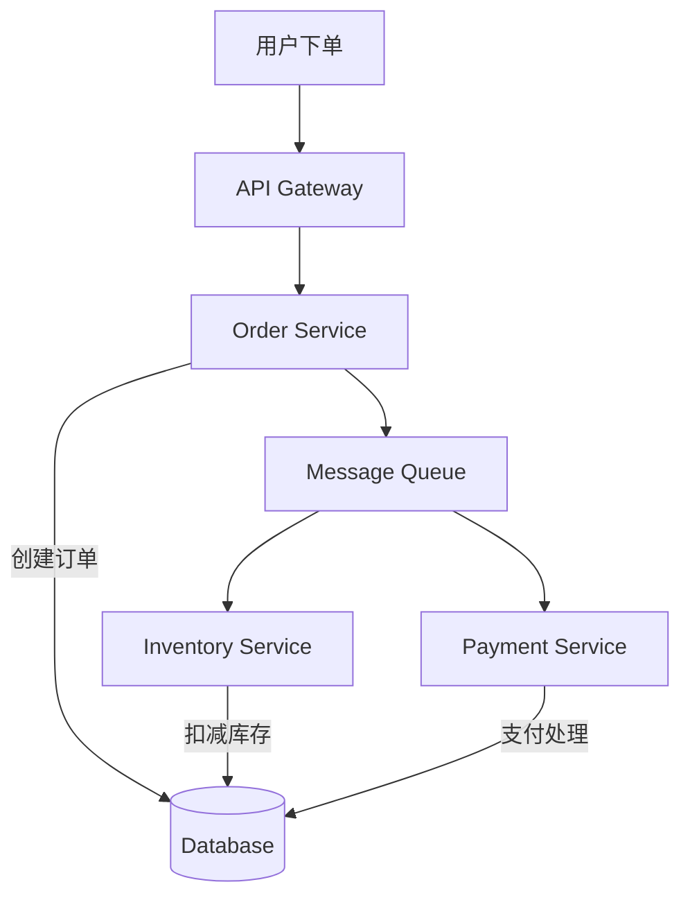
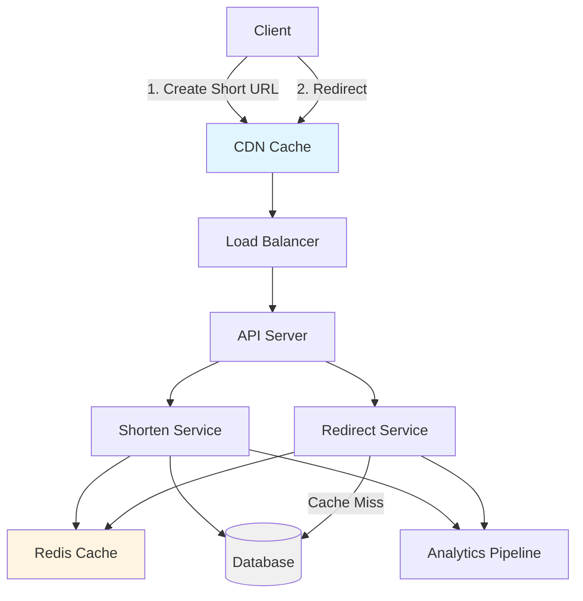

# System Design Fundamentals - Self Assessment

评估你对系统设计基础概念的理解和应用能力。

## Quick Check (10 minutes)

### 1. CAP Theorem
**问题**: 一个分布式系统在网络分区发生时，如果选择保持可用性(A)，必须牺牲什么？

A) 一致性(C)
B) 分区容错性(P)
C) 两者都不要牺牲
D) 可以同时保持所有三个属性

**答案**: A) 一致性(C)

**解析**: CAP定理指出在发生网络分区(P)时，系统只能在一致性(C)和可用性(A)之间选择一个。如果选择可用性，就必须牺牲强一致性，接受最终一致性。

---

### 2. Load Balancing Algorithms
**问题**: 哪种负载均衡算法最适合需要保证同一用户总是路由到同一服务器的场景？

A) Round Robin
B) Least Connections
C) IP Hash
D) Random

**答案**: C) IP Hash

**解析**:
- **Round Robin**: 依次分发，不考虑session
- **Least Connections**: 基于当前连接数
- **IP Hash**: 根据client IP计算hash，保证同一IP到同一server
- **Random**: 完全随机，不保证sticky session

---

### 3. Caching Strategies
**问题**: 哪种缓存策略能保证缓存和数据库始终一致，但可能导致写操作延迟较高？

A) Cache-Aside (Lazy Loading)
B) Write-Through
C) Write-Back (Write-Behind)
D) Write-Around

**答案**: B) Write-Through

**解析**:
- **Cache-Aside**: 读时缓存miss才加载，写时直接更新DB
- **Write-Through**: 写时同时更新缓存和DB，保证一致性但写延迟高
- **Write-Back**: 写时只更新缓存，异步更新DB，性能好但可能丢数据
- **Write-Around**: 写时直接写DB，不更新缓存

---

### 4. Sharding Strategies
**问题**: 如果应用需要经常按时间范围查询数据（如查询某个月的所有订单），哪种分片策略最合适？

A) Hash-based Sharding
B) Range-based Sharding
C) Consistent Hashing
D) Random Sharding

**答案**: B) Range-based Sharding

**解析**:
- **Hash-based**: 数据分布均匀但不支持范围查询
- **Range-based**: 按时间范围分片，支持范围查询但可能导致热点
- **Consistent Hashing**: 适合分布式缓存，减少rebalancing影响
- **Random**: 不适合生产环境

---

### 5. Database Choices
**问题**: 对于需要ACID事务的金融应用，应该选择哪种类型的数据库？

A) Document Store (MongoDB)
B) Key-Value Store (Redis)
C) Relational Database (PostgreSQL)
D) Graph Database (Neo4j)

**答案**: C) Relational Database (PostgreSQL)

**解析**:
- **金融应用特点**: 强一致性、事务支持、复杂查询
- **Relational DB**: ACID事务、成熟稳定、复杂SQL查询
- **NoSQL**: 最终一致性、不适合强事务场景

---

## Architecture Evaluation (15 minutes)

### Scenario 1: Social Media Feed System
**需求**: 设计一个类似Twitter的信息流系统
- DAU: 1000万用户
- 每个用户平均关注200人
- 每秒新增推文1000条
- 需要支持fanout和timeline查询

**问题**: 你会推荐哪种架构模式？

**选项**:
A) Pull Model (Lazy Fanout)
B) Push Model (Eager Fanout)
C) Hybrid Model
D) No Fanout, Query on Read

**答案**: C) Hybrid Model

**解析**:
**Push Model (Eager Fanout)**:
- 写入时推送到所有follower的timeline
- 读取快：直接从用户timeline读取
- 写入慢：如果有百万粉丝，写入会非常慢
- 适合：大V少，普通用户多

**Pull Model (Lazy Fanout)**:
- 读取时合并所有followee的推文
- 写入快：只需要写入一次
- 读取慢：需要实时聚合大量数据
- 适合：普通用户

**Hybrid Model**:
- 大V（followers > threshold）: Pull model
- 普通用户: Push model
- 平衡读写性能

---

### Scenario 2: E-commerce Order Processing
**需求**: 设计电商订单处理系统
- 每秒1000个订单
- 需要保证订单不丢失
- 需要防止重复下单
- 库存必须准确

**问题**: 哪种架构设计最合适？

**关键考虑**:
A) 同步处理，数据库事务
B) 异步处理，消息队列
C) CQRS + Event Sourcing
D) 纯内存处理

**答案**: C) CQRS + Event Sourcing（with B为fallback）

**推荐架构**:


**设计要点**:
1. **幂等性**: 使用order ID作为去重键
2. **最终一致性**: 使用事件驱动更新库存
3. **可靠性**: 消息队列持久化 + 重试机制
4. **监控**: 订单状态追踪和告警

---

## Design Exercise (20 minutes)

### Problem: Design a URL Shortener
**要求**:
- 需求：创建短链接、重定向、自定义短码
- 规模：每天1000万个新短链接
- QPS: 读1万，写1000
- 延迟：重定向< 100ms

#### Part 1: High-Level Design (10分钟)

**问题**: 画出系统架构图，解释各组件作用。

**参考答案**:


**关键组件**:
1. **CDN**: 缓存热门短链接
2. **API Gateway**: 路由、限流、认证
3. **Shorten Service**: 处理短链接创建
4. **Redirect Service**: 处理重定向请求
5. **Cache**: Redis缓存热点数据
6. **Database**: 存储短链接映射
7. **Analytics**: 异步处理点击统计

#### Part 2: Key Design Decisions (10分钟)

**Q1: 如何生成唯一短码？**

**方案对比**:
```kotlin
// 方案1: Database Auto-increment
fun generateShortCode(): String {
    val id = database.nextId() // 1, 2, 3, ...
    return base62Encode(id)    // "1", "2", "3", ...
}
// 优点：简单、保证唯一
// 缺点：数据库单点、可预测

// 方案2: Snowflake ID
fun generateShortCode(): String {
    val id = snowflake.nextId() // 分布式唯一ID
    return base62Encode(id)
}
// 优点：分布式、性能高
// 缺点：需要机器ID分配

// 方案3: Random + Collision Detection
fun generateShortCode(): String {
    while (true) {
        val code = generateRandom(6) // "dnh7u2"
        if (!database.exists(code)) {
            return code
        }
    }
}
// 优点：简单、不可预测
// 缺点：可能冲突、需要重试
```

**推荐**: Snowflake ID + Base62编码

---

**Q2: 如何优化重定向性能？**

**多层缓存策略**:
```kotlin
class RedirectService {
    fun getLongUrl(shortCode: String): String? {
        // L1: CDN Cache (99% hit rate)
        cdnCache.get(shortCode)?.let { return it }

        // L2: Redis Cache (95% hit rate)
        redisCache.get(shortCode)?.let {
            cdnCache.put(shortCode, it, TTL = 1hour)
            return it
        }

        // L3: Database (fallback)
        database.getLongUrl(shortCode)?.let {
            redisCache.put(shortCode, it, TTL = 24hours)
            return it
        }

        return null // Not found
    }
}
```

**性能目标**:
- CDN命中: < 10ms
- Redis命中: < 50ms
- Database查询: < 200ms

---

## Capacity Planning (15 minutes)

### Scenario: Designing for 10 Million QPS

**问题**: 一个系统需要处理每秒1000万请求，如何进行容量规划？

#### Part 1: Throughput Calculation

**每层QPS分解**:
```kotlin
// 假设CDN缓存命中率90%
val totalQPS = 10_000_000
val cdnQPS = totalQPS * 0.9      // 900万QPS
val originQPS = totalQPS * 0.1   // 100万QPS

// 假设应用层每实例处理1000 QPS
val appInstances = (originQPS / 1000).ceil()  // 1000 instances

// 假设数据库每实例处理5000 QPS
val dbInstances = (originQPS / 5000).ceil()   // 200 instances
```

#### Part 2: Storage Estimation

**存储需求计算**:
```kotlin
// 假设每个对象1KB，每天新增1亿对象
val objectSize = 1.KB
val dailyObjects = 100_000_000
val dailyStorage = objectSize * dailyObjects // 100GB/day

// 保留30天，需要3TB
val monthlyStorage = dailyStorage * 30 // 3TB

// 考虑副本（3副本），实际需要9TB
val actualStorage = monthlyStorage * 3 // 9TB
```

#### Part 3: Network Bandwidth

**带宽计算**:
```kotlin
// 假设每个请求响应5KB
val responseSize = 5.KB
val totalQPS = 10_000_000

val bandwidthPerSecond = responseSize * totalQPS // 50GB/s
val bandwidthGbps = bandwidthPerSecond * 8 / 1_000_000_000 // 400 Gbps

// 考虑峰值是平均的2倍
val peakBandwidth = bandwidthGbps * 2 // 800 Gbps
```

---

## Scoring Rubric

### Score Calculation
- **Quick Check**: 5题 × 10分 = 50分
- **Architecture Evaluation**: 2题 × 15分 = 30分
- **Design Exercise**: 20分
- **Total**: 100分

### Performance Level
- **90-100分**: Expert Ready - 可以进行高级系统设计面试
- **75-89分**: Strong Intermediate - 需要练习复杂场景
- **60-74分**: Intermediate - 需要加强实践
- **< 60分**: Beginner - 需要系统学习基础知识

### Improvement Recommendations

**如果得分 < 60**:
- 重新学习系统设计基础知识
- 阅读[[System Design Knowledge Map]]
- 练习简单系统设计问题

**如果得分 60-75**:
- 加强架构模式和trade-offs理解
- 练习容量规划和性能分析
- 学习[[Scalability]], [[Availability and Reliability]]

**如果得分 75-90**:
- 练习复杂系统设计
- 关注edge cases和failure scenarios
- 学习[[Design a 10 Million QPS System]]

**如果得分 > 90**:
- 准备系统设计面试
- 练习白板设计和沟通
- 学习[[System Design Offer-Level Playbook]]

## Next Steps

**继续学习**:
- [[3-Month System Design Track]]
- [[Design a URL Shortener]]
- [[Design a Chat System]]

**相关评估**:
- [[Coding Interview Knowledge Map]]
- [[Technical Leadership]]
