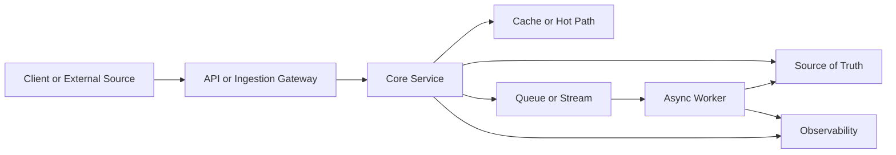

# System Design Project Storytelling Template

项目型 system design 面试的高分答案，不是按组件清单背诵，而是把一个真实系统讲成：**业务目标、数据流、核心难点、真实取舍、可追问答案**。

## 1. 项目一句话定位

用一句话说明系统解决什么问题、给谁用、核心技术挑战是什么。

模板：

> 这是一个面向 `{用户/业务方}` 的 `{系统类型}`，核心目标是在 `{规模/延迟/一致性}` 约束下，稳定完成 `{核心业务动作}`。

示例：

> 这是一个面向交易和行情展示的实时价格系统，核心目标是在外部数据源不稳定、热门交易对高并发订阅的情况下，提供低延迟、可解释、可回放的价格服务。

## 2. 面试开场版本

开场不要先画图，先讲边界。

推荐结构：

- 我会先限定 scope：核心读写链路、延迟目标、数据一致性和失败处理。
- 然后定义主数据流：请求或事件从哪里来，经过哪些处理，最终落到哪里。
- 接着讲 source of truth：哪些数据是权威状态，哪些是缓存、索引或派生视图。
- 最后深入 2 到 3 个难点：热点、幂等、顺序、一致性、降级、观测。

## 3. 推荐架构表达

架构图后要解释每一层为什么存在。

面试表达：

- Gateway 负责接入控制、限流和协议转换。
- Core service 负责业务规则，不应该承担大量耗时副作用。
- Cache 是读路径优化，不是 source of truth。
- Queue/stream 用来削峰、解耦和重放，但必须配套幂等、重试和 DLQ。
- Observability 要覆盖 latency、error、queue lag、cache hit rate、hot key 和业务正确性指标。

## 4. 核心难点展开模板

每个难点用同一套格式讲。

### 难点名称

真实 case：

- 生产中会遇到什么具体问题。
- 这个问题为什么会影响正确性、延迟或成本。

面试表达：

- 我会怎么设计。
- 为什么这个设计比简单方案更稳。
- 它牺牲了什么。

可追问：

Q：为什么不用更简单的方案？

A：简单方案在小流量下可以，但在 `{热点/失败/乱序/重试}` 下会出现 `{具体风险}`，所以我会把 `{关键边界}` 明确拆出来。

Q：如果这个组件故障怎么办？

A：先保证主链路可降级，再让异步链路可恢复。具体包括 `{缓存兜底/限流/重试/DLQ/回放/告警}`。

## 5. 高频追问回答框架

### Source of Truth

Q：哪个系统是真实状态？

A：数据库或事件日志是 source of truth；cache、search index、analytics table 和 WebSocket push 都是派生视图。派生视图可以延迟，但必须能从 source of truth 重建。

### Idempotency

Q：重试会不会写重复？

A：写请求必须带 idempotency key 或业务唯一键。服务端保存请求结果或状态转移记录，重复请求返回同一结果，而不是重新执行副作用。

### Ordering

Q：系统是否保证顺序？

A：通常不保证全局顺序，只保证业务边界内顺序，例如 conversation、symbol、booking 或 user。跨分区全局顺序成本很高，除非需求明确。

### Hot Path

Q：热点怎么处理？

A：先识别热点，再做 local cache、request coalescing、hot key replica、预计算和限流。不能只说“加 Redis”，因为 Redis 单 key 也可能成为瓶颈。

### Failure

Q：下游慢或失败怎么办？

A：同步链路设置 timeout、bulkhead、circuit breaker 和 degraded response；异步链路设置 retry with backoff、DLQ、poison message 隔离和 replay。

## 6. 亮点总结模板

最后用 30 秒总结亮点。

模板：

> 这个系统的关键不是堆组件，而是把 `{主链路}` 和 `{派生链路}` 分开。主链路保证 `{低延迟/正确性}`，异步链路处理 `{统计/通知/历史归档}`。对风险点，我重点设计了 `{热点保护}`、`{幂等}`、`{乱序处理}` 和 `{可观测性}`，所以系统在流量峰值和部分失败时仍然可解释、可恢复。

## 相关

- [[System Design Interview Practicum]]
- [[How to Approach a System Design Interview]]
- [[System Design Trade-offs]]
- [[Observability in System Design]]
- [[Queues and Asynchronous Processing]]
